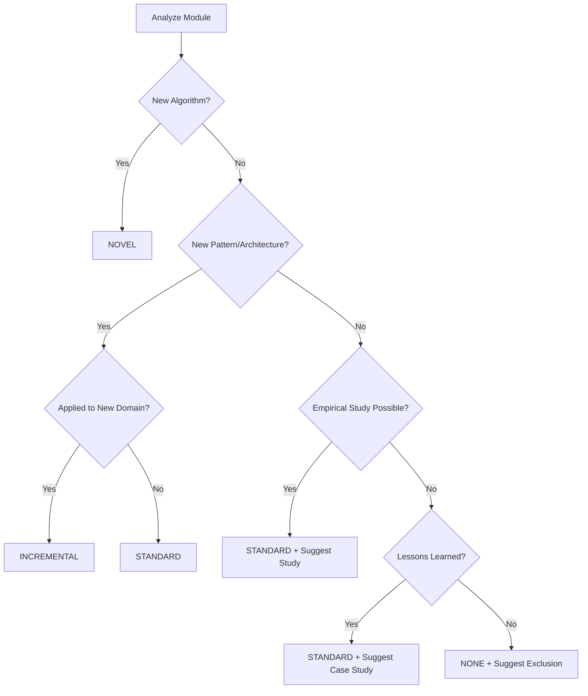

# Novelty Analysis Examples

## Example 1: Strong Novelty (INCREMENTAL)

### Module: Atomic Crew Builder

**Novel Aspect:** Dynamic crew construction through declarative YAML blueprints

**Differentiation:**
- CrewAI: Requires hardcoded Python for each crew
- **Our approach:** Data-driven instantiation from database

**Research Angle:**
"Declarative Multi-Agent Orchestration: From YAML Blueprints to Executable Crews"

**Supporting Evidence:**
- Complexity analysis: O(m·k) vs. O(1) for static crews
- Flexibility: Add new crews without code changes
- Reproducibility: Crew configurations versioned in DB

---

## Example 2: Moderate Novelty (INCREMENTAL)

### Module: Performance Monitor

**Novel Aspect:** Unified CPU/GPU/token tracking for agent workflows

**Differentiation:**
- MLflow: Requires manual instrumentation points
- **Our approach:** Automatic capture via decorator pattern

**Research Angle:**
"Comprehensive Performance Profiling for Multi-Agent LLM Systems"

**Suggested Empirical Study:**
- Measure overhead of monitoring (< 2% acceptable)
- Identify resource bottlenecks in 10+ agent workflows
- Create performance optimization playbook

---

## Example 3: No Novelty (NONE) - With Suggestions

### Module: JSON Utilities

**Status:** Standard JSON parsing helpers

**Suggested Research Angles:**

**Option 1: Error Recovery Study**
"Robustness Patterns for Malformed LLM JSON Outputs"
- Analyze 1000+ LLM responses
- Classify error types
- Propose automated repair strategies

**Option 2: Schema Evolution**
"Managing Configuration Schema Changes in Production Agent Systems"
- Document migration challenges
- Propose versioning strategy
- Measure impact on uptime

**Option 3: Validation Performance**
"Trade-offs Between Validation Strictness and Parsing Speed"
- Benchmark Pydantic vs. jsonschema vs. no validation
- Recommend strategy per use case

---

## Classification Decision Tree



---

## Publication Framing Templates

### Template 1: Algorithmic Contribution
```
"We present [X], a [technique] that achieves [Y] in [domain]. 
Unlike existing approaches [A, B] which [limitation], our method [advantage] 
through [key insight]. Experimental evaluation on [dataset] demonstrates 
[quantitative improvement] compared to baselines."
```

### Template 2: Architectural Contribution
```
"We describe [Pattern Name], an architectural pattern for [problem domain]. 
The pattern addresses [specific challenge] by [mechanism]. We compare our 
approach with [Alternative 1] and [Alternative 2], showing [trade-off analysis] 
based on [metrics]. Implementation in [system] demonstrates [benefit]."
```

### Template 3: Empirical Contribution
```
"We conduct a comprehensive empirical study of [X] in [context], analyzing 
[Y] across [Z dimensions]. Our findings include: (1) [finding 1], (2) [finding 2], 
(3) [finding 3]. Based on these results, we provide [actionable recommendations] 
for practitioners."
```

### Template 4: Case Study
```
"We report on our experience applying [technique/pattern] to [real-world system]. 
We document [N] key challenges encountered, propose solutions, and evaluate 
their effectiveness. Lessons learned include [insight 1], [insight 2], and 
[insight 3], which generalize to [broader context]."
```
