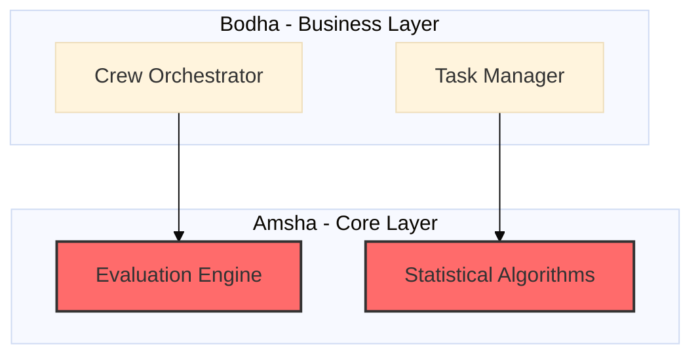

# Visual Generator Skill

## Purpose
This skill visualizes the system architecture and performance metrics for the research paper.

## Instructions

### 1. Analyze Architecture
Understand the 3-tier architecture (Amsha, Bodha, Yantra) by inspecting the codebase structure and relationships.

### 2. Select Appropriate Diagram Types
Choose diagram types based on what you need to visualize:
- **Flowchart** - Algorithm logic, workflows, process flows
- **Sequence Diagram** - Module interactions, message flows, temporal sequences
- **Class Diagram** - Domain models, OOP structure, protocol hierarchies
- **Block Diagram** - High-level system overview, component relationships
- **State Diagram** - Task lifecycles, FSMs, status workflows
- **ER Diagram** - Database schemas, repository patterns
- **C4 Context** - System boundaries, external dependencies
- **Architecture Diagram** - Infrastructure layout, deployment view
- **Pie Chart** - Code distribution, resource allocation

**Rule:** Use 2-3 diagram types per module, 6-8 total for a comprehensive paper.

### 3. Critical Error Prevention (MUST FOLLOW)

**❌ NEVER:**
- Use lowercase `end` as a node label in flowcharts (reserved keyword)
- Put brackets `()`, braces `{}`, or parentheses in labels without quotes
- Start node labels with `o` or `x` immediately after `---` connectors
- Apply styles without defining `classDef` first
- Create diagrams with >10 nodes without using subgraphs

**✅ ALWAYS:**
- Capitalize reserved words: `End` not `end`
- Wrap complex labels in quotes: `A["Process (Step 1)"]`
- Define `classDef` before use: `classDef importantClass fill:#f96`
- Use `autonumber` in sequence diagrams for clarity
- Specify visibility markers in class diagrams: `+public`, `-private`, `#protected`
- Break complex diagrams into subgraphs with explicit directions

### 4. Generate High-Quality Visuals

**Mermaid Diagrams:**

**Performance Tables:**
| Operation | Time (ms) | Memory (MB) | CPU (%) | Source |
|:----------|----------:|------------:|--------:|:-------|
| Crew Creation | 12.3 ± 1.2 | 4.2 | 15 | `crew_monitor` logs |

**Requirements:**
- All component names must match actual source files
- All relationships must reflect actual dependencies
- Include error bars (±) for measured data
- Cite source files: `src/path/to/file.py:L42`
- Add descriptive captions for every figure/table

### 5. Verify Against Source Code (STRICT)
- Run `grep -r "class ClassName"` to verify class existence
- Check imports to confirm relationships
- Trace method calls to validate sequence diagrams
- Cross-reference performance data with actual measurements

### 6. Output Format
    -   File: `docs/paper/architecture/visuals.md`
    -   Format: Markdown with Mermaid code blocks and tables.
    -   Content:
        -   Architectural diagrams.
        -   Performance data tables.
        -   Captions and explanations for each visual.

## Verification
-   Verify that all components in the diagrams exist in the codebase.
-   Verify that the relationships depicted in the diagrams match the actual dependencies and calls in the code.
-   Ensure performance data is traced back to actual metrics or reasonable estimates based on the code.

## Supporting Materials

### Resources
- **[mermaid_templates.md](resources/mermaid_templates.md)** - Comprehensive collection of Mermaid diagram templates (class diagrams, sequence diagrams, component diagrams, flowcharts) with Clean Architecture examples and performance table formats
- **[mermaid_dos_donts.md](resources/mermaid_dos_donts.md)** - ⭐ **CRITICAL** - Do's and don'ts covering reserved keywords (lowercase "end"), special characters, connector ambiguity, styling, theming, and common error fixes with verification checklist
- **[diagram_types_reference.md](resources/diagram_types_reference.md)** - Complete reference of all 15+ Mermaid.js diagram types (Flowchart, Sequence, Class, State, ER, Gantt, Pie, Architecture, Block, C4, Mindmap, Timeline, Quadrant, Requirements, Sankey) with syntax examples and selection guide for research papers
- **[table_formatting_guide.md](resources/table_formatting_guide.md)** - ⭐ **TABLE GUIDE** - Comprehensive guide for creating 9 types of Markdown tables (performance metrics, module comparison, baseline comparison, ablation study, hyperparameters, dataset stats, error analysis, complexity, code distribution) with formatting rules, alignment best practices, caption format, and common mistakes to avoid

### Examples
- **[architecture_example.md](examples/architecture_example.md)** - Complete set of visualizations including 3-tier architecture, class diagrams, sequence diagrams, and performance benchmark tables
- **[table_examples.md](examples/table_examples.md)** - ⭐ **TABLE EXAMPLES** - 10 real-world table examples for research papers showing module metrics, performance benchmarks, feature comparison, experimental results, ablation study, hyperparameters, dataset statistics, error analysis, code distribution, and time complexity with proper formatting, captions, and source citations

## Quality Indicators

When using these materials:
- **Error Prevention:** Review `mermaid_dos_donts.md` FIRST - avoid lowercase "end", quote special chars, prevent connector ambiguity
- **Diagram Selection:** Use `diagram_types_reference.md` to choose appropriate types (2-3 per module)
- **Diagrams:** Use subgraphs to organize layers (Amsha/Bodha/Yantra) with explicit directions
- **Classes:** All class/interface names must match actual source files exactly
- **Sequences:** Verify message flow matches actual method calls; use `autonumber`
- **Tables:** Review `table_formatting_guide.md` for table type selection and formatting
  - Include S.No column for >5 rows
  - Right-align numbers, left-align text, center-align symbols
  - Include units in headers: `Time (ms)`, `Memory (MB)`
  - Add error bars (±) for measured data
  - Bold best/total values
  - Define abbreviations in caption
  - Cite source: `crew_monitor logs`, `pytest-cov results`
- **Captions:** Every figure/table needs descriptive caption with verification note
- **Theme:** Use `base` or `neutral` theme for professional research papers
- **Complexity:** Maximum 10 nodes per diagram; use subgraphs to organize larger systems
- **Verification:** Test all diagrams in https://mermaid.live/ before finalizing
