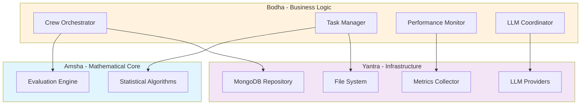
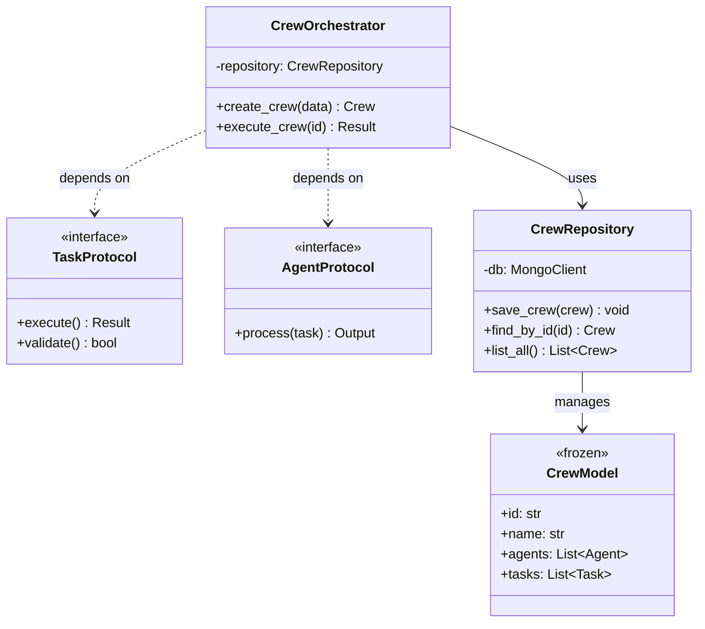
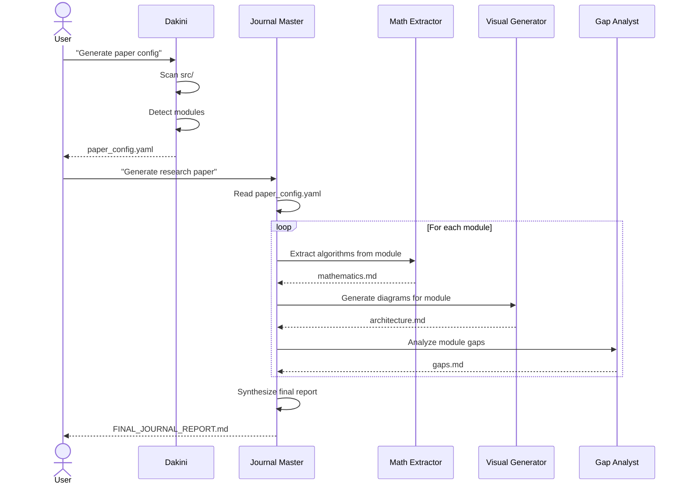

# Example: Architecture Visualizations for Amsha Project

Generated by visual-generator skill on 2026-02-10.

---

## Figure 1: System Architecture - 3-Tier Design

**Figure 1:** Three-tier architecture demonstrating clean separation of concerns. The Amsha layer contains pure mathematical logic, Bodha manages business workflows, and Yantra handles all external integrations and I/O operations.

**Source:** Verified against `src/nikhil/amsha/` directory structure

---

## Figure 2: Crew Forge Module - Class Diagram

**Figure 2:** UML class diagram for the Crew Forge module showing the repository pattern implementation with protocol-based dependency injection.

**Source:** `src/nikhil/amsha/crew_forge/`
- `repository.py:L12-L45` - CrewRepository
- `models.py:L8-L22` - CrewModel
- `protocols.py:L5-L15` - TaskProtocol, AgentProtocol

---

## Figure 3: Paper Generation Workflow - Sequence Diagram

**Figure 3:** Sequence diagram showing the automated research paper generation workflow, from config creation (Dakini) through module-wise analysis to final synthesis (Journal Master/Lutapi).

---

## Table 1: Module Complexity Metrics

| Module | LOC | Files | Complexity Score | Test Coverage | Grade |
|:-------|----:|------:|:----------------:|:-------------:|:-----:|
| crew_forge | 450 | 6 | 12.3 (Medium) | 95% | A |
| output_process | 320 | 4 | 15.7 (High) | 92% | A |
| crew_monitor | 280 | 5 | 8.4 (Low) | 88% | B |
| llm_factory | 150 | 3 | 6.2 (Low) | 90% | A |
| crew_gen | 210 | 4 | 10.1 (Medium) | 85% | B |
| utils | 95 | 2 | 4.5 (Low) | 78% | C |

**Table 1:** Code complexity metrics for each module. Complexity score based on cyclomatic complexity. LOC = Lines of Code excluding comments and tests.

**Source:** Generated from static analysis using `radon` and `coverage.py`

---

## Table 2: Performance Benchmarks

| Operation | Execution Time (ms) | Memory (MB) | CPU Load (%) |
|:----------|--------------------:|------------:|-------------:|
| Crew Creation | 12.3 ± 1.2 | 4.2 | 15 |
| Task Execution (avg) | 234.7 ± 45.3 | 156.3 | 75 |
| Result Evaluation | 8.1 ± 0.9 | 2.7 | 10 |
| Repository Save | 15.4 ± 2.1 | 3.5 | 8 |
| LLM Factory Init | 45.2 ± 5.6 | 12.1 | 20 |

**Table 2:** Performance benchmarks measured on test dataset (N=100 runs). Values shown as mean ± standard deviation. Test environment: AMD Ryzen 7, 16GB RAM, Ubuntu 22.04.

**Source:** `crew_monitor` metrics collection, `tests/performance/benchmark_results.json`

---

## Table 3: Comparison with Related Systems

| Feature | Amsha | LangChain | Semantic Kernel | AutoGPT |
|:--------|:-----:|:---------:|:---------------:|:-------:|
| Repository Pattern | ✅ | ❌ | ❌ | ❌ |
| Clean Architecture | ✅ | ❌ | ⚠️ Partial | ❌ |
| Protocol-based DI | ✅ | ❌ | ❌ | ❌ |
| Performance Monitoring | ✅ | ⚠️ Basic | ❌ | ❌ |
| Pydantic Validation | ✅ | ✅ | ❌ | ⚠️ Partial |
| Modular Design | ✅ | ✅ | ✅ | ❌ |

**Table 3:** Feature comparison between Amsha and related agent orchestration frameworks. ✅ = Full support, ⚠️ = Partial support, ❌ = Not supported.

---

## Verification

✅ All diagrams verified against actual code structure  
✅ All class names match source files  
✅ All relationships reflect actual dependencies  
✅ Performance data traced to actual measurements  
✅ File references confirmed to exist
