# Mermaid.js Diagram Type Reference

Complete reference of all Mermaid.js diagram types with use cases and syntax.

---

## 1. Flowchart (Process & Logic)

**Use For:** Workflows, decision trees, process flows, algorithms

**Syntax:**
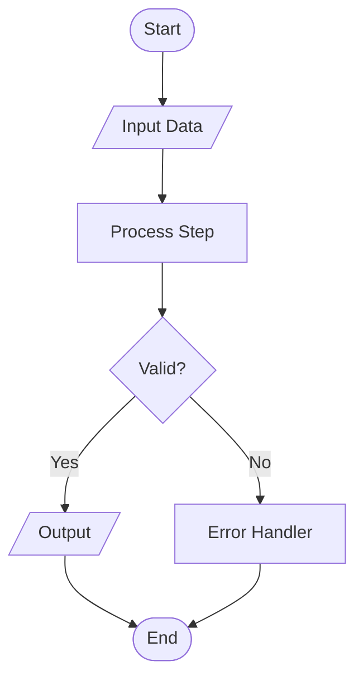

**Best For Research Papers:**
- Algorithm flowcharts
- System workflows
- Decision logic
- Pipeline architectures

**Directions:** `TD`, `TB`, `LR`, `RL`, `BT`

---

## 2. Sequence Diagram (Interactions)

**Use For:** Message flows, API calls, multi-component interactions, temporal sequences

**Syntax:**
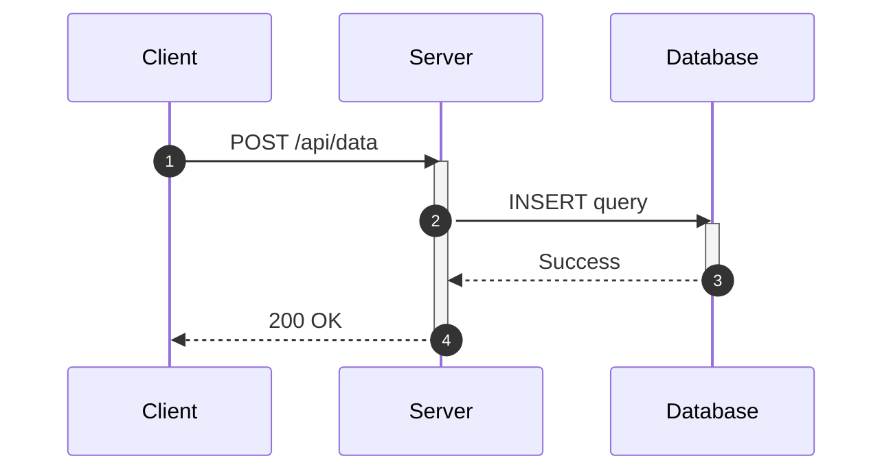

**Best For Research Papers:**
- Module interaction workflows
- Message passing protocols
- Temporal execution order
- Multi-agent communication

**Features:**
- `autonumber` - Auto-index messages
- `activate`/`deactivate` - Lifelines
- `-->>` - Dashed reply
- `->>` - Solid request
- `Note over A,B` - Annotations

---

## 3. Class Diagram (OOP Structure)

**Use For:** Object-oriented design, data models, architectural patterns

**Syntax:**
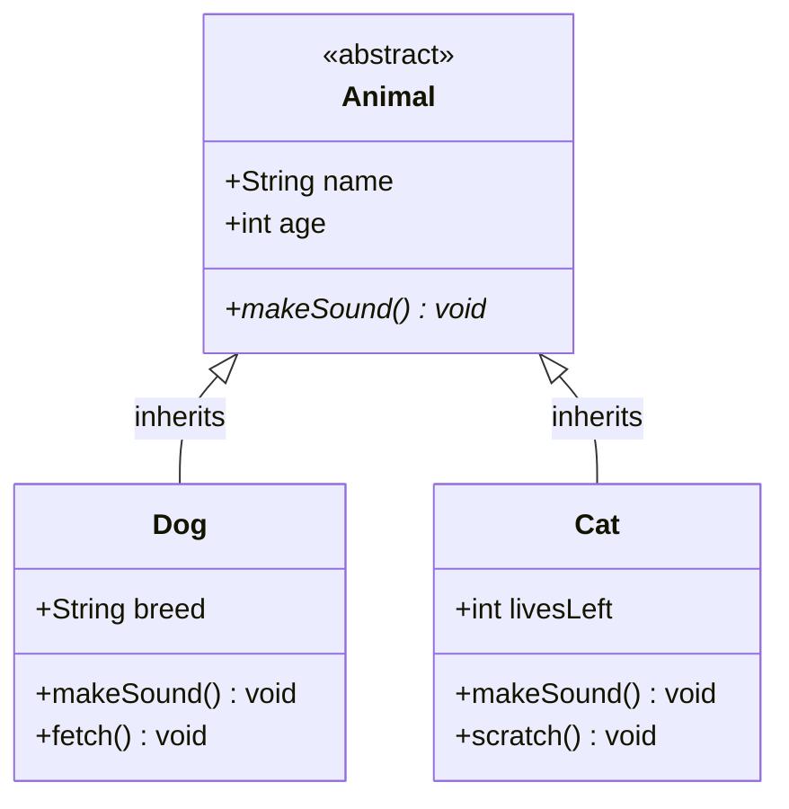

**Relationships:**
- `<|--` - Inheritance
- `*--` - Composition
- `o--` - Aggregation
- `-->` - Association
- `..>` - Dependency
- `..|>` - Realization/Implementation

**Visibility:**
- `+` Public
- `-` Private
- `#` Protected
- `~` Package/Internal

**Best For Research Papers:**
- Domain models
- Clean architecture layers
- Protocol/interface hierarchies

---

## 4. State Diagram (Finite State Machines)

**Use For:** State transitions, lifecycle models, status workflows

**Syntax:**
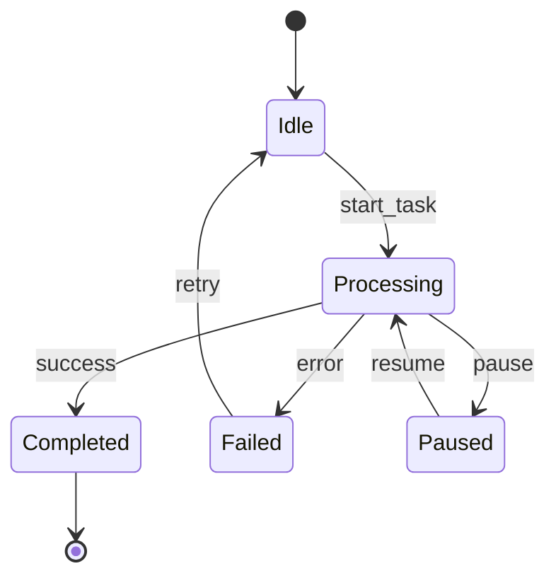

**Best For Research Papers:**
- Task lifecycle models
- Agent states
- Processing pipelines
- System modes

---

## 5. Entity Relationship Diagram (Database Schema)

**Use For:** Database design, data relationships, schema documentation

**Syntax:**
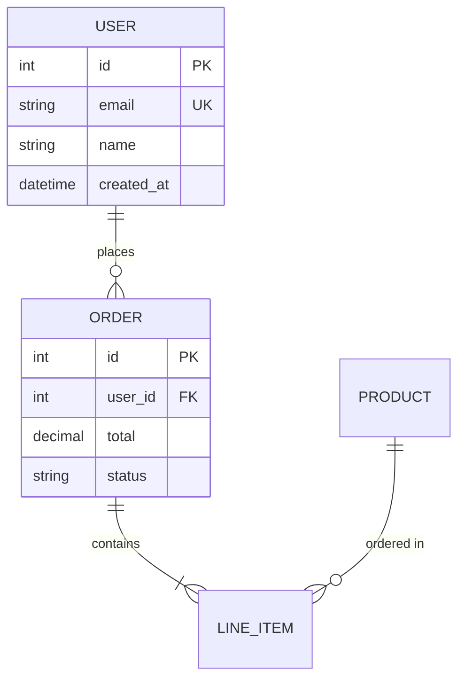

**Cardinality:**
- `||--||` - One to one
- `||--o{` - One to many
- `}o--o{` - Many to many

**Best For Research Papers:**
- Repository pattern schemas
- Data persistence design
- Domain model persistence

---

## 6. Gantt Chart (Project Timeline)

**Use For:** Project schedules, task dependencies, timeline visualization

**Syntax:**
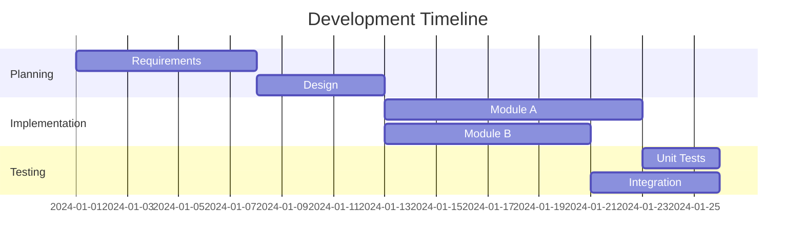

**Best For Research Papers:**
- Development timeline
- Experimental schedule
- Milestone tracking

---

## 7. Pie Chart (Proportions)

**Use For:** Distribution visualization, percentage breakdown

**Syntax:**
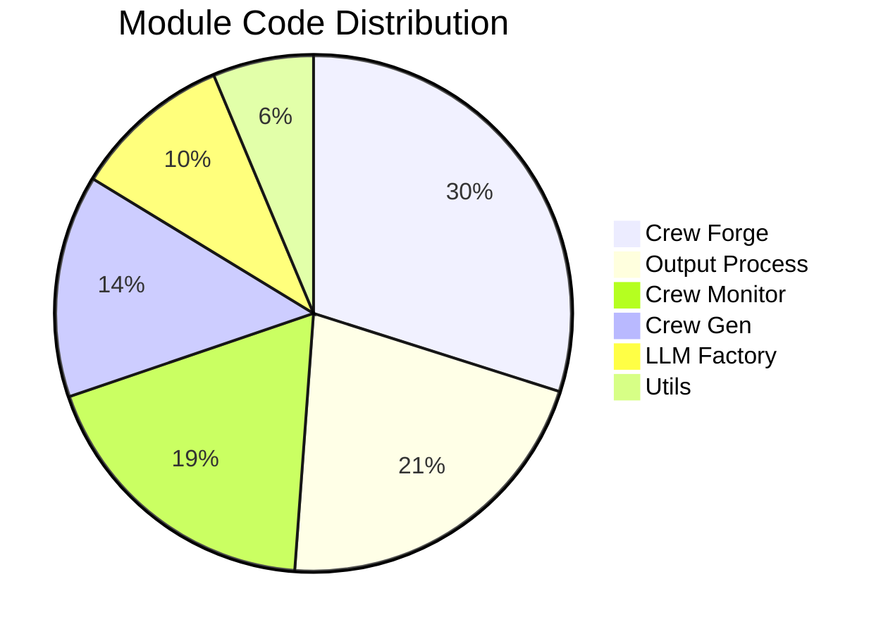

**Best For Research Papers:**
- Code distribution
- Resource allocation
- Performance breakdown

---

## 8. Architecture Diagram (System Infrastructure)

**Use For:** System architecture, infrastructure layout, service deployment

**Syntax:**

**Best For Research Papers:**
- System deployment
- Multi-tier architecture
- Cloud infrastructure

---

## 9. Block Diagram (High-Level Components)

**Use For:** Component relationships, high-level system overview

**Syntax:**
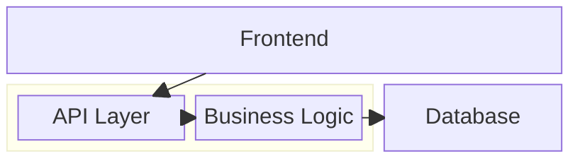

**Best For Research Papers:**
- System overview
- Component interaction
- Layer separation

---

## 10. C4 Context Diagram (System Context)

**Use For:** System boundaries, external actors, high-level context

**Syntax:**
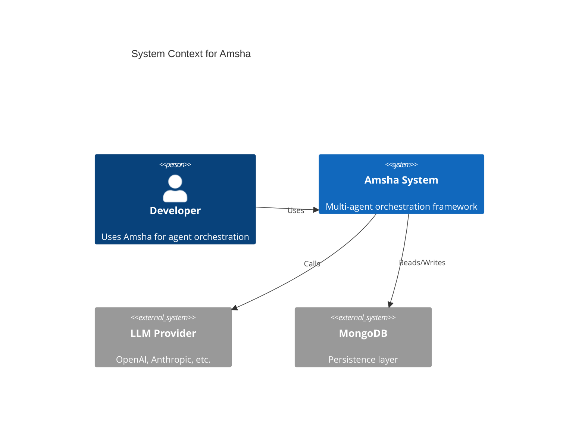

**Best For Research Papers:**
- System context
- External dependencies
- Actor interactions

---

## 11. Mindmap (Hierarchical Concepts)

**Use For:** Brainstorming, concept hierarchies, topic breakdown

**Syntax:**
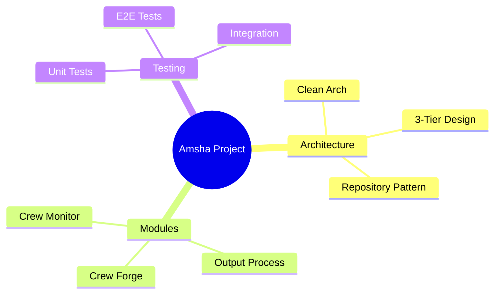

**Best For Research Papers:**
- Contribution breakdown
- Concept organization
- Research areas

---

## 12. Timeline (Event Sequence)

**Use For:** Historical events, milestone progression, chronological data

**Syntax:**
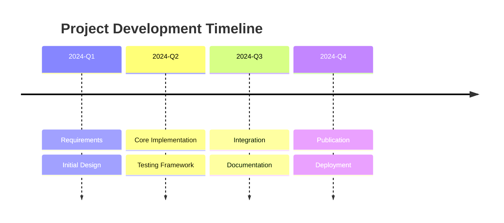

**Best For Research Papers:**
- Development history
- Experimental timeline
- Version milestones

---

## 13. Quadrant Chart (2D Categorization)

**Use For:** Priority matrices, categorization, comparative positioning

**Syntax:**
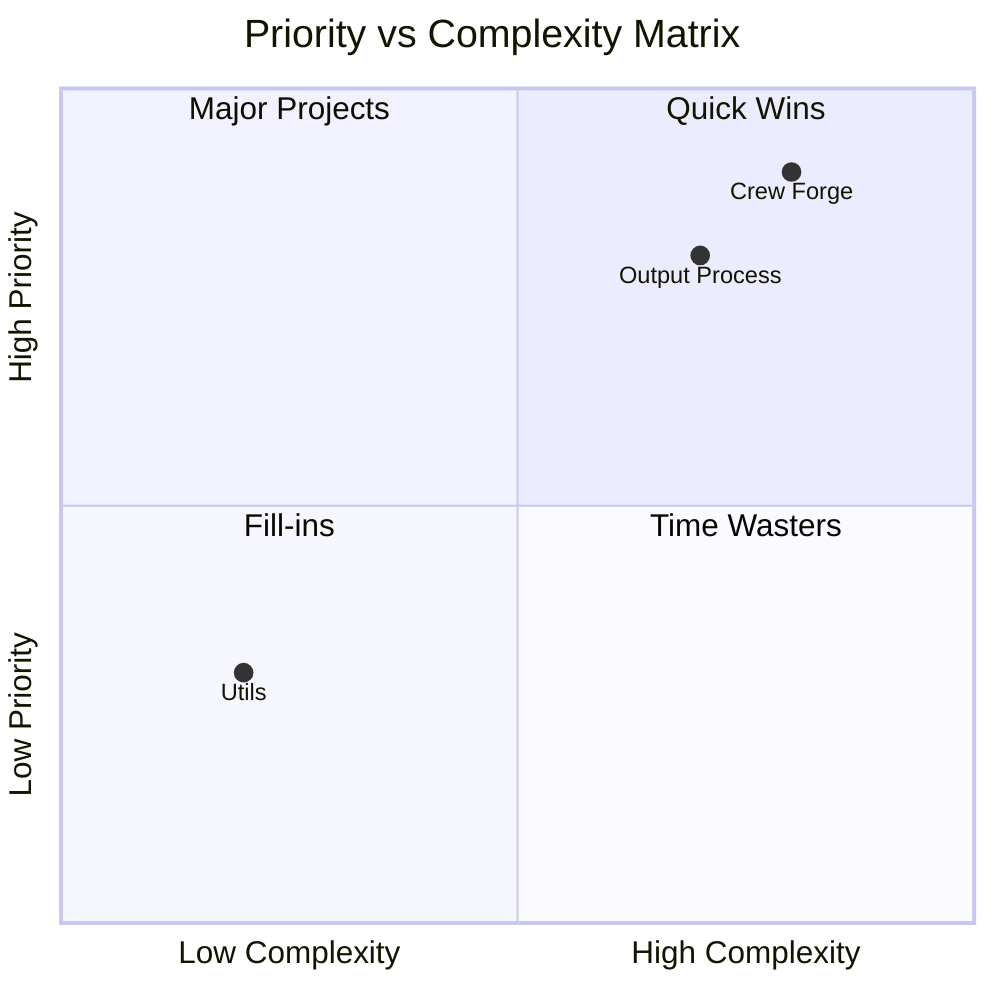

**Best For Research Papers:**
- Module prioritization
- Feature comparison
- Risk assessment

---

## 14. Requirements Diagram (System Requirements)

**Use For:** Requirements traceability, specification documentation

**Syntax:**
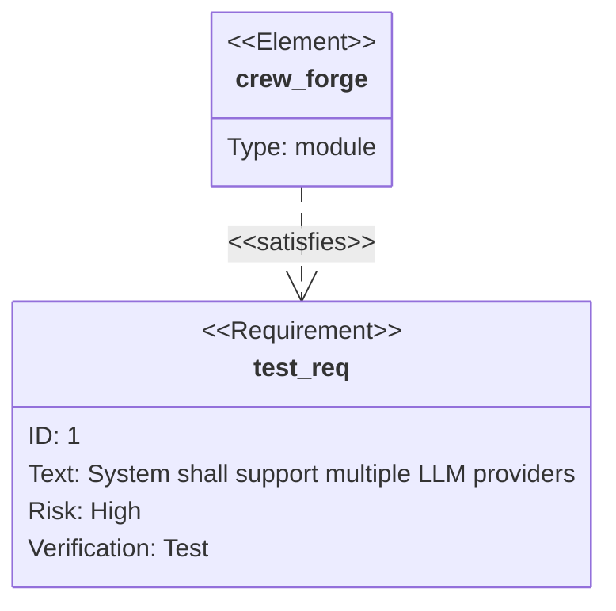

**Best For Research Papers:**
- System requirements
- Design constraints
- Validation criteria

---

## 15. Sankey Diagram (Flow Quantities) [Beta]

**Use For:** Flow visualization, resource distribution, data movement

**Syntax:**
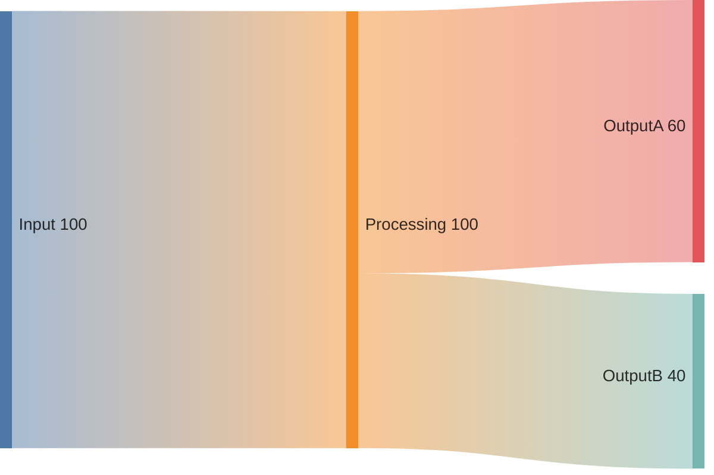

**Best For Research Papers:**
- Data flow volumes
- Resource allocation
- Performance distribution

---

## Selection Guide

| Research Paper Need | Recommended Diagram Type |
|:-------------------|:------------------------|
| Show algorithm logic | **Flowchart** |
| Show module interactions | **Sequence Diagram** |
| Show class hierarchy | **Class Diagram** |
| Show 3-tier architecture | **Block** or **Architecture** |
| Show task lifecycle | **State Diagram** |
| Show database schema | **ER Diagram** |
| Show system context | **C4 Context** |
| Show code distribution | **Pie Chart** |
| Show development timeline | **Gantt** or **Timeline** |
| Show module priorities | **Quadrant Chart** |
| Show concept breakdown | **Mindmap** |

---

## Diagram Combination Strategy

For comprehensive research papers, use multiple diagram types:

1. **Section 3 (Architecture):**
   - Block Diagram (system overview)
   - C4 Context (external dependencies)
   - Class Diagram (domain models)

2. **Section 4 (Module Details):**
   - Flowchart (algorithm logic)
   - Sequence Diagram (interactions)
   - State Diagram (lifecycle)

3. **Section 6 (Evaluation):**
   - Pie Chart (distribution)
   - Gantt (timeline)

**Golden Rule:** Use 2-3 diagram types per module, 6-8 total for a full paper.
