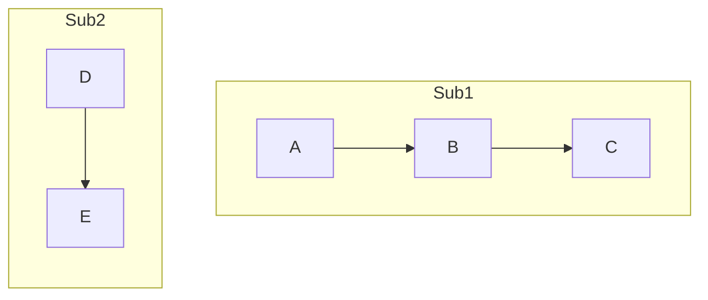
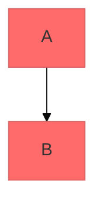
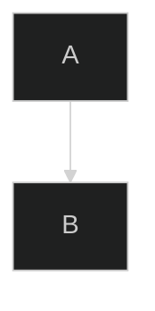
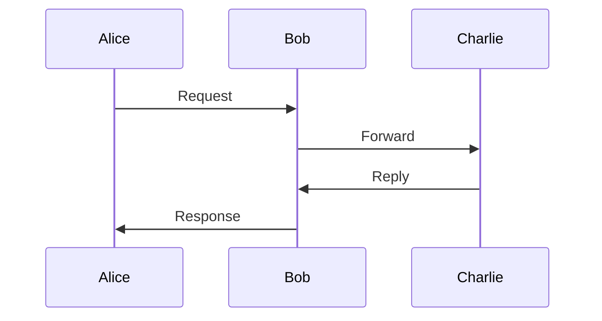
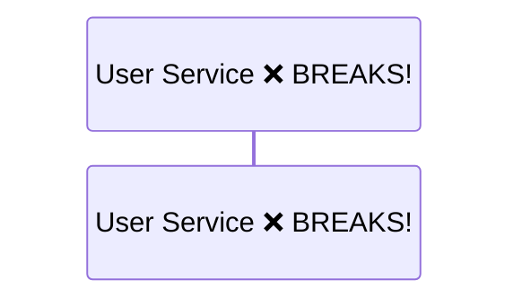
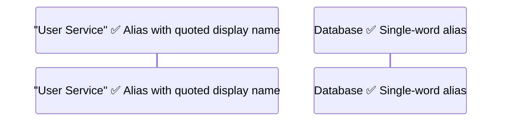
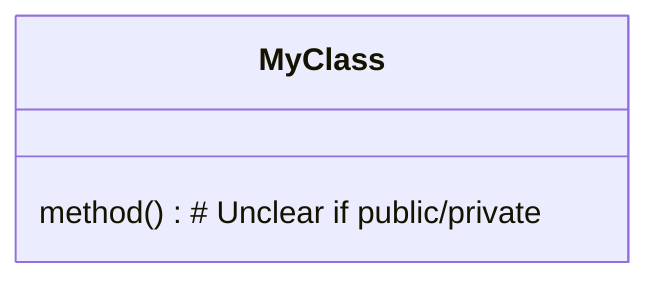
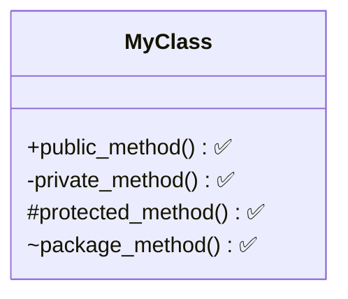

# Mermaid.js Do's and Don'ts

Based on official Mermaid.js documentation - comprehensive guide to avoid common errors.

---

## CRITICAL: Reserved Keywords & Syntax Errors

### ❌ DON'T: Use lowercase "end" as node label in Flowcharts
```mermaid
flowchart TD
    start --> process
    process --> end  ❌ BREAKS! "end" is reserved for subgraphs
```

### ✅ DO: Capitalize or use quotes
```mermaid
flowchart TD
    start --> process
    process --> End  ✅ Capitalized works
    process --> "end"  ✅ Quoted works
```

---

## Special Characters in Labels

### ❌ DON'T: Put brackets/parentheses directly in labels
```mermaid
flowchart TD
    A[Process (Step 1)]  ❌ BREAKS! Parentheses confuse parser
    B{Decision [Important]}  ❌ BREAKS! Brackets inside brackets
```

### ✅ DO: Wrap complex labels in double quotes
```mermaid
flowchart TD
    A["Process (Step 1)"]  ✅ Quotes protect special chars
    B{"Decision [Important]"}  ✅ Works correctly
```

**Rule:** If your label contains `()`, `[]`, `{}`, `:`, or other special characters, wrap the ENTIRE label in double quotes.

---

## Connector Ambiguity

### ❌ DON'T: Start node labels with 'o' or 'x' after connectors
```mermaid
flowchart TD
    A --- oB  ❌ BREAKS! Interpreted as circle arrowhead
    C --- xD  ❌ BREAKS! Interpreted as cross arrowhead
```

### ✅ DO: Add space or use explicit labels
```mermaid
flowchart TD
    A --- " oB"  ✅ Space prevents misinterpretation
    C -->|label| xD  ✅ Explicit label works
    A["Starting"] --- B["oBegin"]  ✅ Quoted labels work
```

---

## Subgraph Direction

### ❌ DON'T: Forget subgraphs can have independent directions
```mermaid
flowchart TD
    subgraph Sub1
        A --> B --> C  # Inherits TD, might look awkward
    end
```

### ✅ DO: Specify direction for each subgraph when needed


**Available Directions:**
- `TB` / `TD` = Top to Bottom (default)
- `BT` = Bottom to Top
- `LR` = Left to Right
- `RL` = Right to Left

---

## Styling Best Practices

### ❌ DON'T: Apply styles without defining them first
```mermaid
flowchart TD
    A:::importantClass  ❌ BREAKS! Class not defined
```

### ✅ DO: Define classDef before using
```mermaid
flowchart TD
    classDef importantClass fill:#f96,stroke:#333,stroke-width:4px
    A:::importantClass  ✅ Works!
```

### ✅ DO: Use inline styles for one-off customization
```mermaid
flowchart TD
    A[Normal]
    B[Custom]
    style B fill:#f9f,stroke:#333,stroke-width:2px  ✅ Direct styling
```

---

## Theming

### ❌ DON'T: Mix theming methods inconsistently
```mermaid
%%{init: {'theme': 'dark'}}%%  # Directive
---
config:
  theme: forest  # Frontmatter
---
flowchart TD
    ❌ CONFLICT! Choose one method
```

### ✅ DO: Use frontmatter for Markdown environments


### ✅ DO: Use directive for single-diagram override


**Available Themes:**
- `default` - Classic blue/green
- `base` - Clean, professional (recommended for papers)
- `neutral` - Grayscale, minimal
- `dark` - Dark mode
- `forest` - Nature-inspired greens

---

## Sequence Diagram Best Practices

### ❌ DON'T: Forget to autonumber for clarity


### ✅ DO: Use autonumber for indexing
```mermaid
sequenceDiagram
    autonumber  ✅ Automatically numbers messages
    Alice->>Bob: Request
    Bob->>Charlie: Forward
    Charlie->>Bob: Reply
    Bob->>Alice: Response
```

### ❌ DON'T: Use spaces in participant names without quotes


### ✅ DO: Use quotes or aliases


---

## Class Diagram Gotchas

### ❌ DON'T: Forget to specify method visibility


### ✅ DO: Use visibility markers


### ❌ DON'T: Use generic relationship arrows without labels
```mermaid
classDiagram
    ClassA -- ClassB  # What's the relationship?
```

### ✅ DO: Use semantic relationships
```mermaid
classDiagram
    ClassA --|> ClassB : inherits  ✅
    ClassA --* ClassB : composition  ✅
    ClassA --o ClassB : aggregation  ✅
    ClassA --> ClassB : association  ✅
    ClassA ..> ClassB : dependency  ✅
```

---

## Complexity Management

### ❌ DON'T: Cram 20+ nodes in one diagram
```mermaid
flowchart TD
    A --> B --> C --> D --> E --> F --> G --> H --> ...
    # Overwhelms readers
```

### ✅ DO: Break into multiple diagrams or use subgraphs
```mermaid
flowchart TD
    subgraph "Layer 1: Input"
        A --> B --> C
    end
    subgraph "Layer 2: Processing"
        D --> E --> F
    end
    subgraph "Layer 3: Output"
        G --> H --> I
    end
    C --> D
    F --> G
```

**Best Practice:** Keep diagrams to 7-10 nodes maximum for readability.

---

## Common Error Messages & Fixes

| Error Message | Cause | Fix |
|:--------------|:------|:----|
| `Parse error on line X` | Reserved keyword used | Capitalize or quote the label |
| `Syntax error` | Special char without quotes | Wrap label in `"..."` |
| `Cannot read property` | Malformed connector | Check for `o` or `x` at start of label |
| `Unexpected token` | Missing semicolon (state diagrams) | Add `;` after state definitions |
| `Unknown diagram type` | Typo in diagram declaration | Use exact names: `flowchart`, `sequenceDiagram`, etc. |

---

## Pro Tips

1. **Test in Live Editor:** Use https://mermaid.live/ to validate before embedding
2. **Start Simple:** Build diagram incrementally, testing after each addition
3. **Use Comments:** Add `%% This is a comment` to document complex parts
4. **Consistent Naming:** Use `camelCase` or `snake_case` consistently for node IDs
5. **Accessibility:** Add `accDescr` for screen readers:
   ```mermaid
   %%{init: {'theme': 'base', 'accDescr': 'System architecture showing 3 tiers'}}%%
   ```

---

## Quick Reference: Node Shapes

```mermaid
flowchart TD
    A[Rectangle]
    B(Rounded)
    C([Stadium])
    D[[Subroutine]]
    E[(Database)]
    F((Circle))
    G>Asymmetric]
    H{Diamond}
    I{{Hexagon}}
    J[/Parallelogram/]
    K[\Parallelogram alt\]
    L[/Trapezoid\]
    M[\Trapezoid alt/]
```

---

## Verification Checklist

Before finalizing any Mermaid diagram:
- [ ] No lowercase `end` used as node label
- [ ] All special characters in labels are quoted
- [ ] No nodes start with `o` or `x` immediately after `---`
- [ ] All `classDef` defined before use
- [ ] Subgraph directions explicitly set if different from parent
- [ ] Diagram type spelled correctly (`flowchart`, not `graph`)
- [ ] Participant names with spaces are quoted
- [ ] Less than 10 nodes per diagram (or split into subgraphs)
- [ ] Tested in mermaid.live editor
