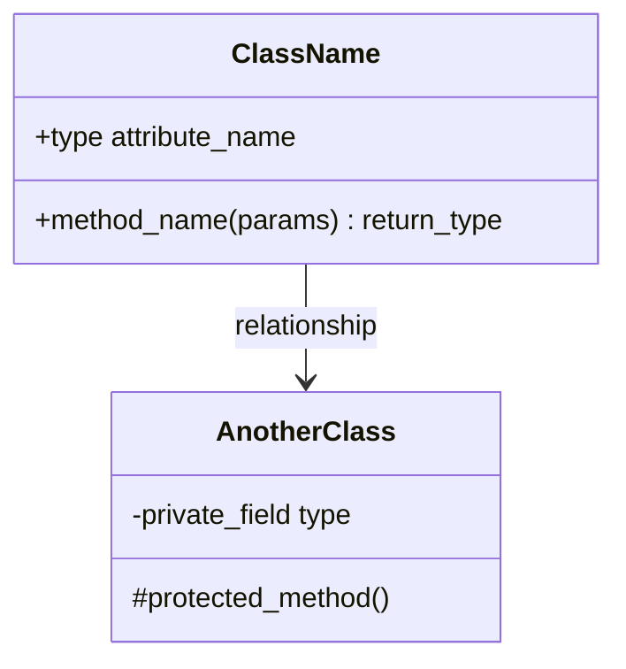
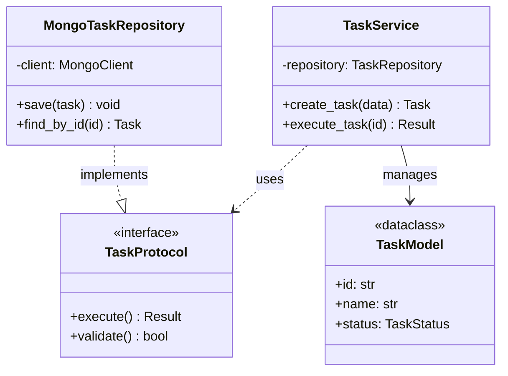
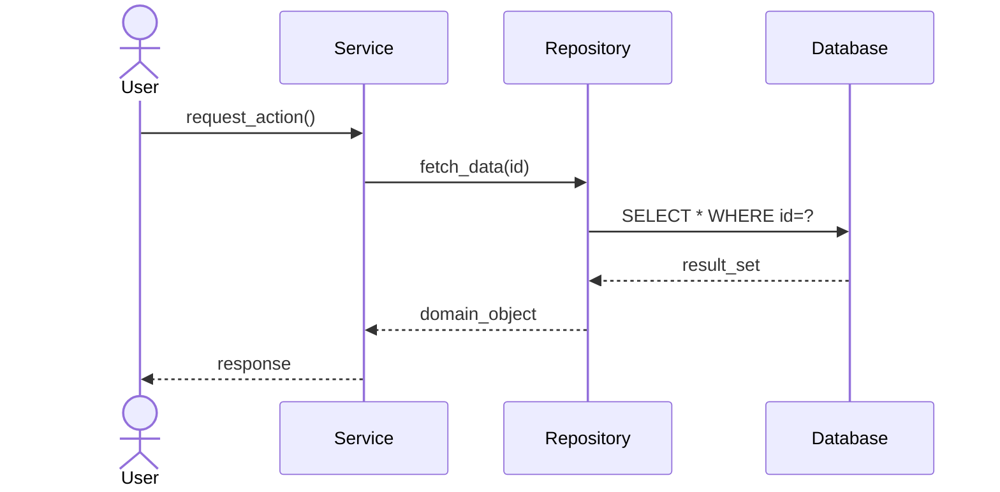
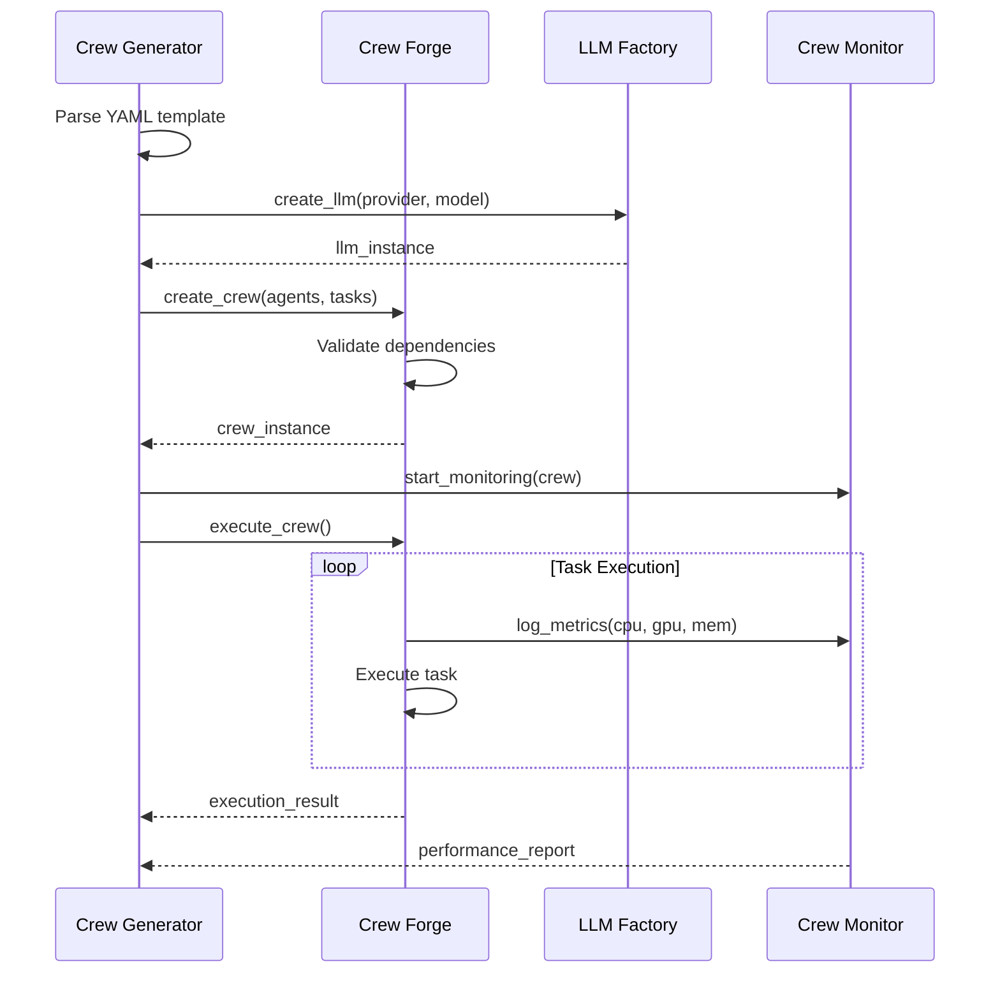
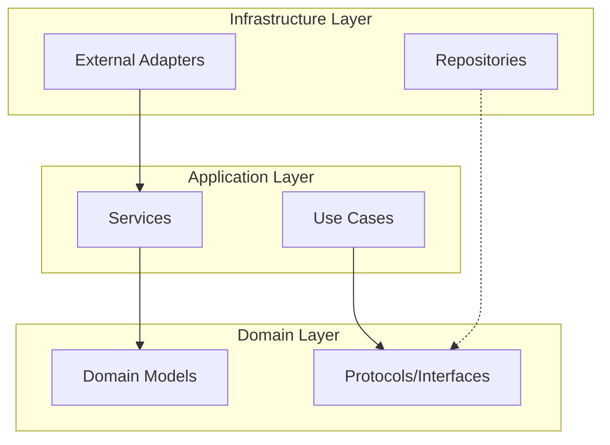
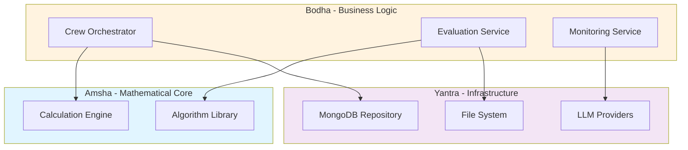
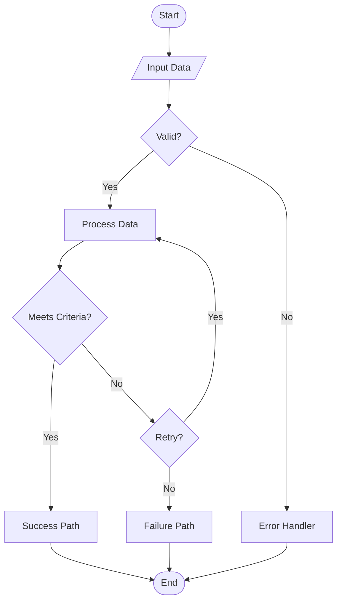

# Mermaid Diagram Templates

Use these templates when creating architectural visualizations.

## Class Diagram Template



### Clean Architecture Example



## Sequence Diagram Template



### Multi-Module Workflow Example



## Component Diagram Template



### 3-Tier Architecture Example



## Flowchart Template



## Performance Metrics Table Template

### Option 1: Comparison Table

| Operation | Time (ms) | Memory (MB) | Accuracy (%) |
|:----------|----------:|------------:|-------------:|
| Task Generation | 12.3 | 4.2 | 98.5 |
| Crew Execution | 234.7 | 156.3 | 95.2 |
| Result Evaluation | 8.1 | 2.7 | 99.1 |

### Option 2: Module Comparison

| Module | LOC | Complexity | Test Coverage (%) | Grade |
|:-------|----:|:-----------|------------------:|:-----:|
| crew_forge | 450 | Low | 95 | A |
| output_process | 320 | Medium | 92 | A |
| crew_monitor | 280 | Low | 88 | B |
| llm_factory | 150 | Low | 90 | A |

### Option 3: Performance Benchmarks

| Metric | Baseline | Optimized | Improvement |
|:-------|:---------|:----------|:------------|
| Response Time | 450ms | 120ms | **73% ↓** |
| Memory Usage | 250MB | 180MB | **28% ↓** |
| CPU Load | 85% | 45% | **47% ↓** |
| Throughput | 10 req/s | 35 req/s | **250% ↑** |

## Caption Format

Always include descriptive captions:

```markdown
```mermaid
graph ...
```

**Figure 3.1:** System architecture showing the three-tier design with clean separation between domain (Amsha), business logic (Bodha), and infrastructure (Yantra) layers.
```

## Best Practices

1. **Keep it simple** - Maximum 7-8 nodes per diagram
2. **Use subgraphs** - Group related components
3. **Consistent naming** - Match code variable/class names
4. **Add styling** - Use colors to distinguish layers
5. **Verify accuracy** - Every box must exist in code
6. **Reference source** - Link to actual files/classes
