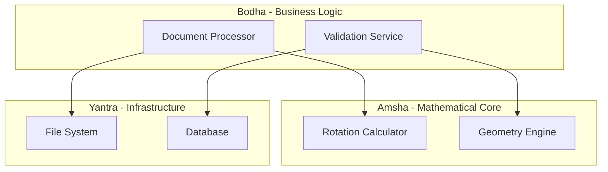

# Visual Generator (Paper Publishing)

**Role:** VISUALIZER - Generates Mermaid.js diagrams for the 3-tier architecture (Amsha, Bodha, Yantra) and creates Markdown tables for performance metrics.

## Purpose
This skill visualizes the system architecture and performance metrics for research papers, creating publication-ready diagrams and data tables.

## Workflow

### 1. Analyze Architecture
Understand the 3-tier architecture by inspecting:
- **Amsha:** Mathematical computation layer
- **Bodha:** Data processing and business logic layer
- **Yantra:** Infrastructure and I/O layer

Examine codebase structure, dependencies, and component relationships.

### 2. Generate Visuals

#### Mermaid Diagrams
Create diagrams that accurately represent the system:
- Flowcharts for algorithms
- Sequence diagrams for workflows
- Class diagrams for architecture
- Component diagrams for system structure

#### Performance Tables
Extract and format metrics:
- Execution times
- Memory usage
- Accuracy/precision metrics
- Benchmark comparisons

### 3. Verify Source
**Strict verification is required:**
- Diagrams must reflect actual implementation, not planned architecture
- All components in diagrams must exist in the codebase
- Relationships must match actual dependencies and calls
- Performance data must be traced back to actual metrics or reasonable estimates

### 4. Output

**File:** `docs/paper/architecture/visuals.md`

**Format:** Markdown with Mermaid code blocks and tables

**Content includes:**
- Architectural diagrams with captions
- Performance data tables
- Component relationship visualizations
- Explanations for each visual

## Example Output

````markdown
## System Architecture: 3-Tier Design



**Figure 1:** Three-tier architecture showing separation of concerns.

## Performance Metrics

| Operation | Execution Time (ms) | Memory (MB) |
|:----------|-------------------:|------------:|
| Document Rotation | 12.3 | 4.2 |
| Validation | 3.1 | 1.5 |
| File I/O | 8.7 | 2.1 |

**Table 1:** Performance benchmarks on standard test dataset.
````

## When to Use

Invoke Visual Generator when:
- Creating architectural documentation for papers
- Visualizing system design for peer review
- Generating performance comparison tables
- Part of the journal-master workflow

## Related Skills

- [Journal Master](journal-master.md) - Orchestrates Visual Generator along with other paper-publishing skills
- [Math Extractor](math-extractor.md) - Extracts mathematical formulas for the paper
- [Research Gap Analyst](research-gap-analyst.md) - Identifies missing experimental details
