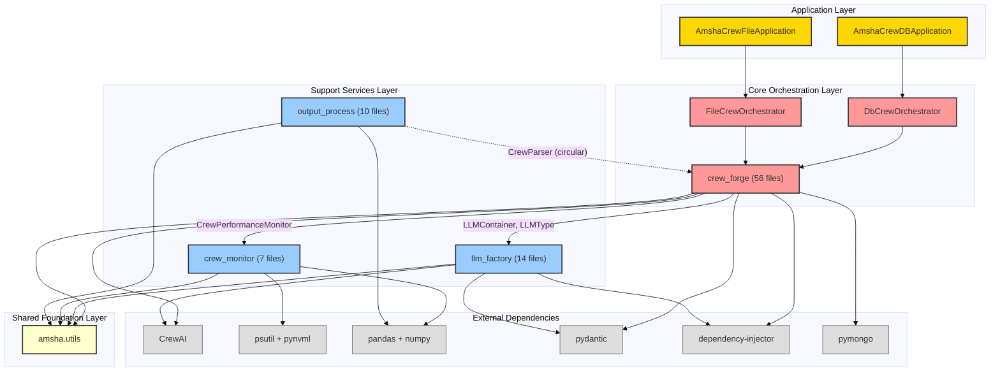
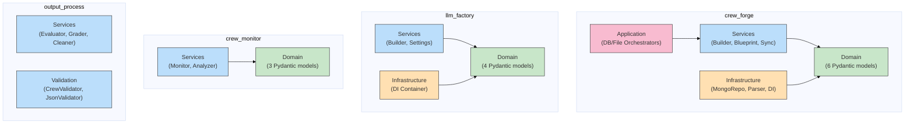
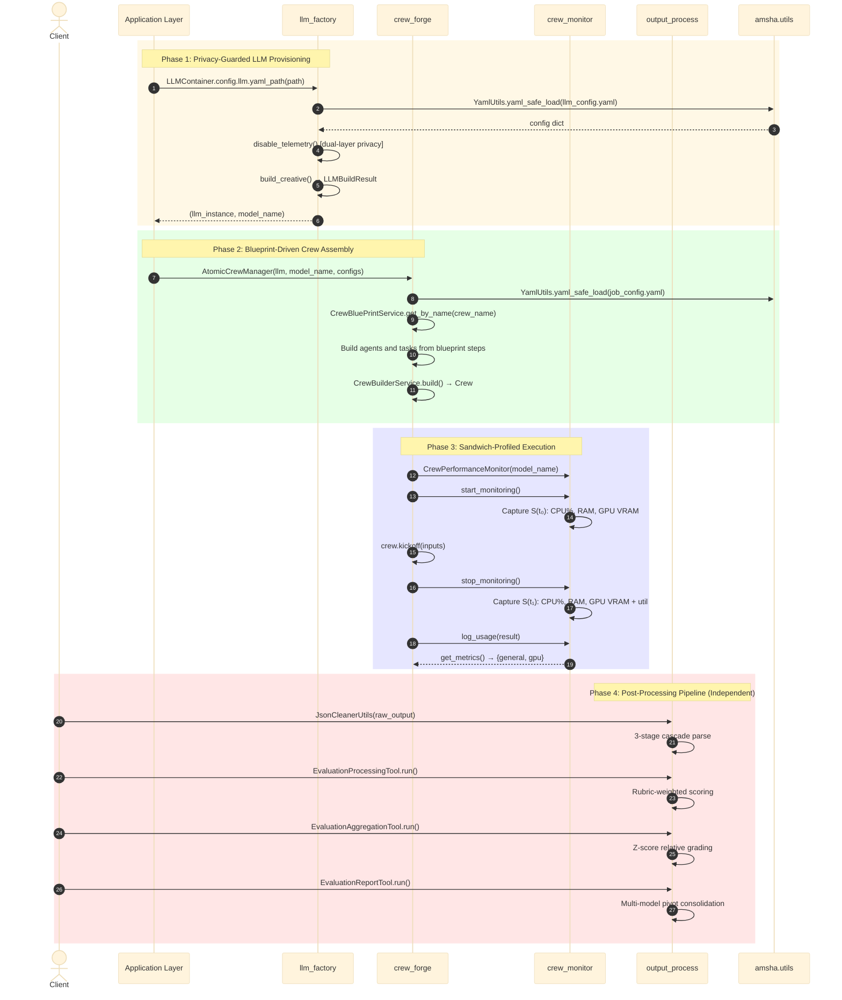
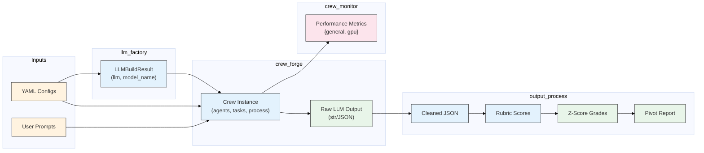
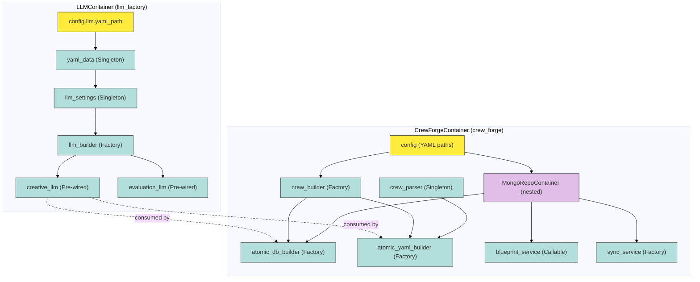
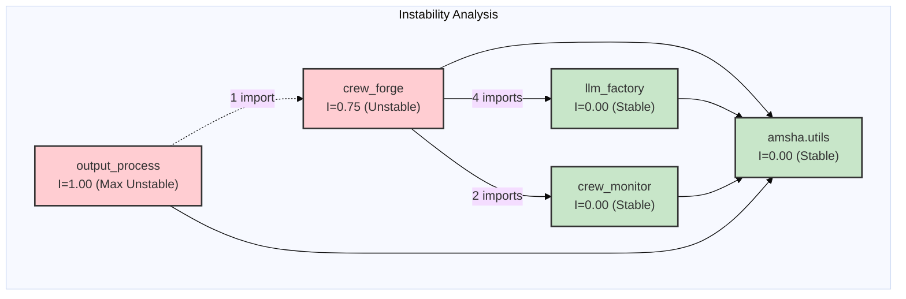
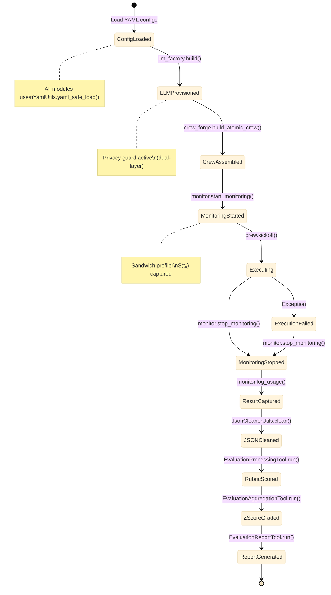
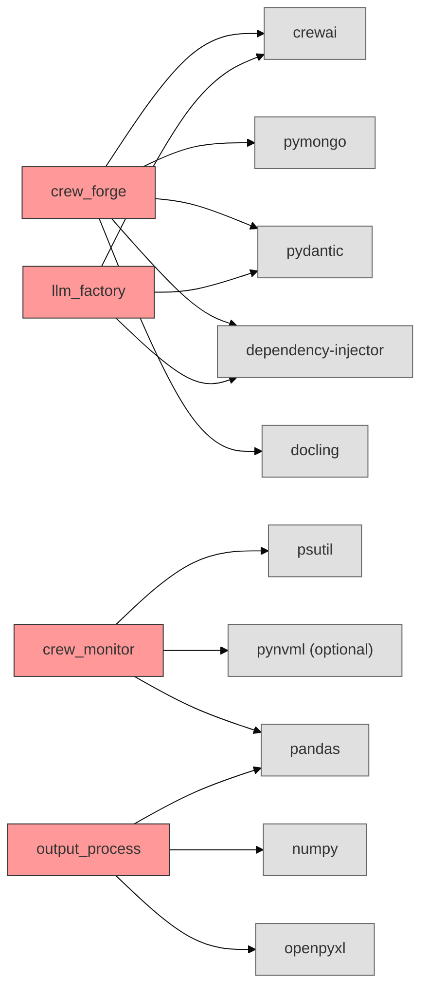

# Cross-Module Architecture & Design

This document provides **system-level architectural diagrams and performance analysis** for the Amsha framework. Unlike per-module architecture documents (which show internal class/sequence diagrams), this document captures the **high-level system architecture**, **end-to-end data flows**, and **global performance metrics** across all 4 analyzed modules.

---

## 1. High-Level System Architecture

### 1.1 Layered Module Architecture

**Figure 1.** High-level layered architecture of the Amsha framework. The Application Layer provides user-facing entry points. The Core Orchestration Layer (crew_forge) coordinates Support Services (llm_factory, crew_monitor, output_process). All modules share a common utility foundation. One architectural violation exists: output_process depends upward on crew_forge.

---

### 1.2 Clean Architecture Compliance per Module

**Figure 2.** Clean Architecture layer compliance for each module. crew_forge has the most complete layered architecture (4 layers). llm_factory has 3 layers. crew_monitor has 2 layers. output_process operates primarily at the service layer with no explicit domain models (uses raw dicts).

---

## 2. End-to-End Data Flow Architecture

### 2.1 Full Execution Pipeline (Provisioning → Execution → Monitoring → Evaluation)

**Figure 3.** Complete end-to-end execution sequence spanning all 4 modules. Phase 1 provisions LLMs with privacy guard. Phase 2 materializes the crew from blueprints. Phase 3 wraps execution in a sandwich profiler. Phase 4 applies a 4-stage evaluation pipeline. Phases 1–3 are tightly coupled; Phase 4 operates independently on filesystem artifacts.

---

### 2.2 Data Transformation Pipeline

**Figure 4.** Data transformation pipeline showing type transformations at each stage. YAML configs drive LLM provisioning and crew assembly. Raw LLM output undergoes 4-stage refinement into graded reports. Performance metrics are captured as a side-channel.

---

## 3. DI Container Hierarchy (System-Wide)

**Figure 5.** System-wide Dependency Injection container hierarchy. The `LLMContainer` (llm_factory) produces LLM instances consumed by `CrewForgeContainer` (crew_forge). Both use the `dependency-injector` library with Singleton, Factory, and Pre-wired provider strategies.

---

## 4. Module Coupling Architecture

### 4.1 Coupling Matrix

**Figure 6.** Module instability analysis. Dependencies flow from unstable modules (crew_forge, output_process) toward stable modules (llm_factory, crew_monitor, utils), following the Stable Dependencies Principle. The one violation (output_process→crew_forge) breaks this principle.

### 4.2 Coupling Metrics Table

| Module | Files | Efferent ($C_e$) | Afferent ($C_a$) | Instability ($I$) | Classification |
|:---|:---:|:---:|:---:|:---:|:---|
| `crew_forge` | 56 | 3 | 1 | 0.75 | Unstable (main consumer) |
| `llm_factory` | 14 | 0 | 2 | 0.00 | Maximally Stable (provider) |
| `crew_monitor` | 7 | 0 | 1 | 0.00 | Maximally Stable (provider) |
| `output_process` | 10 | 1 | 0 | 1.00 | Maximally Unstable (consumer) |
| `amsha.utils` | 4 | 0 | 4 | 0.00 | Maximally Stable (foundation) |

*Table 1.* Module coupling metrics using Robert Martin's Instability formula: $I = C_e / (C_a + C_e)$. Source: Cross-module import analysis (see `dependencies.md`).

---

## 5. System State Machine

**Figure 7.** System-wide state machine for a complete Amsha execution lifecycle. The lifecycle spans 4 modules in sequence: configuration loading (utils) → LLM provisioning (llm_factory) → crew execution (crew_forge + crew_monitor) → post-processing (output_process). Error handling ensures monitoring is stopped even on execution failure.

---

## 6. Module Size and Complexity Comparison

| Module | Files | Sub-Packages | Pydantic Models | Diagrams (per-module) | Algorithms | Design Patterns |
|:---|:---:|:---:|:---:|:---:|:---:|:---:|
| `crew_forge` | 56 | 12 | 6 | 6 | 8 | 9 |
| `llm_factory` | 14 | 6 | 4 | 4 | 6 | 6 |
| `crew_monitor` | 7 | 3 | 3 | 3 | 7 | 7 |
| `output_process` | 10 | 3 | **0** ⚠️ | 3 | 7 | 8 |
| **System Total** | **87** | **24** | **13** | **16** | **28** | **30** |

*Table 2.* Module-level metrics from per-module analysis. crew_forge is the largest module (56 files). output_process lacks Pydantic domain models — a notable gap. Source: Module analysis documents.

---

## 7. External Dependency Architecture

**Figure 8.** External dependency graph. crew_forge has the highest external dependency count (5 libraries). llm_factory shares 3 dependencies with crew_forge (crewai, pydantic, dependency-injector). crew_monitor's pynvml is optional (graceful degradation). pandas is shared between crew_monitor and output_process.

### External Dependency Risk Assessment

| Library | Used By | Risk Level | Reason |
|:---|:---|:---:|:---|
| `crewai` | crew_forge, llm_factory | **High** | Core framework, breaking API changes |
| `pydantic` | crew_forge, llm_factory | Medium | Stable, but v1→v2 migration risk |
| `dependency-injector` | crew_forge, llm_factory | Low | Mature, stable API |
| `pymongo` | crew_forge | Low | Stable driver |
| `docling` | crew_forge | Medium | Newer library, fewer guarantees |
| `psutil` | crew_monitor | Low | OS-level, very stable |
| `pynvml` | crew_monitor | Low | NVIDIA official, optional |
| `pandas` | crew_monitor, output_process | Low | Industry standard |
| `numpy` | output_process | Low | Industry standard |
| `openpyxl` | crew_monitor, output_process | Low | Stable Excel engine |

*Table 3.* External dependency risk assessment. crewai is the highest-risk dependency due to frequent API surface changes. Source: requirements analysis and external dependency survey.

---

## 8. Architectural Quality Summary

### Compliance Scorecard

| Quality Attribute | Score | Evidence |
|:---|:---:|:---|
| Clean Architecture Adherence | **7/8** relations valid | 1 violation: output_process → crew_forge |
| Dependency Direction | **Mostly correct** | Dependencies flow toward stable modules |
| Configuration Externalization | **4/4 modules** | Universal YAML pattern via amsha.utils |
| Domain Model Coverage | **3/4 modules** | output_process lacks Pydantic models |
| DI Container Usage | **2/4 modules** | crew_forge and llm_factory only |
| Monitoring Integration | **Seamless** | Negligible overhead ($\leq$0.05%) |
| Privacy Enforcement | **Dual-layer** | Environment + reflection-based |
| Testability | **High** | Protocol-based, DI-enabled |

### Recommendations for Architectural Improvement

1. **P0 — Break circular dependency:** Move `CrewParser` to `amsha.common.parsing`
2. **P1 — Add Pydantic models to output_process:** Formalize evaluation schemas
3. **P2 — Extend DI to crew_monitor and output_process:** Consistent instantiation pattern
4. **P3 — Add protocol-based decoupling:** Use Python Protocols for crew_forge → crew_monitor interface
