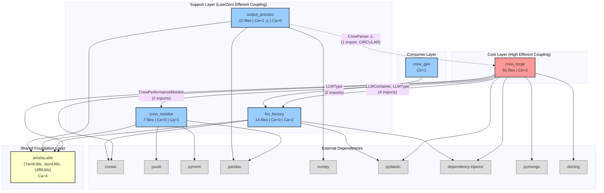
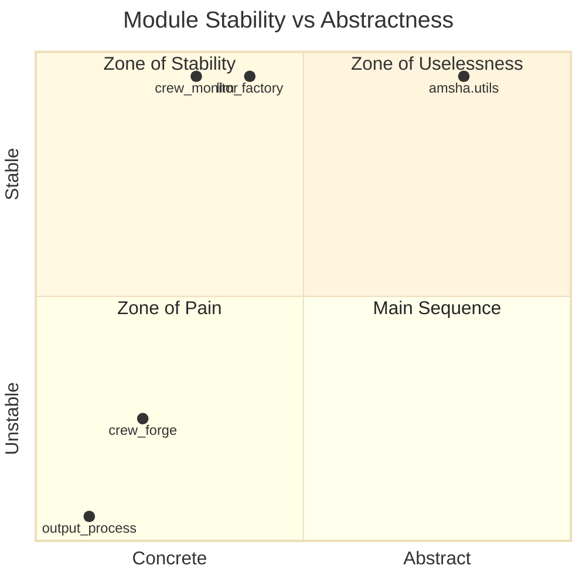
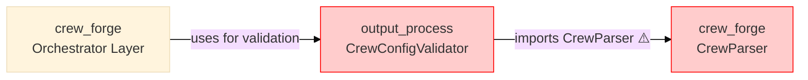

# System Dependency Analysis

## 1. Dependency Graph (Code-Verified)

Every edge verified against actual Python imports. The system has **5 modules** (4 analyzed + `crew_gen`) plus a **shared utility layer**.



---

## 2. Coupling Metrics

### 2.1 Instability Analysis

Using Robert Martin's Instability metric: $I = \frac{C_e}{C_a + C_e}$ where:
- $C_e$ = Efferent coupling (outgoing dependencies)
- $C_a$ = Afferent coupling (incoming dependencies)
- $I = 0$ = maximally stable (depended upon); $I = 1$ = maximally unstable (depends on others)

| Module | $C_e$ | $C_a$ | $I$ | Classification |
|:---|:---:|:---:|:---:|:---|
| `crew_forge` | 3 | 1 | 0.75 | **Unstable** — Main consumer, changes propagate |
| `llm_factory` | 0 | 2 | 0.00 | **Maximally Stable** — Pure provider |
| `crew_monitor` | 0 | 1 | 0.00 | **Maximally Stable** — Pure provider |
| `output_process` | 1 | 0 | 1.00 | **Maximally Unstable** — Consumer only |
| `amsha.utils` | 0 | 4 | 0.00 | **Maximally Stable** — Foundation |

### 2.2 Dependency Direction Analysis



---

## 3. Circular Dependency Analysis

### The output_process → crew_forge Cycle



**Violation:** `output_process` (support layer) imports from `crew_forge` (core layer), creating a **bidirectional dependency**. Support modules should never depend upward on the core.

**Evidence:** [crew_validator.py:L7](file:///home/dell/PycharmProjects/Amsha/src/nikhil/amsha/output_process/validation/crew_validator.py#L7):
```python
from amsha.crew_forge.seeding.parser.crew_parser import CrewParser
```

**Impact:**
- Cannot deploy `output_process` independently without `crew_forge`
- Testing `CrewConfigValidator` requires the entire `crew_forge` module on the import path
- Violates the Dependency Inversion Principle

**Recommended Fix:** Extract `CrewParser` to `amsha.utils.crew_parser` or create a `amsha.common.parsing` module that both can import from.

---

## 4. Architectural Validation Matrix

| Relationship | Expected | Actual | Status | Evidence |
|:---|:---|:---|:---|:---|
| crew_forge → llm_factory | ↓ Downward | ↓ Downward | ✅ Valid | 4 imports in orchestrator layer |
| crew_forge → crew_monitor | ↓ Downward | ↓ Downward | ✅ Valid | 2 imports in orchestrator layer |
| crew_forge → amsha.utils | ↓ Downward | ↓ Downward | ✅ Valid | 6 import sites |
| llm_factory → amsha.utils | ↓ Downward | ↓ Downward | ✅ Valid | 1 import site |
| crew_monitor → amsha.utils | ↓ Downward | ↓ Downward | ✅ Valid | 2 import sites |
| output_process → amsha.utils | ↓ Downward | ↓ Downward | ✅ Valid | 3 import sites |
| output_process → crew_forge | ✗ Forbidden | ↑ **Upward** | ❌ **Violation** | 1 import (CrewParser) |
| crew_gen → llm_factory | ↓ Downward | ↓ Downward | ✅ Valid | 2 imports (LLMType enum only) |

**Result:** 7/8 relationships are architecturally valid. **1 violation** detected.

---

## 5. External Dependency Inventory

| External Library | Used By | Purpose | Version Risk |
|:---|:---|:---|:---|
| `crewai` | crew_forge, llm_factory | Core AI agent framework | High (API changes) |
| `pymongo` | crew_forge | MongoDB repository backend | Low |
| `pydantic` | crew_forge, llm_factory | Data validation & modeling | Medium |
| `dependency-injector` | crew_forge, llm_factory | DI container framework | Low |
| `docling` | crew_forge | Document processing (knowledge) | Medium |
| `psutil` | crew_monitor | CPU/RAM profiling | Low |
| `pynvml` | crew_monitor | NVIDIA GPU profiling | Low (optional) |
| `pandas` | crew_monitor, output_process | Data manipulation & Excel | Low |
| `numpy` | output_process | Statistical calculations | Low |
| `openpyxl` | crew_monitor, output_process | Excel file generation | Low |

**External Dependency Count:** 10 unique libraries across 4 modules.

---

## 6. Recommendations

1. **Break Circular Dependency (P0):** Move `CrewParser` to `amsha.utils.parsing` or `amsha.common.parser`.
2. **Formalize amsha.utils as Foundation Layer:** Document it as the explicit shared dependency layer.
3. **Consider Protocol-Based Decoupling:** Use Python Protocols for `crew_forge` → `crew_monitor` to enable mock-based testing.
4. **Pin External Versions:** `crewai` is highest-risk external dependency (API surface changes frequently).
