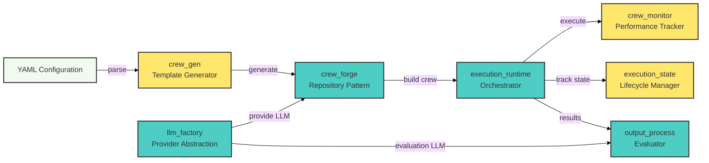
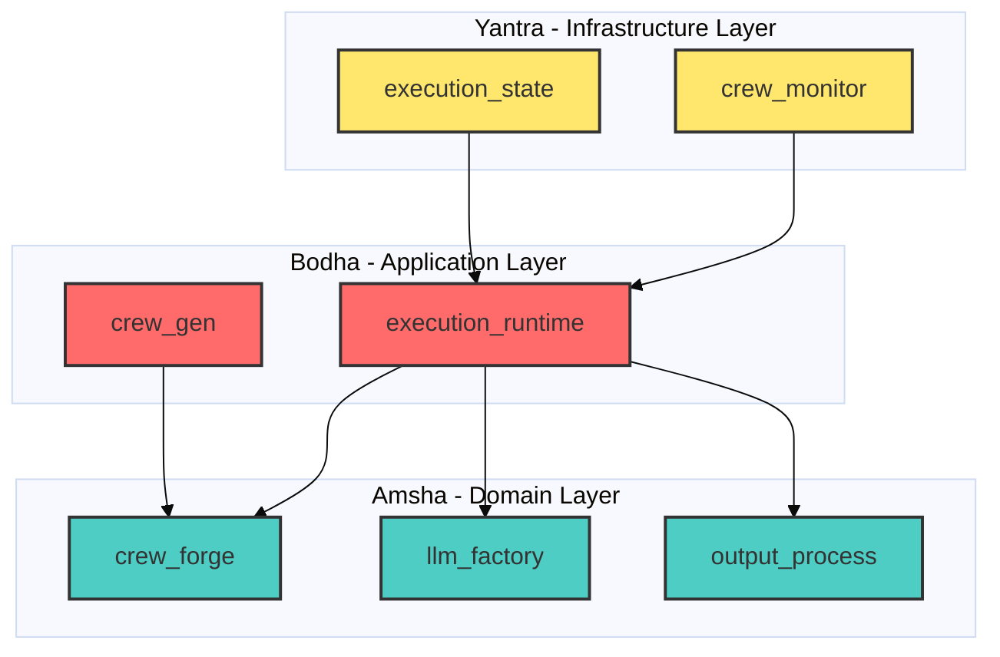

# Cross-Module Analysis - Module Interactions

## Overview
This document analyzes how the core modules of the Amsha project interact to form a cohesive multi-agent orchestration system.

---

## 1. Module Interaction Matrix

### Table 1.1: Direct Dependencies

| Source Module | Target Module | Interaction Type | Purpose |
|:--------------|:--------------|:-----------------|:--------|
| `crew_forge` | `llm_factory` | Service Dependency | Retrieves LLM instances for agent instantiation |
| `crew_forge` | `execution_runtime` | Orchestration | Passes constructed crews to runtime executor |
| `execution_runtime` | `crew_monitor` | Instrumentation | Monitors crew execution performance |
| `execution_runtime` | `execution_state` | State Management | Tracks execution lifecycle |
| `output_process` | `llm_factory` | Service Dependency | Uses evaluation LLM for grading |
| `crew_gen` | `crew_forge` | Data Flow | Generates YAML configs consumed by crew builder |

**Total Interactions:** 6 direct dependencies

---

## 2. Data Flow Diagram

**Caption:** Figure 2.1 - System-wide data flow showing how modules collaborate to execute and evaluate multi-agent workflows.

---

## 3. Architectural Layers

The Amsha system follows a 3-tier architecture inspired by Clean Architecture principles:

### Layer 1: Domain/Core (Amsha  Layer)
- **Modules:** `crew_forge`, `llm_factory`, `output_process`
- **Responsibility:** Business logic, algorithms, domain models
- **Dependencies:** None (pure domain logic)

### Layer 2: Application/Services (Bodha Layer)
- **Modules:** `execution_runtime`, `crew_gen`
- **Responsibility:** Use case orchestration, workflow management
- **Dependencies:** Depends on Domain layer

### Layer 3: Infrastructure/Adapters (Yantra Layer)
- **Modules:** `crew_monitor`, `execution_state`
- **Responsibility:** Technical concerns (monitoring, state persistence)
- **Dependencies:** Depends on Domain and Application layers

**Caption:** Figure 3.1 - Three-tier architecture showing layer separation and dependency flow (always domain ← application ← infrastructure).

---

## 4. Interface Contracts

### Table 4.1: Key Interface Protocols

| Module | Interface/Protocol | Purpose | Implementing Classes |
|:-------|:-------------------|:--------|:---------------------|
| `crew_forge` | `IRepository` | Generic data access abstraction | `MongoRepository`, `AgentRepository`, `TaskRepository` |
| `crew_forge` | `IAgentRepository` | Agent-specific operations | `AgentRepository` |
| `crew_forge` | `ITaskRepository` | Task-specific operations | `TaskRepository` |
| `llm_factory` | `LLMBuilder` | Factory for LLM instantiation | Cloud/Local providers |
| `crew_monitor` | `CrewPerformanceMonitor` | Performance tracking interface | CPU/GPU monitors |

**Total Protocols:** 5

**Design Principle:** Protocol-based design enables dependency inversion and testability.

---

## 5. Shared State Management

### Stateful Modules

| Module | State Type | Persistence | Scope |
|:-------|:-----------|:------------|:------|
| `execution_state` | Execution lifecycle | In-memory/File | Per crew execution |
| `crew_monitor` | Performance metrics | Transient | Per execution session |
| `crew_forge` | Agent/Task repository | MongoDB | Global (cross-execution) |
| `llm_factory` | Configuration cache | In-memory | Application lifetime |

**State Isolation:** Each module manages its own state with clear boundaries.

---

## 6. Communication Patterns

### Pattern 1: Dependency Injection
**Used by:** `crew_forge`, `llm_factory`  
**Benefit:** Loose coupling, testability  
**Example:** `CrewForgeContainer` injects repository implementations

### Pattern 2: Factory Pattern
**Used by:** `llm_factory`, `crew_forge`  
**Benefit:** Abstraction over provider selection  
**Example:** `LLMBuilder` creates provider-specific LLMs

### Pattern 3: Observer Pattern (Implicit)
**Used by:** `crew_monitor`  
**Benefit:** Performance tracking without coupling  
**Example:** Monitor observes runtime events without direct dependency

---

## Summary

**Total Modules Analyzed:** 7  
**Direct Interactions:** 6  
**Shared Protocols:** 5  
**Architectural Layers:** 3 (Amsha, Bodha, Yantra)

The Amsha system demonstrates strong architectural discipline with clear separation of concerns and protocol-based contracts enabling teemStability and extensibility.
