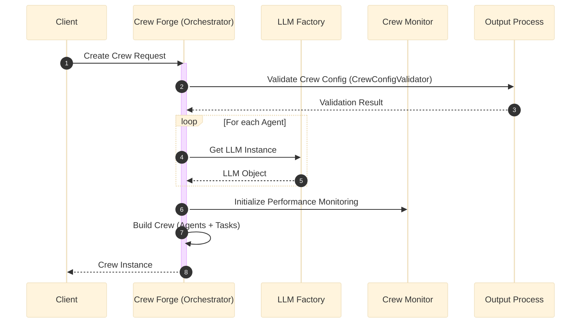

# Module Interactions Analysis

## 1. Overview of Interactions

The Amsha system follows a **hub-and-spoke** interaction model where `crew_forge` acts as the central orchestrator, coordinating services from specialized modules like `llm_factory`, `crew_monitor`, and `output_process`.

## 2. Interaction Flows

### 2.1 Crew Creation and Execution Flow

The primary workflow involves `crew_forge` assembling a crew. It requests LLM instances from `llm_factory`, initializes monitoring via `crew_monitor`, and validates configurations using `output_process`.

## 3. Data Flow Analysis

| Source Module | Target Module | Data Transferred | Mechanism |
|:---|:---|:---|:---|
| `crew_forge` | `llm_factory` | Configuration (Model Type, API Key) | Function Call |
| `llm_factory` | `crew_forge` | LLM Instance (LCD/LangChain object) | Return Value |
| `crew_forge` | `output_process` | Raw JSON/YAML Config | Function Call |
| `output_process` | `crew_forge` | Validation Status, Cleaned JSON | Return Value |
| `crew_forge` | `crew_monitor` | Task Execution Events | Event/Callback |

## 4. Key Findings

- **Centralized Orchestration**: `crew_forge` is the heavy lifter, containing most of the business logic for coordination.
- **Service Delegation**: Specialized tasks (validation, monitoring, LLM creation) are strictly delegated to peripheral modules.
- **Synchronous Communication**: Most interactions appear to be synchronous method calls, implying tight coupling during the execution phase.
