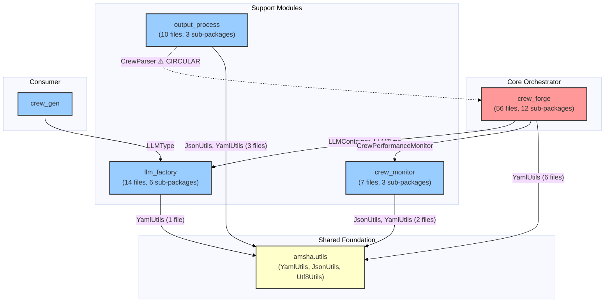
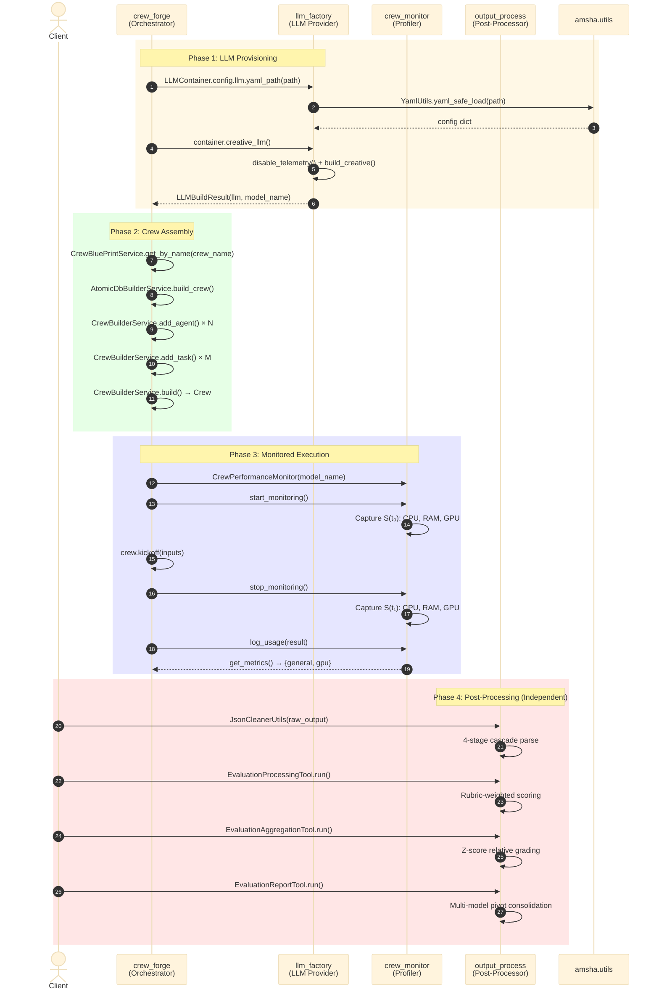

# Cross-Module Interactions Analysis

## 1. Overview

The Amsha framework follows a **hub-and-spoke** interaction model with `crew_forge` as the central orchestrator. This document traces every cross-module import at code level, mapping exact files, lines, and data flows across the 4 analyzed modules plus shared utilities.

---

## 2. Complete Import Dependency Graph

---

## 3. Code-Verified Import Registry

Every cross-module import traced to exact file and line:

### 3.1 crew_forge → llm_factory

| Source File | Import | Line |
|:---|:---|:---:|
| [amsha_crew_db_application.py](file:///home/dell/PycharmProjects/Amsha/src/nikhil/amsha/crew_forge/orchestrator/db/amsha_crew_db_application.py) | `LLMContainer` | L7 |
| [amsha_crew_db_application.py](file:///home/dell/PycharmProjects/Amsha/src/nikhil/amsha/crew_forge/orchestrator/db/amsha_crew_db_application.py) | `LLMType` | L8 |
| [amsha_crew_file_application.py](file:///home/dell/PycharmProjects/Amsha/src/nikhil/amsha/crew_forge/orchestrator/file/amsha_crew_file_application.py) | `LLMContainer` | L7 |
| [amsha_crew_file_application.py](file:///home/dell/PycharmProjects/Amsha/src/nikhil/amsha/crew_forge/orchestrator/file/amsha_crew_file_application.py) | `LLMType` | L8 |

### 3.2 crew_forge → crew_monitor

| Source File | Import | Line |
|:---|:---|:---:|
| [db_crew_orchestrator.py](file:///home/dell/PycharmProjects/Amsha/src/nikhil/amsha/crew_forge/orchestrator/db/db_crew_orchestrator.py) | `CrewPerformanceMonitor` | L5 |
| [file_crew_orchestrator.py](file:///home/dell/PycharmProjects/Amsha/src/nikhil/amsha/crew_forge/orchestrator/file/file_crew_orchestrator.py) | `CrewPerformanceMonitor` | L5 |

### 3.3 output_process → crew_forge ⚠️ CIRCULAR

| Source File | Import | Line |
|:---|:---|:---:|
| [crew_validator.py](file:///home/dell/PycharmProjects/Amsha/src/nikhil/amsha/output_process/validation/crew_validator.py) | `CrewParser` | L7 |

### 3.4 crew_gen → llm_factory

| Source File | Import | Line |
|:---|:---|:---:|
| [crew_gen_app.py](file:///home/dell/PycharmProjects/Amsha/src/nikhil/amsha/crew_gen/application/crew_gen_app.py) | `LLMType` | L4 |
| [designer_crew_app.py](file:///home/dell/PycharmProjects/Amsha/src/nikhil/amsha/crew_gen/units/designer/designer_crew_app.py) | `LLMType` | L4 |

### 3.5 All Modules → amsha.utils

| Module | Utility | Files Using |
|:---|:---|:---|
| crew_forge | `YamlUtils` | 6 files (orchestrator apps, parsers, sync manager) |
| llm_factory | `YamlUtils` | 1 file (llm_container.py) |
| crew_monitor | `JsonUtils`, `YamlUtils` | 2 files (contribution_analyzer, reporting_tool) |
| output_process | `JsonUtils`, `YamlUtils` | 3 files (all evaluation tools) |

---

## 4. Full Execution Lifecycle Sequence

---

## 5. Data Flow Matrix (Code-Verified)

| Source → Target | Data Type | Mechanism | Code Reference |
|:---|:---|:---|:---|
| `crew_forge` → `llm_factory` | YAML path (str) | Container config inject | `LLMContainer.config.llm.yaml_path.from_value()` |
| `llm_factory` → `crew_forge` | `LLMBuildResult` (LLM + name) | Return value | `container.creative_llm()` |
| `crew_forge` → `crew_monitor` | model_name (str) | Constructor arg | `CrewPerformanceMonitor(model_name)` |
| `crew_monitor` → `crew_forge` | metrics dict | Return value | `monitor.get_metrics()` |
| `output_process` → `crew_forge` | None (imports only) | Static import | `from crew_forge...CrewParser` |
| All → `amsha.utils` | file paths, configs | Static utility calls | `YamlUtils.yaml_safe_load()`, `JsonUtils.*` |

---

## 6. Key Findings

1. **Strict Hub-and-Spoke:** `crew_forge` imports from `llm_factory` (4 imports) and `crew_monitor` (2 imports) — never the reverse. Clean unidirectional dependency.
2. **One Architectural Violation:** `output_process` → `crew_forge` creates a **circular dependency** via `CrewParser` import.
3. **Shared Foundation:** `amsha.utils` is the implicit shared layer — used by all 4 modules (12+ import sites).
4. **Loosely Coupled Post-Processing:** `output_process` evaluation tools operate **independently** of the execution pipeline — they consume filesystem artifacts, not runtime objects.
5. **Type-Only Coupling:** `crew_gen` depends on `llm_factory` only for the `LLMType` enum — minimal coupling.
