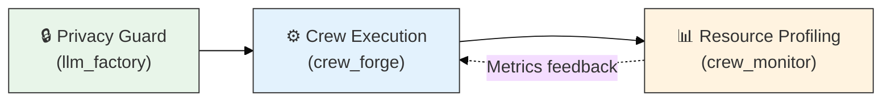

# Cross-Module Novelty Analysis

## 1. System-Level Innovation Assessment

**Overall System Novelty:** **MODERATE-HIGH**
**Confidence:** HIGH

The Amsha framework's novelty emerges from the **composition** of individually moderate contributions into a **cohesive system** that addresses an under-explored niche: **engineering-rigorous Multi-Agent System (MAS) orchestration** with built-in observability, privacy, and evaluation fairness.

---

## 2. System-Level Innovations

### 2.1 Dual-State Orchestration Engine

- **Claim:** A single framework supports both **YAML-file** and **MongoDB-database** backends for crew configuration with zero client code changes.
- **Evidence (Code-Verified):**
  - [AmshaCrewFileApplication](file:///home/dell/PycharmProjects/Amsha/src/nikhil/amsha/crew_forge/orchestrator/file/amsha_crew_file_application.py) — File backend
  - [AmshaCrewDBApplication](file:///home/dell/PycharmProjects/Amsha/src/nikhil/amsha/crew_forge/orchestrator/db/amsha_crew_db_application.py) — DB backend
  - [DatabaseSeeder](file:///home/dell/PycharmProjects/Amsha/src/nikhil/amsha/crew_forge/seeding/database_seeder.py) — Idempotent YAML→DB sync
- **Differentiation:**
  - **CrewAI:** YAML-only config, no database backend
  - **AutoGen:** Code-only config, no file/DB abstraction
  - **Amsha:** Both backends with idempotent sync between them
- **Novelty:** ⭐⭐⭐ (Moderate-High)

### 2.2 Privacy-First Multi-Provider LLM Factory

- **Claim:** Unified factory creates LLMs for 6+ providers (Cloud + Local) with **dual-layer privacy enforcement** (env variable + reflection-based telemetry neutralization), all via YAML config.
- **Evidence (Code-Verified):**
  - [LLMBuilder.build()](file:///home/dell/PycharmProjects/Amsha/src/nikhil/amsha/llm_factory/service/llm_builder.py#L15-L48) — Conditional cloud/local branching
  - [LLMUtils.disable_telemetry()](file:///home/dell/PycharmProjects/Amsha/src/nikhil/amsha/llm_factory/utils/llm_utils.py#L16-L24) — Reflection-based privacy
- **Differentiation:**
  - **LangChain:** Different client classes per provider
  - **Standard approach:** Environment variable only (single layer)
  - **Amsha:** One class, `base_url` branching + dual-layer privacy
- **Novelty:** ⭐⭐⭐ (Moderate-High)

### 2.3 Integrated Physical-Logical Observability

- **Claim:** Simultaneous tracking of **physical resources** (CPU%, RAM, GPU VRAM) and **logical units** (tokens, features) in a single monitoring session, enabling cross-dimensional metrics like "VRAM per kToken".
- **Evidence (Code-Verified):**
  - [CrewPerformanceMonitor](file:///home/dell/PycharmProjects/Amsha/src/nikhil/amsha/crew_monitor/service/crew_performance_monitor.py) — Sandwich profiler
  - [ContributionAnalyzer](file:///home/dell/PycharmProjects/Amsha/src/nikhil/amsha/crew_monitor/service/contribution_analyzer.py) — Feature consensus $P(F) = |C_F|/N$
- **Differentiation:**
  - **MLflow:** Training-time metrics, not inference
  - **CrewAI:** Token counts only
  - **Amsha:** Physical + Logical + Consensus in one system
- **Novelty:** ⭐⭐⭐ (Moderate-High)

### 2.4 Psychometric Evaluation Pipeline

- **Claim:** Raw LLM outputs undergo a **4-stage pipeline** — cascading JSON sanitization → rubric-weighted scoring → Z-score relative grading → multi-model consensus consolidation — applying psychometric principles to AI evaluation.
- **Evidence (Code-Verified):**
  - [JsonCleanerUtils](file:///home/dell/PycharmProjects/Amsha/src/nikhil/amsha/output_process/optimization/json_cleaner_utils.py) — 4-stage cascade
  - [EvaluationProcessingTool](file:///home/dell/PycharmProjects/Amsha/src/nikhil/amsha/output_process/evaluation/evaluation_processing_tool.py) — Rubric scoring
  - [EvaluationAggregationTool](file:///home/dell/PycharmProjects/Amsha/src/nikhil/amsha/output_process/evaluation/evaluation_aggregate_tool.py) — Z-score grading
  - [EvaluationReportTool](file:///home/dell/PycharmProjects/Amsha/src/nikhil/amsha/output_process/evaluation/evaluation_report_tool.py) — Multi-model pivot
- **Differentiation:**
  - **LLM benchmarks (MMLU):** Absolute thresholds
  - **Amsha:** Population-relative Z-score grading — ranking preserved even under biased judges
- **Novelty:** ⭐⭐⭐ (Moderate-High)

---

## 3. Synergistic (Cross-Module) Contributions

### 3.1 Privacy-Guarded Monitored Execution

The integration of `llm_factory` (privacy) → `crew_forge` (orchestration) → `crew_monitor` (profiling) creates a unique system property:

$$
\texttt{System} = \texttt{Privacy}(\texttt{Monitor}(\texttt{Execute}(\texttt{Build}(config))))
$$

**No telemetry leaks** during **fully profiled** execution — a property no individual module provides alone.



### 3.2 End-to-End Evaluation Pipeline

The connection from `crew_forge` (execution) → raw output → `output_process` (4-stage pipeline) creates a complete **Build → Execute → Evaluate** lifecycle:

| Stage | Module | Algorithm |
|:---:|:---|:---|
| 1 | crew_forge | Blueprint materialization → Crew assembly → Monitored execution |
| 2 | output_process | JSON sanitization (4-stage cascade) |
| 3 | output_process | Rubric-weighted scoring ($F\% = \sum S_w / S_{max}$) |
| 4 | output_process | Z-score relative grading ($G = f(\mu, \sigma)$) |
| 5 | output_process | Multi-model pivot consolidation |

### 3.3 Config-as-Code Universality

**Every module** uses YAML-driven configuration, creating a consistent developer experience:

```
llm_config.yaml → LLM provisioning
crew YAML files → Agent/Task definitions
analysis config → Contribution analysis jobs
evaluation config → Scoring/grading jobs
```

This universality means a single `srotas.yaml` master config can potentially drive the entire framework.

---

## 4. Comparative Advantage

| Feature | Amsha | CrewAI | LangChain | AutoGen |
|:---|:---|:---|:---|:---|
| **Backend** | Hybrid File+DB | File only | Code only | Code only |
| **LLM Switching** | Zero-code (YAML) | Partial | Different classes | Config dicts |
| **Privacy** | Dual-layer (env + reflection) | None built-in | None | None |
| **Monitoring** | Physical+Logical+Consensus | Token counts | Callbacks | Conversation log |
| **Evaluation** | Z-score relative + multi-judge | None built-in | None | None |
| **JSON Recovery** | 4-stage cascade | None | OutputParser | None |
| **Architecture** | Clean Arch + DI | Monolithic | Library | Framework |
| **Config Sync** | Idempotent YAML↔DB | N/A | N/A | N/A |

---

## 5. Aggregate Novelty Metrics

### Per-Module Contribution Summary

| Module | Contributions | Top Novelty | Algorithms | Patterns | Gaps |
|:---|:---:|:---:|:---:|:---:|:---:|
| crew_forge | 5 | ⭐⭐⭐½ (MOD-HIGH) | 8 | 9 | 14 |
| llm_factory | 4 | ⭐⭐⭐ (MODERATE) | 6 | 6 | 11 |
| crew_monitor | 4 | ⭐⭐⭐ (MODERATE) | 7 | 7 | 10 |
| output_process | 5 | ⭐⭐⭐ (MODERATE) | 7 | 8 | 10 |
| **System Total** | **18** | **⭐⭐⭐½ (MOD-HIGH)** | **28** | **30** | **45** |

### System-Level Innovation Matrix

| # | System Innovation | Modules Involved | Novelty |
|---|:---|:---|:---:|
| 1 | Dual-State Orchestration | crew_forge | ⭐⭐⭐ |
| 2 | Privacy-First Multi-Provider Factory | llm_factory | ⭐⭐⭐ |
| 3 | Physical-Logical Observability | crew_monitor + crew_forge | ⭐⭐⭐ |
| 4 | Psychometric Evaluation Pipeline | output_process | ⭐⭐⭐ |
| 5 | Privacy-Guarded Monitored Execution | llm_factory + crew_forge + crew_monitor | ⭐⭐⭐½ |
| 6 | End-to-End Build-Execute-Evaluate | crew_forge + output_process | ⭐⭐⭐ |
| 7 | Config-as-Code Universality | All 4 modules | ⭐⭐ |

---

## 6. Publication Strategy

### Recommended System-Level Paper Titles
1. *"Amsha: A Privacy-First, Engineering-Rigorous Framework for Multi-Agent LLM Orchestration"*
2. *"From Prompt Engineering to Agent Systems Engineering: Architectural Patterns for Reliable MAS"*
3. *"Structure-First GenAI: A Modular Monolith Approach to Multi-Agent System Design"*

### Target Venues
| Venue | Focus Area | Best Contribution |
|:---|:---|:---|
| AAAI (Safety/Privacy) | Privacy-first LLM systems | Innovations 2, 5 |
| ACM TIST | Intelligent systems | Full system paper |
| EMNLP (Eval track) | LLM evaluation methodology | Innovation 4 |
| MLSys | Systems for ML | Innovations 1, 3 |
| SPE Journal | Software engineering patterns | Innovation 7 |

---

## 7. Conclusion

The Amsha framework's novelty is **greater than the sum of its parts**. While individual module contributions are MODERATE, their compositional synergy — privacy-guarded execution with integrated profiling, config-as-code universality, and psychometric evaluation — creates a system-level innovation rated **MODERATE-HIGH**. The framework demonstrates how **Software Engineering rigor** (Clean Architecture, DI, YAML config, Pydantic validation) can be systematically applied to the typically experimental field of GenAI, producing a blueprint for **enterprise-grade, privacy-first, scientifically evaluable** multi-agent systems.
