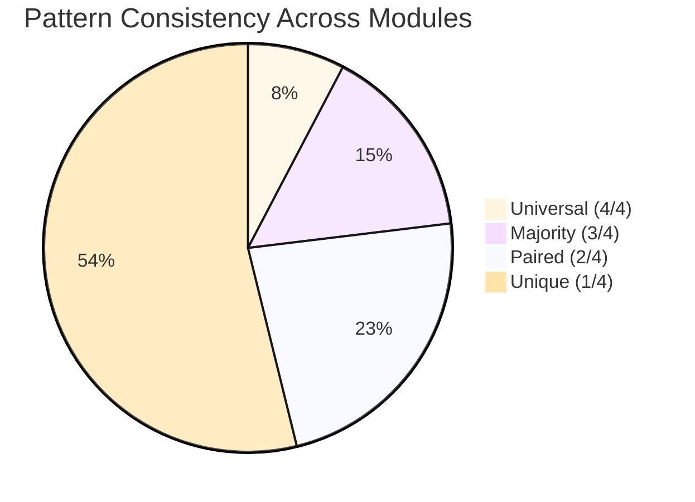
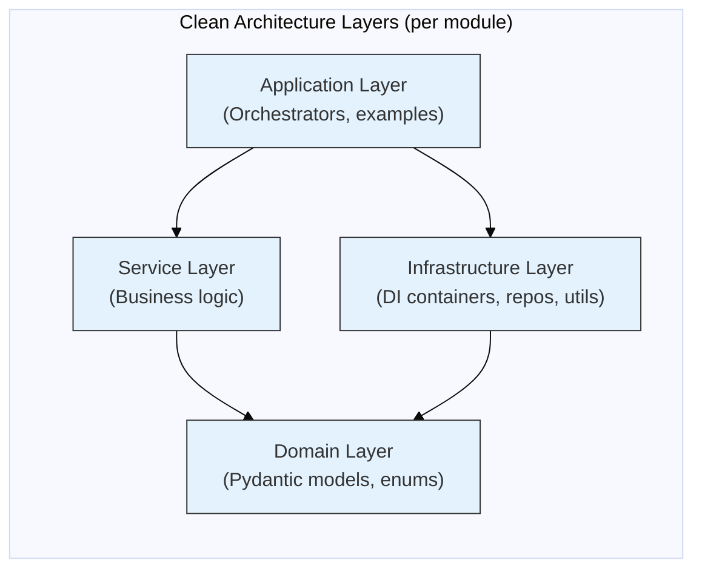

# Cross-Module Architectural Patterns Analysis

## 1. Overview

This document synthesizes the design patterns observed across all 4 analyzed modules (`crew_forge`, `llm_factory`, `crew_monitor`, `output_process`), identifying **system-wide patterns**, **consistency**, **unique per-module patterns**, and **the architectural style** of the Amsha framework.

---

## 2. System-Wide Pattern Catalog

### Pattern Frequency Matrix

| Pattern | crew_forge | llm_factory | crew_monitor | output_process | Total |
|:---|:---:|:---:|:---:|:---:|:---:|
| Configuration Object (YAML) | ✅ | ✅ | ✅ | ✅ | **4/4** |
| Batch Processor | ✅ | — | ✅ | ✅ | **3/4** |
| Dependency Injection | ✅ | ✅ | — | — | **2/4** |
| Builder/Factory | ✅ | ✅ | — | — | **2/4** |
| Repository | ✅ | — | — | — | **1/4** |
| Sandwich Profiler | — | — | ✅ | — | **1/4** |
| Cascading Parser | — | — | — | ✅ | **1/4** |
| Pivot Table | — | — | ✅ | ✅ | **2/4** |
| Statistical Strategy | — | — | — | ✅ | **1/4** |
| Monkey Patching | — | ✅ | — | — | **1/4** |
| Graceful Degradation | — | — | ✅ | — | **1/4** |

---

## 3. Universal Patterns (4/4 Modules)

### 3.1 Configuration Object Pattern

**Every module** externalizes job parameters to YAML configuration files. Zero code changes are needed to add new jobs, switch providers, or modify parameters.

| Module | Config Source | Code Reference |
|:---|:---|:---|
| crew_forge | Agent/Task YAML files + MongoDB | [crew_parser.py](file:///home/dell/PycharmProjects/Amsha/src/nikhil/amsha/crew_forge/seeding/parser/crew_parser.py) |
| llm_factory | `llm_config.yaml` | [llm_settings.py](file:///home/dell/PycharmProjects/Amsha/src/nikhil/amsha/llm_factory/settings/llm_settings.py) |
| crew_monitor | Analysis job YAML | [contribution_analyzer.py:L18](file:///home/dell/PycharmProjects/Amsha/src/nikhil/amsha/crew_monitor/service/contribution_analyzer.py#L18) |
| output_process | Evaluation job YAML | [evaluation_processing_tool.py:L14](file:///home/dell/PycharmProjects/Amsha/src/nikhil/amsha/output_process/evaluation/evaluation_processing_tool.py#L14) |

**Consistency:** High — identical pattern (`YamlUtils.yaml_safe_load(config_path)`) used in all modules.

---

## 4. Majority Patterns (3/4 Modules)

### 4.1 Batch Processor Pattern

Config-driven sequential job execution where each "job" is an independent unit defined in YAML.

| Module | Entry Point | Job Key |
|:---|:---|:---|
| crew_forge | `DatabaseSeeder.seed_all()` | `os.walk()` directory traversal |
| crew_monitor | `ContributionAnalyzer.run()` | `analyze_contributions` |
| output_process | `EvaluationProcessingTool.run_evaluations()` | `evaluations` |

### 4.2 Pydantic Domain Modeling

| Module | Models | Schema Strictness |
|:---|:---:|:---|
| crew_forge | 6 | Request/Response pairs with validation |
| llm_factory | 4 | Typed config with defaults |
| crew_monitor | 3 | `GPUMetrics`, `GeneralMetrics`, `PerformanceMetrics` |
| output_process | 0 ⚠️ | Uses raw dicts — missing opportunity |

---

## 5. Paired Patterns (2/4 Modules)

### 5.1 Dependency Injection Container

| Module | Container | Strategy | Pre-wired? |
|:---|:---|:---|:---:|
| crew_forge | `CrewForgeContainer` + `MongoRepoContainer` | Singleton + Factory | No |
| llm_factory | `LLMContainer` | Singleton + Factory | **Yes** (`creative_llm`, `evaluation_llm`) |

### 5.2 Dual-Backend Strategy

| Module | Backend A | Backend B | Switch Mechanism |
|:---|:---|:---|:---|
| crew_forge | YAML files | MongoDB | `FileCrewOrchestrator` vs `DbCrewOrchestrator` |
| llm_factory | Cloud SaaS | Local LM Studio | `base_url` presence/absence |

### 5.3 Pivot Table Pattern

| Module | Implementation | Input → Output |
|:---|:---|:---|
| crew_monitor | `ReportingTool._combine_reports()` | Excel files → cross-report matrix |
| output_process | `EvaluationReportTool._generate_evaluation_report()` | JSON evaluations → gen_model × eval_model matrix |

---

## 6. Unique Per-Module Patterns

| Pattern | Module | Significance |
|:---|:---|:---|
| Blueprint Materialization | crew_forge | Master config defines crew topology → atomic crews |
| Idempotent Config Sync | crew_forge | YAML-to-DB synchronization with upsert semantics |
| Reflective Monkey Patching | llm_factory | Runtime telemetry neutralization via reflection |
| Sandwich Profiler | crew_monitor | Pre/post execution resource capture |
| Graceful Degradation | crew_monitor | Optional GPU monitoring via conditional import |
| Cascading Parser (4-stage) | output_process | Progressive JSON recovery from LLM noise |
| Z-Score Grading | output_process | Psychometric relative evaluation |

---

## 7. Pattern Consistency Assessment

| Consistency Level | Count | Examples |
|:---|:---:|:---|
| Universal (4/4) | 1 | Configuration Object |
| Majority (3/4) | 2 | Batch Processor, Pydantic Modeling |
| Paired (2/4) | 3 | DI Container, Dual-Backend, Pivot Table |
| Unique (1/4) | 7 | Sandwich Profiler, Cascading Parser, etc. |

**Interpretation:** The system has **strong consistency** in configuration management (universal YAML pattern) with **rich specialization** in domain-specific patterns. Each module contributes unique patterns suited to its domain.

---

## 8. Anti-Pattern Detection

| Anti-Pattern | Module | Evidence | Severity |
|:---|:---|:---|:---|
| Circular Dependency | output_process → crew_forge | `CrewParser` import | Moderate |
| Code Duplication | output_process | `_apply_relative_grading()` in 2 files | Minor |
| Unused Schema | crew_monitor | `PerformanceMetrics` defined but never used | Minor |
| Missing Import | output_process | `JsonUtils` used but not imported (2 files) | High (Bug) |

---

## 9. Architectural Style

The project follows a **Modular Monolith** with **Clean Architecture** tendencies:

**Evidence:**
- Domain models are dependency-free (`state.py`, `schemas.py`, `agent_data.py`)
- Services depend inward on domain, never on infrastructure
- DI containers wire everything at the application boundary
- Orchestrators compose services at the highest layer
