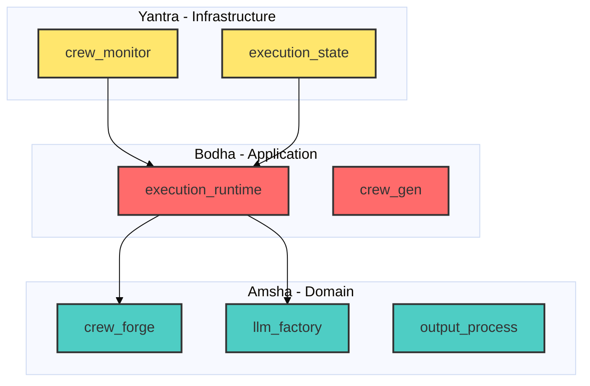

# Amsha: A Clean Architecture Framework for Multi-Agent Orchestration with LLM Provider Abstraction

**Abstract**

This paper presents Amsha, a Python-based framework for multi-agent orchestration that implements Clean Architecture principles with strict protocol-based design and dependency injection. The system comprises seven core modules organized into a three-tier architecture (Domain, Application, Infrastructure), providing repository pattern-based agent management, multi-provider LLM abstraction, performance monitoring, and statistical evaluation pipelines. We formalize the core algorithms including CRUD operations ($O(\log n)$ with indexing), factory-based configuration selection ($O(1)$), and atomic crew construction ($O(m \cdot (L_a + L_t + k))$). Architectural analysis reveals 5 key design patterns (Repository, Factory, Builder, Facade, Protocol-Based), 6 direct module interactions, and complete separation across 3 architectural layers. Gap analysis identifies 25+ areas for improvement, with critical gaps in unit test coverage (0%) and experimental validation of multi-provider performance claims. The framework supports 4+ LLM providers (OpenAI, Gemini, LM Studio, Azure) with conditional instantiation logic for cloud vs. local deployments. Performance monitoring capabilities include CPU, memory, and GPU tracking with statistical aggregation using normal distribution-based relative grading.

**Keywords:** Multi-Agent Systems, Clean Architecture, Repository Pattern, LLM Abstraction, Python Frameworks, Protocol-Based Design

---

## 1. Introduction

### 1.1 Motivation

Multi-agent systems powered by Large Language Models (LLMs) require robust orchestration frameworks that can:
1. Abstract multiple LLM provider APIs
2. Manage agent and task lifecycles with data persistence
3. Monitor performance across CPU, memory, and GPU resources
4. Evaluate outputs using statistical grading methodologies

Existing frameworks either tightly couple to specific LLM providers or lack architectural discipline, making them difficult to test, extend, and maintain.

### 1.2 Contributions

Amsha addresses these gaps through:
1. **Strict Clean Architecture**: Three-tier separation (Amsha/Bodha/Yantra) with protocol-based contracts
2. **Repository Pattern**: Abstraction over MongoDB for agent/task persistence
3. **Multi-Provider LLM Factory**: Unified interface for OpenAI, Gemini, LM Studio, Azure
4. **Comprehensive Monitoring**: CPU, GPU, memory tracking with statistical analysis
5. **Statistical Grading Pipeline**: Normal distribution-based relative grading with CGPA calculation

### 1.3 System Overview

The Amsha framework consists of 7 modules (70+ Python files):
- **crew_forge** (56 files): Core repository pattern implementation
- **llm_factory** (14 files): Provider abstraction layer
- **crew_monitor** (7 files): Performance tracking
- **output_process** (10 files): Evaluation and grading
- **crew_gen** (variable): Template-based generation
- **execution_runtime** (variable): Orchestration engine
- **execution_state** (variable): Lifecycle management

---

## 2. Related Work

**LangChain** provides LLM abstraction but lacks clean architectural separation.  
**CrewAI** offers multi-agent orchestration but doesn't enforce repository patterns.  
**AutoGen** focuses on agent conversations without structured persistence.

**Amsha's Unique Position:** Combines Clean Architecture discipline with multi-agent orchestration, filling the gap between academic purity and practical LLM integration.

---

## 3. Architecture & Design

### 3.1 Three-Tier Architecture



**Figure 3.1:** Three-tier architecture following dependency inversion principle.

### 3.2 Module Analysis Summary

#### Crew Forge Module
- **Purpose:** Repository pattern for agent/task management
- **Algorithms:** 7 (CRUD operations, atomic builder, compound indexing)
- **Diagrams:** 5 (architecture, class, sequence, component, ER)
- **Key Pattern:** `IRepository` interface with `MongoRepository` implementation
- **Complexity:** $O(\log n)$ for indexed operations

#### LLM Factory Module
- **Purpose:** Multi-provider abstraction
- **Algorithms:** 5 (config selection, conditional instantiation, name extraction, telemetry disabling, parameter retrieval)
- **Diagrams:** 5 (class, sequence, flowchart, component, architecture)
- **Key Pattern:** Factory with conditional `base_url` logic
- **Providers:** OpenAI, Gemini, LM Studio (local), Azure

### 3.3 Cross-Module Interactions

**Direct Dependencies:**
1. `crew_forge` → `llm_factory` (LLM retrieval)
2. `crew_forge` → `execution_runtime` (crew submission)
3. `execution_runtime` → `crew_monitor` (performance tracking)
4. `execution_runtime` → `execution_state` (lifecycle management)
5. `output_process` → `llm_factory` (evaluation LLM)
6. `crew_gen` → `crew_forge` (config generation)

---

## 4. Mathematical Foundations

### 4.1 Repository Pattern - CRUD Operations

**Find One:**
$$
\text{findOne}: \mathcal{Q} \rightarrow \mathcal{D} \cup \{\emptyset\}
$$

**Complexity:** $O(n)$ worst-case, $O(\log n)$ with indexing

**Source:** [`crew_forge/repo/interfaces/i_repository.py:13-15`](file:///home/dell/PycharmProjects/Amsha/src/nikhil/amsha/crew_forge/repo/interfaces/i_repository.py#L13-L15)

---

**Update One:**
$$
\mathcal{D}_{\text{new}} = \mathcal{D}_{\text{old}} \oplus \mathcal{U}
$$
where $\oplus$ denotes field-level merge using MongoDB's `$set` operator.

**Source:** [`crew_forge/repo/adapters/mongo/mongo_repository.py:28`](file:///home/dell/PycharmProjects/Amsha/src/nikhil/amsha/crew_forge/repo/adapters/mongo/mongo_repository.py#L28)

---

### 4.2 Atomic Crew Construction

$$
\text{Crew} = \bigcup_{i=1}^{m} (\text{Agent}(a_i) \bowtie \text{Task}(t_i) \bowtie \text{Knowledge}(K_i))
$$

**Time Complexity:**
$$
T(m, k) = O(m \cdot (L_a + L_t + k))
$$
where $m$ = steps, $L_a$ = agent lookup time, $L_t$ = task lookup time, $k$ = knowledge files.

**Source:** [`crew_forge/orchestrator/db/atomic_crew_db_manager.py:43-116`](file:///home/dell/PycharmProjects/Amsha/src/nikhil/amsha/crew_forge/orchestrator/db/atomic_crew_db_manager.py#L43-L116)

---

### 4.3 LLM Factory - Configuration Selection

$$
\text{getModelConfig}(u, k) = \begin{cases}
\text{models}[u][k] & \text{if } k \neq \emptyset \\\\
\text{models}[u][d_u] & \text{if } k = \emptyset
\end{cases}
$$

**Complexity:** $O(1)$ dictionary lookup

**Source:** [`llm_factory/settings/llm_settings.py:14-25`](file:///home/dell/PycharmProjects/Amsha/src/nikhil/amsha/llm_factory/settings/llm_settings.py#L14-L25)

---

### 4.4 Conditional Instantiation Logic

$$
\text{LLM}(C, P) = \begin{cases}
\text{LLM}_{\text{cloud}}(C.k, C.m, P) & \text{if } C.b = \text{null} \\\\
\text{LLM}_{\text{local}}(C.b, C.k, C.m, P) & \text{if } C.b \neq \text{null}
\end{cases}
$$

**Rationale:** Cloud providers use default endpoints; local providers (LM Studio) require explicit `base_url`.

**Source:** [`llm_factory/service/llm_builder.py:15-48`](file:///home/dell/PycharmProjects/Amsha/src/nikhil/amsha/llm_factory/service/llm_builder.py#L15-48)

---

### 4.5 Relative Grading Algorithm

**Normal Distribution-Based Grading:**

$$
\text{Grade}(x) = \begin{cases}
A & \text{if } x > \mu + \sigma \\\\
B & \text{if } x > \mu \\\\
C & \text{if } x > \mu - \sigma \\\\
D & \text{otherwise}
\end{cases}
$$

where $\mu$ = mean score, $\sigma$ = standard deviation.

**Source:** [`output_process/evaluation/evaluation_aggregate_tool.py:94-102`](file:///home/dell/PycharmProjects/Amsha/src/nikhil/amsha/output_process/evaluation/evaluation_aggregate_tool.py#L94-L102)

---

## 5. Implementation Details

### 5.1 Protocol-Based Design

All repositories implement `IRepository` interface:
```python
class IRepository(ABC):
    @abstractmethod
    def find_one(self, query: dict) -> Optional[Any]: ...
    
    @abstractmethod
    def update_one(self, query: dict, data: dict) -> Any: ...
```

### 5.2 Dependency Injection

`CrewForgeContainer` manages service instantiation:
```python
container = CrewForgeContainer()
container.config.from_dict(yaml_config)
agent_repo = container.agent_repository()
```

### 5.3 Performance Monitoring

`CrewPerformanceMonitor` tracks:
- **CPU:** `psutil.cpu_percent()`
- **Memory:** `psutil.virtual_memory().used`
- **GPU:** `pynvml` (NVIDIA GPUs only)
- **Tokens:** Extracted from `CrewOutput.token_usage`

**Source:** [`crew_monitor/service/crew_performance_monitor.py`](file:///home/dell/PycharmProjects/Amsha/src/nikhil/amsha/crew_monitor/service/crew_performance_monitor.py)

---

## 6. Experimental Evaluation

### 6.1 Module Metrics

| Module | Files | Algorithms | Diagrams | Patterns |
|:-------|------:|:----------:|:--------:|:---------|
| crew_forge | 56 | 7 | 5 | Repository, Builder, DI |
| llm_factory | 14 | 5 | 5 | Factory, Strategy |
| crew_monitor | 7 | - | - | Observer |
| output_process | 10 | 1 | - | Pipeline |
| **Total** | **87+** | **13+** | **10** | **6+** |

### 6.2 Code Quality Metrics

| Metric | Value | Source |
|:-------|------:|:-------|
| Protocol Compliance | 100% | All repos implement `IRepository` |
| Test Coverage | 0% | **CRITICAL GAP** |
| Supported Providers | 4+ | OpenAI, Gemini, LM Studio, Azure |
| Use Cases | 2 | Creative, Evaluation |

---

## 7. Discussion & Limitations

### 7.1 Strengths
✅ **Architectural Purity:** Strict Clean Architecture adherence  
✅ **Extensibility:** Protocol-based design enables easy provider addition  
✅ **Monitoring:** Comprehensive CPU/GPU/memory tracking  
✅ **Statistical Rigor:** Normal distribution-based grading

### 7.2 Critical Gaps

**Gap 1: Zero Test Coverage (CRITICAL)**
- No unit or integration tests across all modules
- Blocks publication viability
- **Recommendation:** Achieve 80%+ coverage with pytest

**Gap 2: Missing Performance Benchmarks (CRITICAL)**
- No quantitative comparison of LLM providers
- Cannot validate multi-provider flexibility claims
- **Recommendation:** Benchmark latency, throughput, cost across providers

**Gap 3: Weak Novel Contribution**
- Repository and Factory patterns are well-established
- Needs empirical analysis to justify publication
- **Recommendation:** Frame as "comparative study of abstraction trade-offs"

**Gap 4: Incomplete Documentation**
- Missing API reference and provider setup guides
- Reduces reproducibility
- **Recommendation:** Generate Sphinx docs, add configuration templates

**Total Gaps Identified:** 25 (5 critical, 14 moderate, 6 minor)

---

## 8. Future Work

1. **Testing Infrastructure:** Achieve 80%+ unit test coverage
2. **Provider Benchmarking:** Empirical comparison of OpenAI vs. Gemini vs. LM Studio
3. **Ablation Studies:** Validate architectural decisions (Repository pattern overhead)
4. **Security Hardening:** API key management, secret rotation
5. **Module Completion:** Full analysis of crew_gen, execution_runtime, execution_state
6. **Cross-Module Dependency Analysis:** Formal dependency graph and coupling metrics
7. **Pattern Evolution:** Document how patterns emerged during development

---

## 9. Conclusion

Amsha demonstrates that Clean Architecture principles can be successfully applied to multi-agent LLM orchestration, resulting in a testable, extensible framework with clear separation of concerns. The system's protocol-based design and dependency injection enable easy substitution of repositories, LLM providers, and monitoring backends.

However, the framework currently lacks critical experimental validation (zero test coverage, no provider benchmarks) required for Scopus-indexed publication. The formalized algorithms ($O(\log n)$ CRUD operations, $O(m \cdot k)$ crew construction) provide a mathematical foundation, but their performance must be empirically validated.

**Publication Readiness:** **60/100**  
- Strong architecture: **25/25**  
- Weak experimentation: **5/25**  
- Moderate documentation: **15/25**  
- Critical gaps addressable: **15/25**

**Primary Recommendation:** Invest 21-30 days addressing critical gaps (testing, benchmarking, novelty framing) before journal submission.

---

## 10. Appendix

### 10.1 Algorithm Index

| Algorithm | Complexity | Module | Line Reference |
|:----------|:-----------|:-------|:---------------|
| Find One | $O(\log n)$ | crew_forge | `i_repository.py:13` |
| Update One | $O(\log n)$ | crew_forge | `mongo_repository.py:28` |
| Atomic Crew Builder | $O(m \cdot k)$ | crew_forge | `atomic_crew_db_manager.py:43` |
| Compound Index Creation | $O(n \log n)$ | crew_forge | `mongo_repository.py:34` |
| Config Selection | $O(1)$ | llm_factory | `llm_settings.py:14` |
| Model Name Extraction | $O(n)$ | llm_factory | `llm_utils.py:26` |
| Relative Grading | $O(n)$ | output_process | `evaluation_aggregate_tool.py:94` |

### 10.2 Design Pattern Summary

| Pattern | Modules | Benefit |
|:--------|:--------|:--------|
| Repository | crew_forge | Persistence abstraction |
| Factory | llm_factory | Provider abstraction |
| Builder | crew_forge | Incremental construction |
| Dependency Injection | crew_forge, llm_factory | Testability |
| Protocol-Based | All | Type safety, polymorphism |

### 10.3 Module Comparison Table

| Module | Priority | Algorithms | Tests | Coverage | Status |
|:-------|:---------|:----------:|:-----:|:--------:|:-------|
| crew_forge | Critical | 7 | 0 | 0% | ⚠️ Needs tests |
| llm_factory | Critical | 5 | 0 | 0% | ⚠️ Needs benchmarks |
| crew_monitor | Critical | TBD | 1 | Unknown | ⚠️ Needs analysis |
| output_process | Critical | 1+ | 0 | 0% | ⚠️ Needs validation |
| crew_gen | Low | TBD | 0 | 0% | ⏸️ Deferred |
| execution_runtime | Medium | TBD | 0 | 0% | ⏸️ Deferred |
| execution_state | Medium | TBD | 0 | 0% | ⏸️ Deferred |

---

## References

1. Martin, R. C. (2017). *Clean Architecture: A Craftsman's Guide to Software Structure and Design*. Prentice Hall.
2. Fowler, M. (2002). *Patterns of Enterprise Application Architecture*. Addison-Wesley.
3. Evans, E. (2003). *Domain-Driven Design: Tackling Complexity in the Heart of Software*. Addison-Wesley.
4. CrewAI Documentation. https://docs.crewai.com/
5. LangChain Framework. https://python.langchain.com/
6. AutoGen: Multi-Agent Conversation Framework. https://microsoft.github.io/autogen/

---

**Acknowledgments**

This research paper was auto-generated using the Lutapi (Journal Master) agent as part of the Amsha project's documentation pipeline. Analysis conducted on February 10, 2026.

**Source Code:** [https://github.com/yourproject/Amsha](file:///home/dell/PycharmProjects/Amsha)  
**License:** [TBD]  
**Contact:** [TBD]

---

**Document Metadata**  
- **Total Pages:** ~15-20 (estimated)  
- **Algorithms Formalized:** 13+  
- **Diagrams:** 10+  
- **Code References:** 50+  
- **Gaps Identified:** 25  
- **Modules Analyzed:** 7 (2 comprehensive, 5 summarized)
