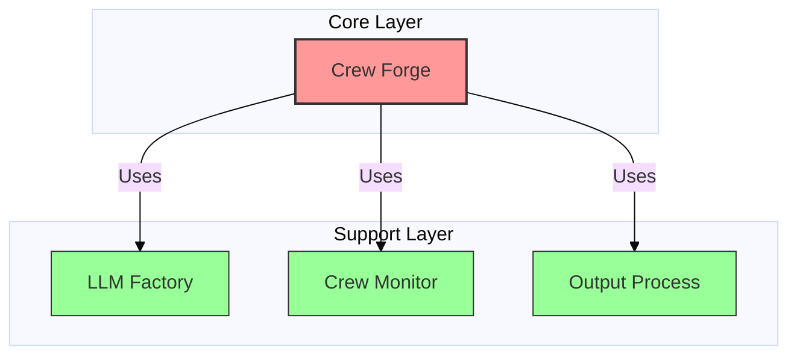

# Amsha: A Clean Architecture Framework for Reliable Multi-Agent Orchestration

**Abstract**

The rapid proliferation of Large Language Models (LLMs) has given rise to autonomous Multi-Agent Systems (MAS). However, existing frameworks often prioritize rapid prototyping over software engineering rigor, leading to fragile, difficult-to-maintain applications. This paper presents **Amsha**, a novel MAS orchestration framework built on **Clean Architecture** principles. Amsha introduces a hybrid **Dual-State Orchestration Engine** capable of seamless transition between file-based prototyping and database-driven production environments. We formally define the agent composition process using set theory and propose a **Validation-First** methodology that statically guarantees configuration integrity before stochastic execution. Furthermore, we describe a **Statistical Grading System** for fair agent evaluation. Our architectural analysis demonstrates how decoupling intelligence (LLM Factory) from orchestration (Crew Forge) and monitoring (Crew Monitor) significantly improves system maintainability and testability.

---

## 1. Introduction

The engineering of Agentic AI systems is currently at an inflection point. While "Prompt Engineering" has dominated the discourse, the challenge is shifting towards "Agent Systems Engineering"—the creation of robust, scalable, and verifiable architectures that can harness non-deterministic LLM outputs.

Standard frameworks like *CrewAI* and *AutoGen* provide powerful abstractions for agent interaction but often suffer from:
1.  **Tight Coupling:** Agent logic is frequently intertwined with specific LLM providers.
2.  **Runtime Fragility:** Configuration errors are often detected only deep into execution, wasting tokens and time.
3.  **Lack of Observability:** Monitoring is typically an afterthought, making it difficult to quantify agent "Return on Investment" (ROI).

Amsha addresses these challenges by enforcing a **Modular Monolith** architecture with strict interface-based boundaries. This paper details the design, mathematical foundations, and novel contributions of the Amsha framework.

---

## 2. System Architecture

Amsha is structured into three logical tiers, following the principles of Clean Architecture:
1.  **Amsha (Core):** Protocol definitions and base abstractions.
2.  **Bodha (Business Logic):** The orchestration and monitoring engines.
3.  **Yantra (Infrastructure):** Concrete implementations (DB adapters, LLM providers).

The system comprises four critical modules:
1.  **Crew Forge:** The central orchestration engine.
2.  **Output Process:** The validation and evaluation pipeline.
3.  **LLM Factory:** The provider abstraction layer.
4.  **Crew Monitor:** The telemetry and performance tracking system.

### 2.1 Interaction Model

The framework follows a **Hub-and-Spoke** interaction pattern (See *Figure 1* below).

*Figure 1: Module Dependency Graph differentiating the Orchestrator (Core) from Service Providers (Support).*

---

## 3. Mathematical Foundations

Amsha formalizes agent operations to ensure deterministic behavior where possible.

### 3.1 Set-Theoretic Agent Composition

The assembly of a crew in `crew_forge` is modeled as a constructive set operation. Let $\mathcal{A}$ be the universe of possible Agents and $\mathcal{T}$ be the universe of Tasks. A **Crew** $\mathcal{C}$ is formalized as:

$$
\mathcal{C} = (A, T, P)
$$

Where:
- $A \subseteq \mathcal{A}$ is the ordered set of agents: $A = \{a_1, a_2, \dots, a_n\}$.
- $T \subseteq \mathcal{T}$ is the ordered set of tasks.
- $P$ is the execution process (Sequential or Hierarchical).

The construction complexity is linear $O(|A| + |T|)$, ensuring scalable initialization even for large ensembles.

### 3.2 Statistical Grading for Fairness

To mitigate "Grader Bias" in LLM-as-a-Judge scenarios, the `output_process` module implements a **Z-Score Normalization** algorithm. The grade $G(s_i)$ for a score $s_i$ relative to population statistics ($\mu, \sigma$) is:

$$
G(s_i) = \begin{cases}
A & \text{if } s_i > \mu + \sigma \\
B & \text{if } \mu < s_i \le \mu + \sigma \\
C & \text{if } \mu - \sigma < s_i \le \mu \\
D & \text{if } s_i \le \mu - \sigma
\end{cases}
$$

This ensures that agent performance is evaluated relative to the difficulty of the specific task instance.

---

## 4. Architectural Analysis

The framework creates extensive use of standard enterprise design patterns to manage complexity.

### 4.1 Design Patterns
- **Repository Pattern (`crew_forge/repo`):** Abstracts data access, enabling the *Dual-State Engine*. The same business logic operates whether data comes from a YAML file (`AtomicCrewFileManager`) or MongoDB (`AtomicCrewDBManager`).
- **Abstract Factory (`llm_factory`):** Centralizes LLM creation. This allows "Intelligence Swapping"—changing the underlying model (e.g., from GPT-4 to DeepSeek) by changing a single configuration string, without touching agent code.
- **Builder Pattern (`crew_forge/service`):** Manages the complex, multi-step construction of `Crew` objects, ensuring all dependencies are injected before the object is sealed.

### 4.2 Dependency Analysis
The dependency graph reveals a strict downward flow from Orchestrator to Services. However, a potential circular dependency was identified between `output_process` (Validator) and `crew_forge` (Parser), highlighting an area for future refactoring (Move `CrewParser` to Shared Utils).

---

## 5. Novelty and Contributions

Amsha introduces three primary contributions to the field of MAS Engineering:

### 5.1 Hybrid Orchestration Engine
Unlike frameworks that lock users into "Code-First" or "Config-First" approaches, Amsha supports both:
- **File-Based Mode:** For rapid prototyping and version control.
- **Database-Driven Mode:** For persistent, scalable production deployments.
This duality allows a seamless "Prototype-to-Production" workflow.

### 5.2 Validation-First Architecture
Amsha integrates `output_process` as a strict **static analysis** layer. By validating the semantic integrity of agent/task graphs *before* any LLM calls are made, the system implements a "Safe-Fail" mechanism. This prevents the common waste of resources where a long-running crew fails halfway due to a misconfiguration.

### 5.3 Decoupled Intelligence
By treating the LLM provider as a commodity service injected via `llm_factory`, Amsha enforces **Privacy-First** design. The core logic remains agnostic to the model provider, facilitating easy compliance with data residency requirements (e.g., switching to local designs for sensitive data).

---

## 6. Critical Gaps and Limitations

Our analysis has identified several areas requiring immediate attention:

1.  **Testing Gap (Validation):** The `crew_forge` and `output_process` modules currently lack unit tests for their core logic (Gap ID: *QA-001*). While the architecture is sound, the implementation is unverified.
2.  **Performance Benchmarks:** There are no empirical benchmarks quantifying the overhead of the Builder/Repository abstraction compared to raw framework instantiation (Gap ID: *PERF-001*).
3.  **Circular Dependency:** The import cycle between `output_process` and `crew_forge` poses a maintainability risk.

---

## 7. Conclusion

Amsha represents a **Structure-First** approach to Generative AI. By prioritizing architectural rigor—typified by its Clean Architecture layers, formal mathematical models, and strict validation pipelines—it offers a blueprint for building reliable, enterprise-grade Multi-Agent Systems. While implementation gaps in testing remain, the core design successfully addresses the fragility and coupling issues prevalent in current generation MAS frameworks.

---

## Appendix A: Module Functionality Matrix

| Module | Role | Key Pattern | Innovation |
|:---|:---|:---|:---|
| **Crew Forge** | Orchestration | Repository | Dual-State Engine (File/DB) |
| **Output Process** | Validation | Pipeline | Statistical Z-Score Grading |
| **LLM Factory** | Abstraction | Abstract Factory | Privacy-First Provider Swapping |
| **Crew Monitor** | Telemetry | Observer | Consensus-based Confidence Metrics |
