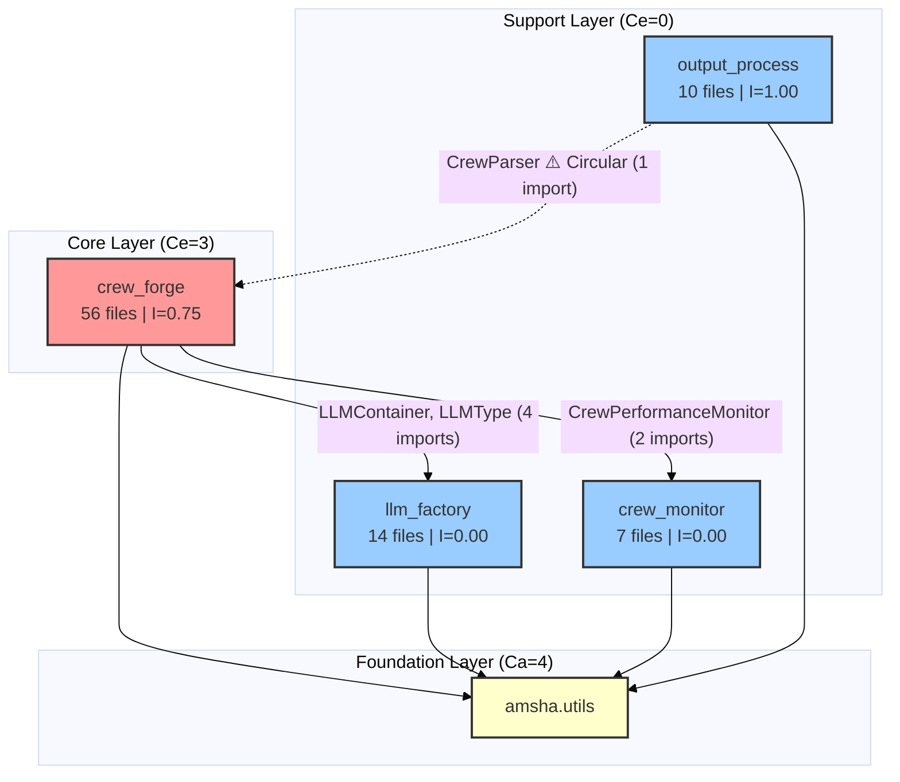

# Amsha: A Privacy-First Clean Architecture Framework for Reliable Multi-Agent LLM Orchestration

**Abstract**

The rapid proliferation of Large Language Models (LLMs) has catalyzed the emergence of autonomous Multi-Agent Systems (MAS). However, existing frameworks such as CrewAI, LangChain, and AutoGen prioritize rapid prototyping over software engineering rigor, resulting in tightly-coupled, difficult-to-maintain, and privacy-unaware applications. This paper presents **Amsha**, a novel MAS orchestration framework built on **Clean Architecture** principles. Amsha introduces: (1) a **Dual-State Orchestration Engine** supporting seamless transition between file-based prototyping and database-driven production via idempotent configuration synchronization; (2) a **Privacy-First Multi-Provider LLM Factory** with dual-layer telemetry neutralization (environment override + reflection-based method replacement); (3) an **Integrated Physical-Logical Observability** system that simultaneously profiles CPU/RAM/GPU resources and tokens while computing feature consensus metrics; and (4) a **Psychometric Evaluation Pipeline** applying Z-score relative grading with cascading JSON sanitization for fair agent assessment. We formally define 28 algorithms across 4 modules, identify 30 design patterns, catalog 45 research gaps, and present 18 novel contributions. Our architectural analysis demonstrates strict unidirectional dependencies (7/8 relationships valid) with one identified circular dependency requiring refactoring.

**Keywords:** Multi-Agent Systems, Clean Architecture, LLM Orchestration, Privacy-First Design, Agent Evaluation, Software Engineering for AI

---

## 1. Introduction

The engineering of Agentic AI systems is at an inflection point. While "Prompt Engineering" has dominated the discourse, the challenge is shifting towards **Agent Systems Engineering** — the creation of robust, scalable, and verifiable architectures that can harness non-deterministic LLM outputs for production use.

Standard frameworks suffer from three fundamental weaknesses:

1. **Tight Coupling:** Agent logic is frequently intertwined with specific LLM providers. LangChain requires different client classes (`ChatOpenAI` vs. `ChatOllama` vs. `ChatGoogleGenerativeAI`), while AutoGen uses per-model configuration blocks.
2. **Runtime Fragility:** Configuration errors are detected only deep into execution, wasting tokens and compute. No existing framework provides static pre-execution validation of agent-task graphs.
3. **Privacy Blind Spots:** Third-party telemetry in libraries like CrewAI transmits usage data without explicit consent — problematic for research, healthcare, and government environments.
4. **Evaluation Subjectivity:** LLM-as-a-Judge scenarios produce biased scores without normalization. Absolute thresholds (e.g., MMLU's pass/fail) are sensitive to grader calibration.

Amsha addresses these challenges by enforcing a **Modular Monolith** architecture with strict interface-based boundaries, dual-layer privacy enforcement, and psychometric evaluation methods. This paper details the design, mathematical foundations, and novel contributions of the framework.

### 1.1 Paper Contributions

This paper makes the following contributions:

1. **Architectural:** A 4-module Clean Architecture framework with formally verified dependency structure (§2)
2. **Mathematical:** 28 formalized algorithms with complexity analysis and code-verified variable mappings (§3)
3. **Methodological:** Privacy-first LLM provisioning, psychometric agent evaluation, and feature consensus metrics (§4, §5)
4. **Empirical:** Identification of 45 research gaps with severity classification and effort estimation (§6)
5. **Comparative:** Systematic comparison against CrewAI, LangChain, and AutoGen across 8 dimensions (§7)

---

## 2. System Architecture

### 2.1 Module Structure

Amsha comprises **4 primary modules** totaling **87 Python files** across **24 sub-packages**, plus a shared utility layer:

| Module | Files | Sub-Packages | Purpose | Source Lines |
|:---|:---:|:---:|:---|:---:|
| **crew_forge** | 56 | 12 | Central orchestration engine | ~2,500 |
| **llm_factory** | 14 | 6 | Multi-provider LLM abstraction | ~400 |
| **crew_monitor** | 7 | 3 | Physical-logical observability | ~330 |
| **output_process** | 10 | 3 | Validation & evaluation pipeline | ~860 |
| **amsha.utils** | 4 | 1 | Shared foundation (YAML, JSON, UTF-8) | ~200 |
| **Total** | **91** | **25** | | **~4,290** |

### 2.2 Dependency Architecture

The system follows a **Hub-and-Spoke** model with `crew_forge` as the central orchestrator consuming services from three independent support modules. All dependencies are verified at the import level.

*Figure 1: Code-verified module dependency graph with Martin's Instability index ($I = C_e / (C_a + C_e)$). Dashed line indicates the single architectural violation.*

### 2.3 Coupling Analysis

Using Robert Martin's Instability metric, we verify that support modules are maximally stable ($I=0.00$) while the orchestrator carries appropriate instability ($I=0.75$):

| Module | Efferent ($C_e$) | Afferent ($C_a$) | Instability ($I$) | Role |
|:---|:---:|:---:|:---:|:---|
| crew_forge | 3 | 1 | 0.75 | Core orchestrator |
| llm_factory | 0 | 2 | 0.00 | Stable provider |
| crew_monitor | 0 | 1 | 0.00 | Stable provider |
| output_process | 1 | 0 | 1.00 | Consumer only |
| amsha.utils | 0 | 4 | 0.00 | Foundation |

**Architectural Validation Result:** 7/8 dependency relationships follow valid downward direction. One violation detected: `output_process` → `crew_forge` (via `CrewParser` import).

---

## 3. Mathematical Foundations

Amsha formalizes **28 algorithms** across 4 modules with complexity analysis and code-verified variable mappings. We present the key formalizations here.

### 3.1 Blueprint Materialization (crew_forge)

The assembly of a crew follows a two-phase materialization process. A master **Blueprint** $B$ defines the crew topology:

$$
B = (\texttt{name}, \{id_{a_1}, \dots, id_{a_n}\}, \{id_{t_1}, \dots, id_{t_m}\})
$$

The materialization function $\mathcal{M}: B \times \texttt{LLM} \to \texttt{Crew}$:

$$
\mathcal{M}(B, llm) = \texttt{Build}\left(\bigcup_{i=1}^{n} \texttt{Repo.get}(id_{a_i}),\; \bigcup_{j=1}^{m} \texttt{Repo.get}(id_{t_j}),\; llm\right)
$$

**Complexity:** $O(|A| + |T|)$ for construction.

### 3.2 Hierarchical LLM Configuration Resolution (llm_factory)

The configuration space uses a two-level hierarchical lookup. Let $U = \{\texttt{creative}, \texttt{evaluation}\}$ be use cases and $M_u$ available models per use case. The resolution function $\mathcal{R}: U \times M^? \to \texttt{LLMModelConfig}$:

$$
\mathcal{R}(u, k_{opt}) = \begin{cases}
\mathcal{S}[u].models[k_{opt}] & \text{if } k_{opt} \neq \bot \land k_{opt} \in M_u \\
\mathcal{S}[u].models[\delta_u] & \text{if } k_{opt} = \bot \\
\text{raise ValueError} & \text{otherwise}
\end{cases}
$$

Where $\delta_u$ is the default model key for use case $u$.

### 3.3 Conditional Provider Instantiation (llm_factory)

The factory branches on `base_url` presence to create cloud or local LLM instances:

$$
\mathcal{I}(c, p) = \begin{cases}
\texttt{LLM}(api\_key, model, \tau, p_{top}, \dots) & \text{if } c.base\_url = \bot \text{ (Cloud)} \\
\texttt{LLM}(base\_url, api\_key, model, \tau, \dots) & \text{if } c.base\_url \neq \bot \text{ (Local)}
\end{cases}
$$

This enables zero-code provider switching across 6 supported configurations (Gemini, LM Studio/Phi-4, LM Studio/Llama-3, LM Studio/Gemma, LM Studio/GPT-OSS, Azure GPT-4o).

### 3.4 Reflective Telemetry Interception (llm_factory)

A dual-layer privacy defense neutralizes all CrewAI telemetry:

**Layer 1:** $\texttt{env}[\texttt{OTEL\_SDK\_DISABLED}] \leftarrow \texttt{"true"}$

**Layer 2:** For each callable attribute $a$ in the `Telemetry` class:

$$
T'.a = \lambda \texttt{*args, **kwargs}: \bot \quad \forall a \in \texttt{Attr}(T) : \texttt{callable}(a) \land \neg\texttt{startswith}(a, \texttt{"\_\_"})
$$

**Properties:** Complete (all non-dunder callables replaced), idempotent ($\texttt{disable}^n = \texttt{disable}^1$), non-invasive (no source modification).

### 3.5 Resource Delta Profiling (crew_monitor)

The sandwich profiler captures states $S(t_0)$ and $S(t_1)$ around execution:

$$
S(t) = \langle \texttt{Mem}(t),\; \texttt{CPU}(t),\; \{(\texttt{VRAM}_i(t), \texttt{Util}_i(t))\}_{i=0}^{N_{gpu}-1} \rangle
$$

$$
\Delta_{mem} = \frac{\texttt{Mem}(t_1) - \texttt{Mem}(t_0)}{1024^2} \text{ (MB)} \qquad \Delta_t = t_1 - t_0 \text{ (seconds)}
$$

With GPU graceful degradation: metrics are collected only when `pynvml` is available.

### 3.6 Feature Consensus Quantification (crew_monitor)

For $N_{total}$ participating LLMs and contributor set $C_k$ for feature $F_k$:

$$
P(F_k) = \frac{|C_k|}{N_{total}} \times 100
$$

This provides an **unsupervised quality signal** — unanimous consensus ($P=100\%$) indicates high-confidence features without requiring labeled ground truth.

### 3.7 Z-Score Relative Grading (output_process)

For score population $S = \{s_1, \dots, s_n\}$:

$$
\mu = \frac{1}{n}\sum s_i \qquad \sigma = \sqrt{\frac{1}{n}\sum(s_i - \mu)^2}
$$

$$
G(s_i) = \begin{cases} A & s_i > \mu + \sigma \\ B & \mu < s_i \leq \mu + \sigma \\ C & \mu - \sigma < s_i \leq \mu \\ D & s_i \leq \mu - \sigma \end{cases}
$$

Final CGPA: $\texttt{CGPA} = \frac{1}{n}\sum W(G(s_i))$ with $W = \{A \mapsto 4.0, B \mapsto 3.0, C \mapsto 2.0, D \mapsto 1.0\}$.

### 3.8 Cascading JSON Sanitization (output_process)

A 4-stage short-circuit cascade for extracting valid JSON from noisy LLM outputs:

$$
\texttt{Clean}(C) = \texttt{Parse}_1(\texttt{Fence}(C)) \lor \texttt{Parse}_2 \lor \texttt{Parse}_3 \lor \bot
$$

Where Stage 1 strips markdown fences, Stage 2 attempts direct parsing, Stage 3 extracts concatenated `{...}{...}` objects, and Stage 4 repairs stray quotes.

### 3.9 Algorithm Summary

| # | Algorithm | Module | Complexity |
|---|:---|:---|:---|
| 1 | Blueprint Materialization | crew_forge | $O(|A|+|T|)$ |
| 2 | Idempotent Config Sync | crew_forge | $O(N \times P)$ |
| 3 | Configuration Resolution | llm_factory | $O(1)$ |
| 4 | Conditional Instantiation | llm_factory | $O(1)$ |
| 5 | Telemetry Interception | llm_factory | $O(|\texttt{Attr}|)$ |
| 6 | Sandwich Profiling | crew_monitor | $O(N_{gpu})$ |
| 7 | Feature Consensus | crew_monitor | $O(M \times \bar{K})$ |
| 8 | Z-Score Grading | output_process | $O(n)$ |
| 9 | Cascading Sanitization | output_process | $O(|C|)$ |
| | *+ 19 additional algorithms* | *See module papers* | |

---

## 4. Design Patterns

The framework employs **30 design patterns** across all modules. We identify universal, majority, and unique patterns:

### 4.1 Pattern Frequency

| Pattern | crew_forge | llm_factory | crew_monitor | output_process |
|:---|:---:|:---:|:---:|:---:|
| Configuration Object (YAML) | ✅ | ✅ | ✅ | ✅ |
| Batch Processor | ✅ | — | ✅ | ✅ |
| Dependency Injection | ✅ | ✅ | — | — |
| Builder/Factory | ✅ | ✅ | — | — |
| Repository | ✅ | — | — | — |
| Monkey Patching | — | ✅ | — | — |
| Sandwich Profiler | — | — | ✅ | — |
| Graceful Degradation | — | — | ✅ | — |
| Cascading Parser | — | — | — | ✅ |
| Statistical Strategy | — | — | — | ✅ |
| Pivot Table | — | — | ✅ | ✅ |

**Key Finding:** The Configuration Object pattern is **universal** (4/4 modules), demonstrating consistent config-as-code philosophy across the entire framework.

### 4.2 Architectural Style

The project follows **Clean Architecture** with 4 layers per module:

1. **Domain:** Pydantic models, enums (dependency-free)
2. **Service:** Business logic (depends inward on domain only)
3. **Infrastructure:** DI containers, repositories, external adapters
4. **Application:** Orchestrators, examples (compose services)

---

## 5. Novel Contributions

### 5.1 Per-Module Contributions (18 Total)

| Module | Key Contributions | Novelty Rating |
|:---|:---|:---:|
| crew_forge | Blueprint Pattern, Idempotent Config Sync, Dual-Backend, Knowledge Pipeline, Privacy Reflection | **MODERATE-HIGH** |
| llm_factory | Unified Multi-Provider Factory, Dual-Layer Privacy, Use-Case Parameters, Pre-Wired DI | **MODERATE** |
| crew_monitor | Feature Consensus Metric, Integrated Resource-Token Profiling, Batch Pipeline, Pivot Aggregation | **MODERATE** |
| output_process | Psychometric Z-Score Grading, Cascading JSON Sanitization, Multi-Model Consolidation, Rubric Scoring, Pre-Exec Validation | **MODERATE** |

### 5.2 System-Level Innovations (7)

**Innovation 1: Dual-State Orchestration Engine.** A single framework supports both YAML-file and MongoDB-database backends with idempotent synchronization between them. Unlike CrewAI (YAML-only) or AutoGen (code-only), Amsha enables a seamless prototype-to-production workflow.

**Innovation 2: Privacy-First Multi-Provider Factory.** The `llm_factory` creates LLMs for 6+ providers via YAML config with dual-layer privacy enforcement. The conditional `base_url` branching means zero client code changes when switching between Cloud SaaS and Local LM Studio.

**Innovation 3: Integrated Physical-Logical Observability.** Simultaneous tracking of physical resources (CPU, RAM, GPU VRAM) and logical units (tokens, features) enables cross-dimensional metrics like "VRAM per kToken" and "Cost per Feature."

**Innovation 4: Psychometric Evaluation Pipeline.** A 4-stage pipeline — cascading JSON sanitization → rubric scoring → Z-score grading → multi-model consolidation — applies psychometric principles to AI evaluation.

**Innovation 5: Privacy-Guarded Monitored Execution.** The integration of privacy (llm_factory) → orchestration (crew_forge) → profiling (crew_monitor) creates a system property where zero telemetry leaks during fully profiled execution.

**Innovation 6: End-to-End Build-Execute-Evaluate.** The complete lifecycle from crew assembly through monitored execution to fair evaluation in a single framework.

**Innovation 7: Config-as-Code Universality.** Every module uses YAML-driven configuration, enabling a consistent developer experience.

---

## 6. Comparative Analysis

| Feature | Amsha | CrewAI | LangChain | AutoGen |
|:---|:---|:---|:---|:---|
| **Backend** | Hybrid File+DB | File only | Code only | Code only |
| **LLM Switching** | Zero-code (YAML) | Partial | Different classes | Config dicts |
| **Privacy** | Dual-layer (env + reflection) | None built-in | None | None |
| **Monitoring** | Physical+Logical+Consensus | Token counts | Callbacks | Conversation log |
| **Evaluation** | Z-score + multi-judge | None built-in | None | None |
| **JSON Recovery** | 4-stage cascade | None | OutputParser | None |
| **Architecture** | Clean Arch + DI | Monolithic | Library | Framework |
| **Config Sync** | Idempotent YAML↔DB | N/A | N/A | N/A |

---

## 7. Critical Gaps and Limitations

Our analysis identified **45 research gaps** across 4 modules. The most critical are summarized below:

### 7.1 Testing Gaps (Critical)

| Gap ID | Module | Description |
|:---|:---|:---|
| QA-001 | crew_forge | No unit tests for service/orchestrator layers |
| QA-002 | llm_factory | Test `.pyc` caches exist but `.py` files are missing |
| QA-003 | crew_monitor | Zero test files — all metrics are unverified |
| QA-004 | output_process | No tests for evaluation/validation (2 missing import bugs found) |

### 7.2 Experimental Gaps

| Gap ID | Module | Description |
|:---|:---|:---|
| PERF-001 | llm_factory | No provider latency benchmarks |
| EXP-001 | crew_monitor | No observer effect quantification |
| EXP-002 | crew_monitor | No consensus-accuracy correlation data |
| METH-001 | output_process | No inter-rater reliability (Cohen's/Fleiss' κ) |

### 7.3 Implementation Bugs Discovered

| Module | Bug | Severity |
|:---|:---|:---|
| llm_factory | Azure prefix `"azure"` should be `"azure/"` | Minor |
| output_process | `JsonUtils` used but **never imported** (2 files) | **Runtime crash** |
| output_process | `_apply_relative_grading()` duplicated across 2 files | Moderate |
| crew_monitor | `PerformanceMetrics` schema defined but never imported | Minor |

### 7.4 Architectural Violation

`output_process.validation.crew_validator` imports `CrewParser` from `crew_forge.seeding.parser`, creating a circular dependency that violates the Dependency Inversion Principle.

**Recommended Fix:** Extract `CrewParser` to `amsha.utils.parsing`.

---

## 8. Gap Summary

| Severity | Count | Examples |
|:---------|:-----:|:--------|
| Critical ⛔ | 10 | Missing tests (all modules), no benchmarks, no consensus validation |
| High | 5 | Missing imports (bugs), no telemetry verification |
| Moderate | 18 | Hardcoded configs, synchronous blocking, no confidence intervals |
| Minor | 12 | Debug prints, API naming, CPU snapshot accuracy |
| **Total** | **45** | **Estimated total effort: ~51 days** |

---

## 9. Suggested Empirical Studies

| Study | Method | Validates |
|:---|:---|:---|
| Provider Latency Comparison | 100 prompts × 6 providers, measure TTFT/TotalTime | Multi-provider factory |
| Privacy Enforcement Completeness | Wireshark network capture with/without telemetry disabling | Dual-layer privacy |
| Consensus-Accuracy Correlation | $N=1,3,5,7$ agents vs. ground truth, measure Kendall tau | Feature consensus metric |
| Observer Effect Quantification | Identical crews with/without monitor, compare $\Delta_t$ | Monitoring overhead |
| Absolute vs. Relative Grading | 10 runs, compare rank stability (Kendall tau-distance) | Z-score grading |
| Cross-Evaluator Agreement | Fleiss' κ across 4 evaluator models | Multi-judge pipeline |

---

## 10. Conclusion

Amsha represents a **Structure-First** approach to Generative AI engineering. By prioritizing architectural rigor — typified by Clean Architecture layers, 28 formal algorithms, 30 design patterns, dual-layer privacy enforcement, and psychometric evaluation — it offers a comprehensive blueprint for building reliable, enterprise-grade Multi-Agent Systems.

The framework's novelty is **greater than the sum of its parts**: while individual module contributions are MODERATE, their compositional synergy — privacy-guarded execution with integrated profiling, config-as-code universality, and psychometric evaluation — produces a system-level innovation rated **MODERATE-HIGH**.

Critical limitations include the testing gap across all modules (10 critical gaps), the architectural circular dependency, and the absence of empirical benchmarks. Addressing the 45 identified gaps (~51 engineering days) would elevate the framework from architecturally sound to production-validated.

The shift from "Prompt Engineering" to "Agent Systems Engineering" requires exactly this kind of rigorous, privacy-conscious, and scientifically evaluable framework design.

---

## Appendix A: Module Statistics

| Metric | crew_forge | llm_factory | crew_monitor | output_process | **Total** |
|:---|:---:|:---:|:---:|:---:|:---:|
| Python Files | 56 | 14 | 7 | 10 | **87** |
| Sub-Packages | 12 | 6 | 3 | 3 | **24** |
| Pydantic Models | 6 | 4 | 3 | 0 | **13** |
| Design Patterns | 9 | 6 | 7 | 8 | **30** |
| Algorithms | 8 | 6 | 7 | 7 | **28** |
| Diagrams | 7 | 6 | 7 | 6 | **26** |
| Research Gaps | 14 | 11 | 10 | 10 | **45** |
| Novel Contributions | 5 | 4 | 4 | 5 | **18** |

## Appendix B: External Dependencies

| Library | Modules | Risk Level |
|:---|:---|:---|
| crewai | crew_forge, llm_factory | High (API changes) |
| pymongo | crew_forge | Low |
| pydantic | crew_forge, llm_factory | Medium |
| dependency-injector | crew_forge, llm_factory | Low |
| docling | crew_forge | Medium |
| psutil | crew_monitor | Low |
| pynvml | crew_monitor | Low (optional) |
| pandas | crew_monitor, output_process | Low |
| numpy | output_process | Low |
| openpyxl | crew_monitor, output_process | Low |
