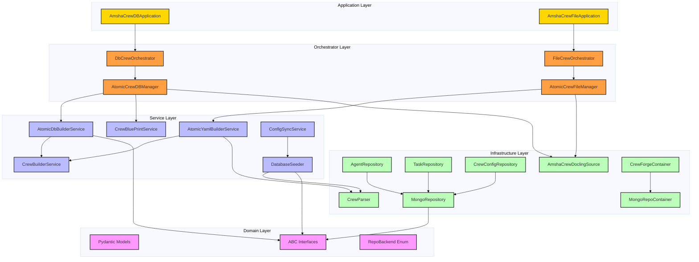
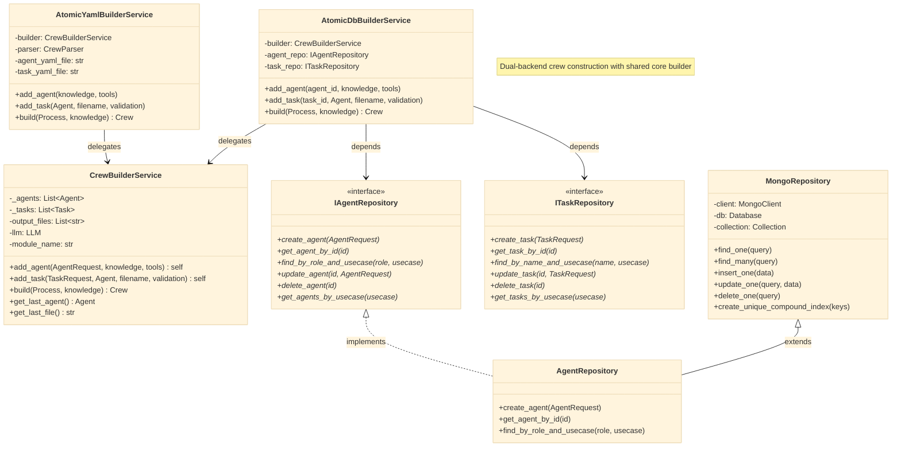
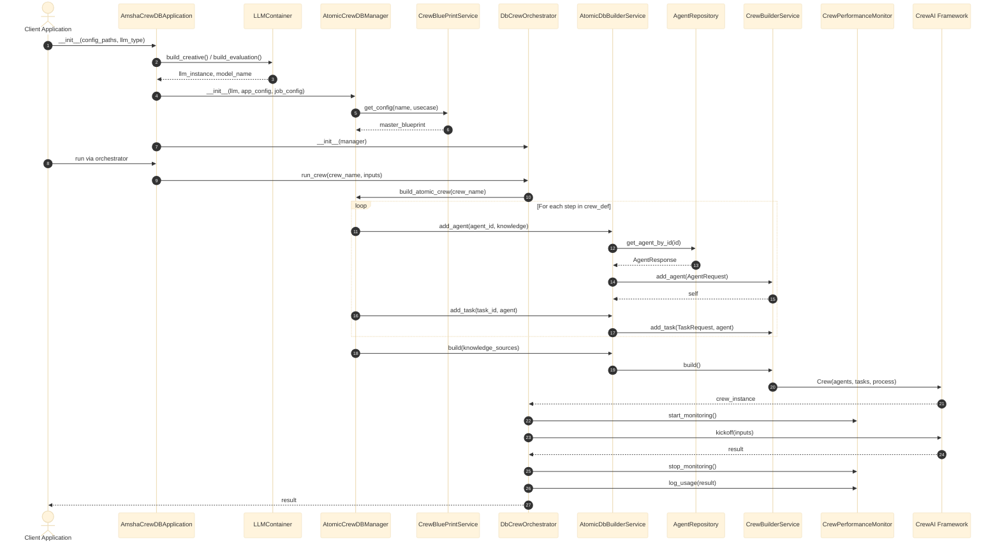
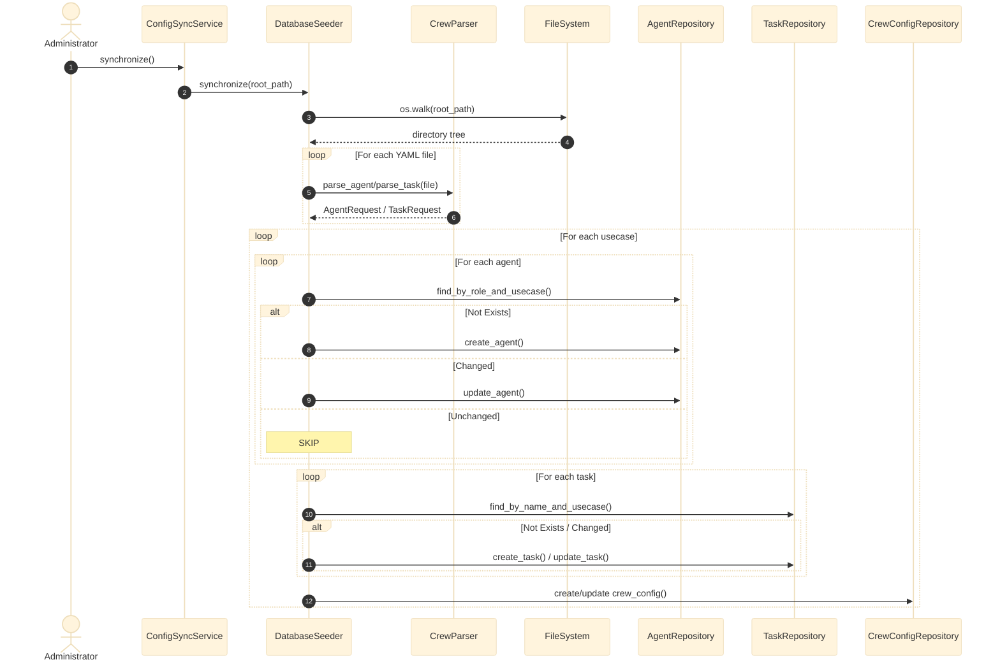
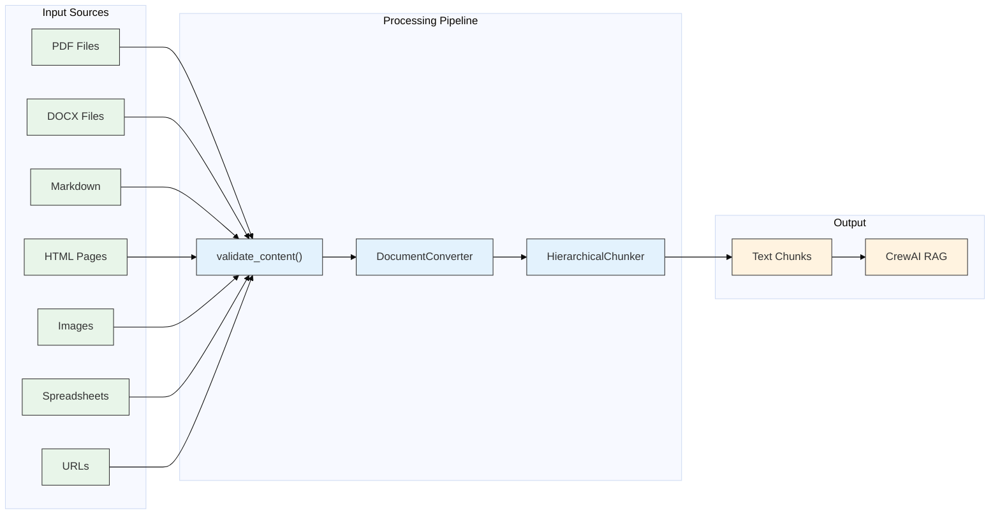
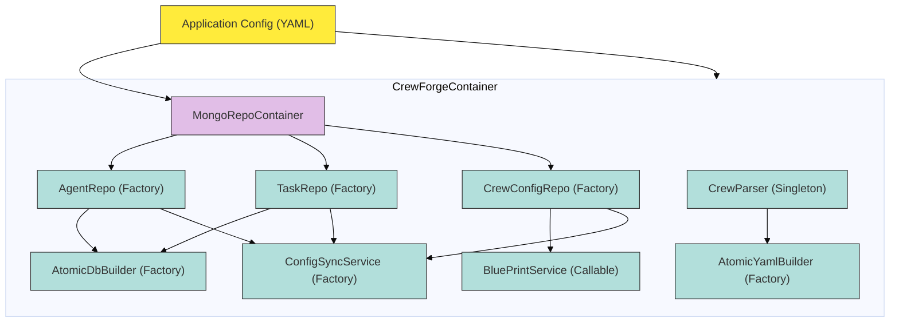

# Crew Forge: Architecture & Design

## 1. Architectural Overview

The `crew_forge` module implements a **four-layer Clean Architecture** for AI Agent orchestration, extending beyond simple Crew construction to encompass configuration management, multi-format knowledge ingestion, and dual-backend persistence. With **56 Python files** across **12 sub-packages**, it is the largest and most structurally mature module in the Amsha framework.

### Layered Architecture Diagram

---

## 2. Sub-Package Structure

| Sub-Package | Files | Purpose |
|:---|:---:|:---|
| `domain/models/` | 6 | Pydantic data models (`AgentRequest/Response`, `TaskRequest/Response`, `CrewData`, `CrewConfigData`, `RepoData`, `SyncConfig`) |
| `domain/enum/` | 1 | `RepoBackend` enum (`MONGO`, `IN_MEMORY`, `COSMOS`) |
| `repo/interfaces/` | 4 | ABC interfaces (`IRepository`, `IAgentRepository`, `ITaskRepository`, `ICrewConfigRepository`) |
| `repo/adapters/mongo/` | 4 | MongoDB implementations with compound index enforcement |
| `service/` | 5 | Business logic layer (Builder, Facades, Blueprint, ConfigSync) |
| `orchestrator/db/` | 3 | DB-backed crew lifecycle management |
| `orchestrator/file/` | 3 | File-backed crew lifecycle management |
| `seeding/` | 2 | YAML→DB synchronization with idempotent upsert |
| `knowledge/` | 1 | Multi-format document ingestion via Docling |
| `dependency/` | 2 | DI containers (declarative, hierarchical) |
| `sync/` | 1 | Crew config export to JSON |
| `exceptions/` | 4 | Typed exception hierarchy |

---

## 3. Class Design: Builder Pattern Hierarchy

### Class Diagram

---

## 4. Orchestrator Layer: Dual-Backend Crew Lifecycle

The orchestrator layer provides the complete crew execution lifecycle: initialization → blueprint loading → crew building → execution with monitoring → result extraction.

### Sequence Diagram: DB-Backed Full Lifecycle

---

## 5. Configuration Synchronization Flow

### Sequence Diagram: YAML → MongoDB Sync

---

## 6. Knowledge Source Integration

---

## 7. Dependency Injection Container Hierarchy

---

## 8. Design Patterns Catalog

| # | Pattern | Implementation | File(s) | Benefit |
|---|:---|:---|:---|:---|
| 1 | **Builder** | `CrewBuilderService` | [crew_builder_service.py](file:///home/dell/PycharmProjects/Amsha/src/nikhil/amsha/crew_forge/service/crew_builder_service.py) | Step-by-step construction of complex Crew objects with fluent chaining |
| 2 | **Repository** | `IAgentRepository`, `ITaskRepository`, `ICrewConfigRepository` | [repo/interfaces/](file:///home/dell/PycharmProjects/Amsha/src/nikhil/amsha/crew_forge/repo/interfaces/) | Decouples domain logic from MongoDB storage |
| 3 | **Facade** | `AtomicDbBuilderService`, `AtomicYamlBuilderService` | [service/](file:///home/dell/PycharmProjects/Amsha/src/nikhil/amsha/crew_forge/service/) | Simplifies heterogeneous data source access behind unified interface |
| 4 | **Abstract Factory** | `AtomicCrewDBManager`, `AtomicCrewFileManager` | [orchestrator/](file:///home/dell/PycharmProjects/Amsha/src/nikhil/amsha/crew_forge/orchestrator/) | Produces families of related crew objects from config |
| 5 | **Blueprint** | `CrewBluePrintService` + `CrewConfigResponse` | [crew_blueprint_service.py](file:///home/dell/PycharmProjects/Amsha/src/nikhil/amsha/crew_forge/service/crew_blueprint_service.py) | Master template for crew topology |
| 6 | **Dependency Injection** | `CrewForgeContainer` + `MongoRepoContainer` | [dependency/](file:///home/dell/PycharmProjects/Amsha/src/nikhil/amsha/crew_forge/dependency/) | Hierarchical container with Factory/Singleton/Callable providers |
| 7 | **Strategy** | Dual-backend resolution (DB vs. YAML) | `atomic_db_builder.py`, `atomic_yaml_builder.py` | Interchangeable data fetching strategies |
| 8 | **Template Method** | `AmshaCrewDBApplication` / `AmshaCrewFileApplication` | [orchestrator/db/](file:///home/dell/PycharmProjects/Amsha/src/nikhil/amsha/crew_forge/orchestrator/db/), [orchestrator/file/](file:///home/dell/PycharmProjects/Amsha/src/nikhil/amsha/crew_forge/orchestrator/file/) | Shared initialization skeleton with backend-specific steps |
| 9 | **Observer** | `CrewPerformanceMonitor` integration | [db_crew_orchestrator.py](file:///home/dell/PycharmProjects/Amsha/src/nikhil/amsha/crew_forge/orchestrator/db/db_crew_orchestrator.py) | Non-intrusive performance tracking |

---

## 9. Metrics Summary

| Metric | Value |
|:---|:---|
| Total Python Files | 56 |
| Sub-Packages | 12 |
| Domain Models (Pydantic) | 6 |
| ABC Interfaces | 4 |
| Design Patterns | 9 |
| Diagrams in this Document | 7 |
| Supported Knowledge Formats | 7 (MD, PDF, DOCX, HTML, IMAGE, XLSX, PPTX) |
