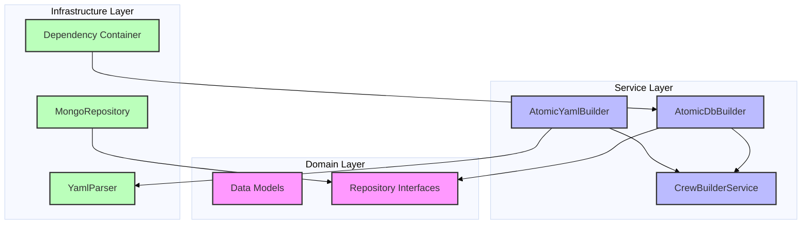
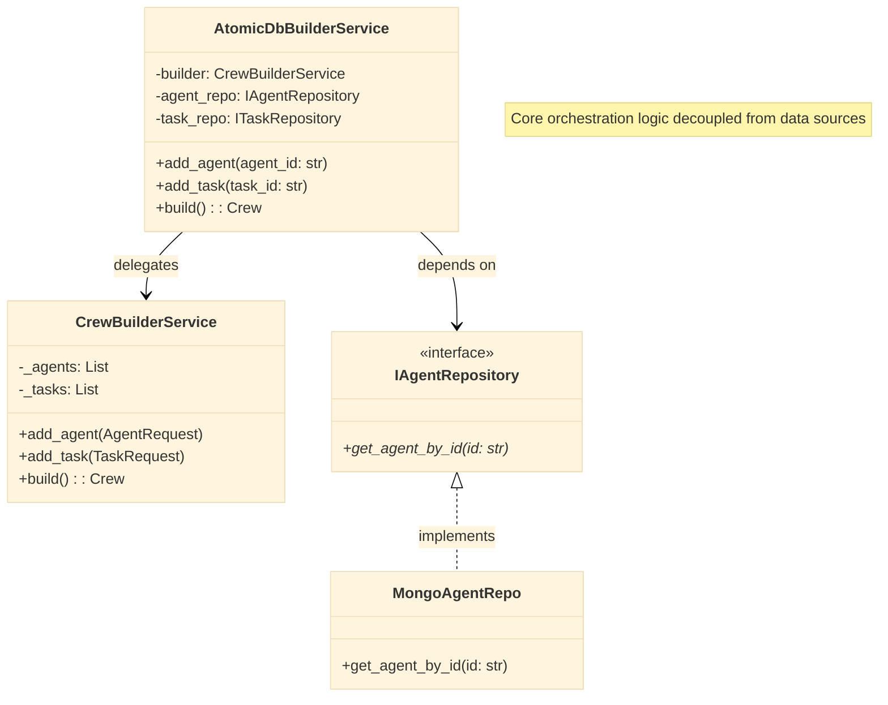
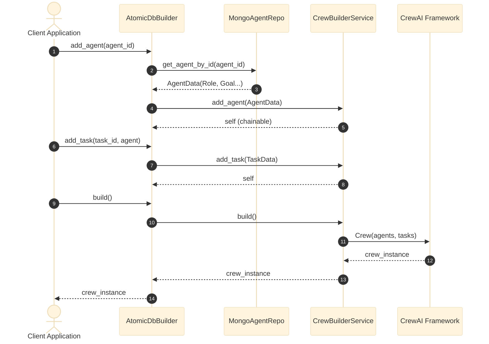

# Crew Forge: Architecture & Design

## 1. Architectural Overview

The `crew_forge` module implements a robust **Clean Architecture** for AI Agent orchestration. It separates the domain logic of Crew composition from the data sources (YAML files vs. MongoDB) using the **Builder** and **Repository** patterns.

### Component Diagram

## 2. Class Design (Builder Pattern)

The core logical unit is `CrewBuilderService`, which constructs the Crew. Wrappers like `AtomicDbBuilderService` act as Facades that fetch data from repositories before delegating to the core builder.

### Class Diagram

## 3. Execution Flow (Sequence Diagram)

The following sequence illustrates how a Crew is built from database records, demonstrating the interaction between the Application, Builder, and Repository layers.

### Sequence Diagram: DB-Based Construction

## 4. Design Patterns Implemented

| Pattern | Implementation | Benefit |
| :--- | :--- | :--- |
| **Builder** | `CrewBuilderService` | Allows step-by-step construction of complex Crew objects. |
| **Repository** | `IAgentRepository` | Decouples business logic from MongoDB implementation. |
| **Facade** | `AtomicDbBuilderService` | Simplifies the interface for creating crews from DB IDs. |
| **Dependency Injection** | `CrewForgeContainer` | Manages component lifecycles and dependencies. |
