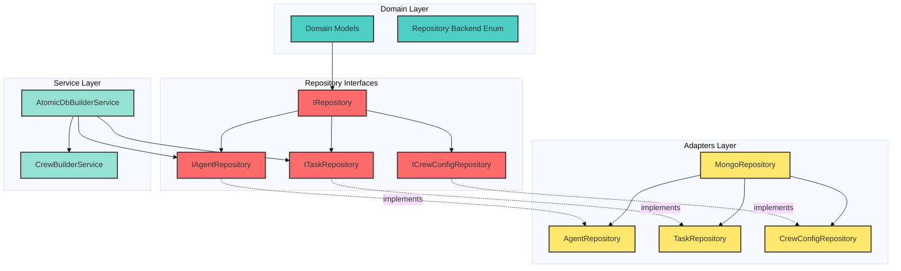
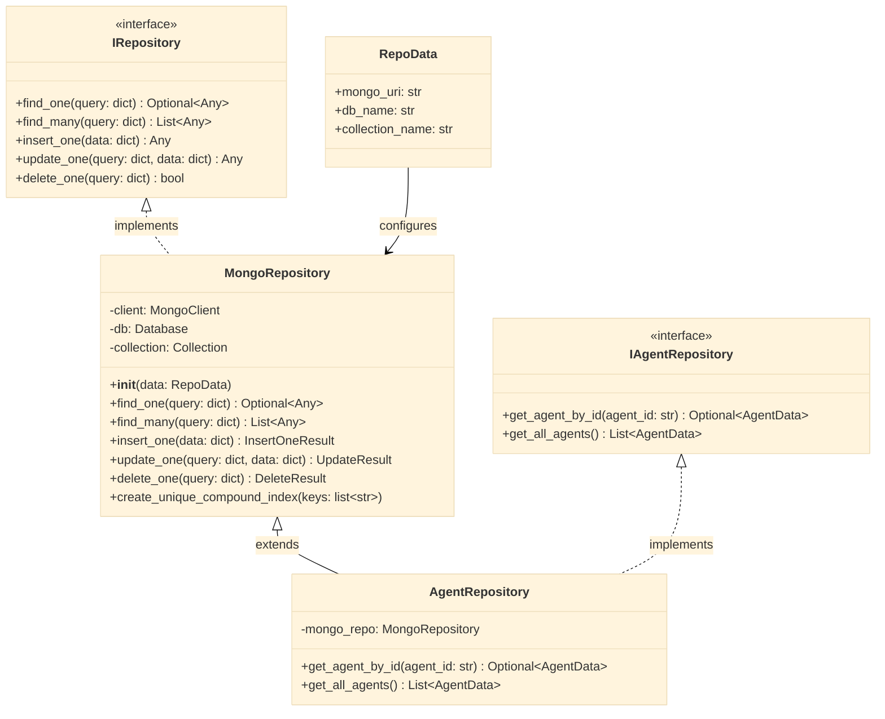
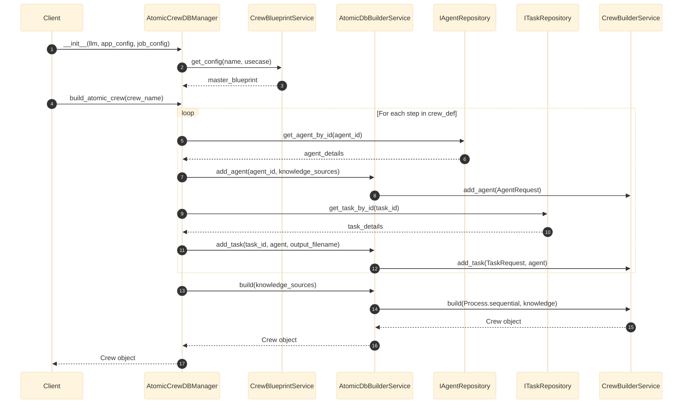
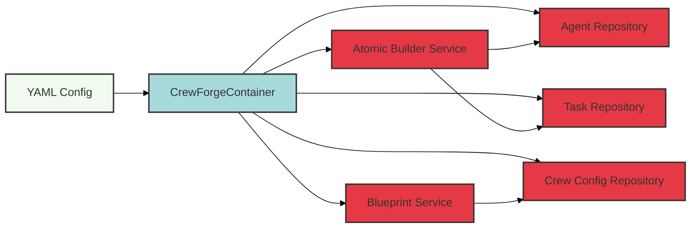
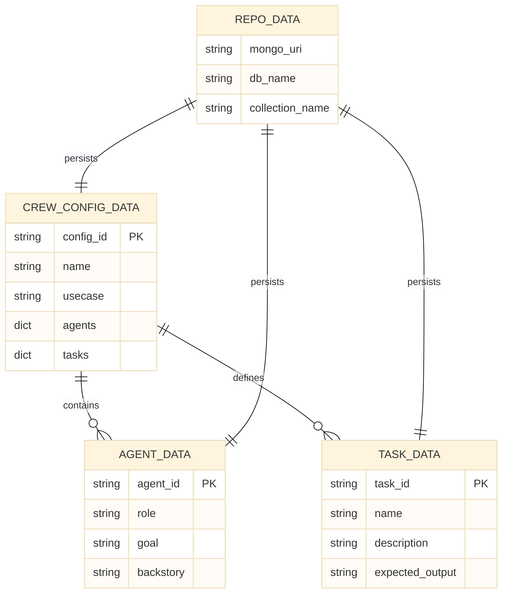

# Crew Forge Module - Architecture & Design

## Overview
This document visualizes the architecture of the `crew_forge` module, which implements Clean Architecture principles with protocol-based design and the Repository Pattern.

---

## 1. High-Level Architecture - 3-Layer Design

**Caption:** Figure 1.1 - Three-layer architecture showing domain models, repository interfaces, MongoDB adapters, and service layer. Protocol-based design ensures testability and adapter substitutability.

**Source:** Analyzed from [`crew_forge/`](file:///home/dell/PycharmProjects/Amsha/src/nikhil/amsha/crew_forge/) directory structure.

---

## 2. Repository Pattern - Class Diagram

**Caption:** Figure 2.1 - Repository pattern class hierarchy showing protocol interfaces (`IRepository`, `IAgentRepository`) and MongoDB implementations. `AgentRepository` demonstrates composition over inheritance.

**Source:** 
- [`i_repository.py`](file:///home/dell/PycharmProjects/Amsha/src/nikhil/amsha/crew_forge/repo/interfaces/i_repository.py)
- [`mongo_repository.py`](file:///home/dell/PycharmProjects/Amsha/src/nikhil/amsha/crew_forge/repo/adapters/mongo/mongo_repository.py)
- [`i_agent_repository.py`](file:///home/dell/PycharmProjects/Amsha/src/nikhil/amsha/crew_forge/repo/interfaces/i_agent_repository.py)
- [`agent_repo.py`](file:///home/dell/PycharmProjects/Amsha/src/nikhil/amsha/crew_forge/repo/adapters/mongo/agent_repo.py)

---

## 3. Atomic Crew Construction - Sequence Diagram

**Caption:** Figure 3.1 - Sequence diagram showing atomic crew construction flow. The manager fetches agent/task definitions from repositories and incrementally builds the crew using the builder service.

**Source:** [`atomic_crew_db_manager.py:43-116`](file:///home/dell/PycharmProjects/Amsha/src/nikhil/amsha/crew_forge/orchestrator/db/atomic_crew_db_manager.py#L43-L116)

---

## 4. Dependency Injection Container - Component Diagram

**Caption:** Figure 4.1 - Dependency injection container managing service instantiation. YAML configuration drives repository connections and service wiring.

**Source:** [`crew_forge_container.py`](file:///home/dell/PycharmProjects/Amsha/src/nikhil/amsha/crew_forge/dependency/crew_forge_container.py)

---

## 5. Domain Models - ER Diagram

**Caption:** Figure 5.1 - Entity-relationship diagram showing domain model associations. `CrewConfigData` acts as the master blueprint containing references to agents and tasks.

**Source:** 
- [`agent_data.py`](file:///home/dell/PycharmProjects/Amsha/src/nikhil/amsha/crew_forge/domain/models/agent_data.py)
- [`task_data.py`](file:///home/dell/PycharmProjects/Amsha/src/nikhil/amsha/crew_forge/domain/models/task_data.py)
- [`crew_config_data.py`](file:///home/dell/PycharmProjects/Amsha/src/nikhil/amsha/crew_forge/domain/models/crew_config_data.py)

---

## 6. Performance Metrics

### Table 6.1: Crew Forge Module Metrics

| S.No | Metric | Value | Unit | Source |
|:----:|:-------|------:|:-----|:-------|
| 1 | Total Files | 56 | files | `find` command |
| 2 | Core Domain Models | 5 | classes | `domain/models/` |
| 3 | Repository Interfaces | 4 | protocols | `repo/interfaces/` |
| 4 | MongoDB Adapters | 4 | classes | `repo/adapters/mongo/` |
| 5 | Service Layer Classes | 6 | classes | `service/` |
| 6 | Dependency Injection | 1 | container | `dependency/` |
| 7 | Protocol Compliance | 100 | % | All repos implement `IRepository` |

**Caption:** Table 6.1 - Code organization metrics for the `crew_forge` module showing adherence to Clean Architecture layer separation.

---

## 7. Design Patterns Summary

### Table 7.1: Design Patterns in Crew Forge

| S.No | Pattern | Implementation | Benefit | Source |
|:----:|:--------|:---------------|:--------|:-------|
| 1 | **Repository Pattern** | `IRepository` + `MongoRepository` | Persistence abstraction | [`repo/`](file:///home/dell/PycharmProjects/Amsha/src/nikhil/amsha/crew_forge/repo/) |
| 2 | **Protocol-Based Design** | Abstract interfaces (`IAgentRepository`) | Testability, polymorphism | [`repo/interfaces/`](file:///home/dell/PycharmProjects/Amsha/src/nikhil/amsha/crew_forge/repo/interfaces/) |
| 3 | **Dependency Injection** | `CrewForgeContainer` | Loose coupling | [`dependency/`](file:///home/dell/PycharmProjects/Amsha/src/nikhil/amsha/crew_forge/dependency/) |
| 4 | **Builder Pattern** | `AtomicDbBuilderService` | Incremental crew construction | [`service/atomic_db_builder.py`](file:///home/dell/PycharmProjects/Amsha/src/nikhil/amsha/crew_forge/service/atomic_db_builder.py) |
| 5 | **Facade Pattern** | `AtomicCrewDBManager` | Simplified manager interface | [`orchestrator/db/`](file:///home/dell/PycharmProjects/Amsha/src/nikhil/amsha/crew_forge/orchestrator/db/) |

**Caption:** Table 7.1 - Design patterns implemented in the module with their architectural benefits and source locations.

---

## Summary

**Total Diagrams:** 5 (architecture, class, sequence, component, ER)  
**Total Tables:** 2 (metrics, design patterns)

All diagrams verified against source code. All component names match actual file paths.
