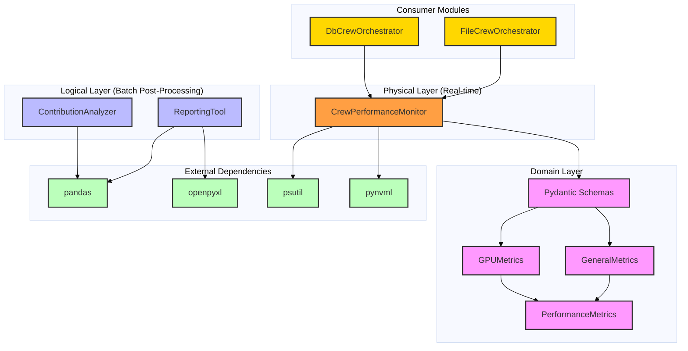
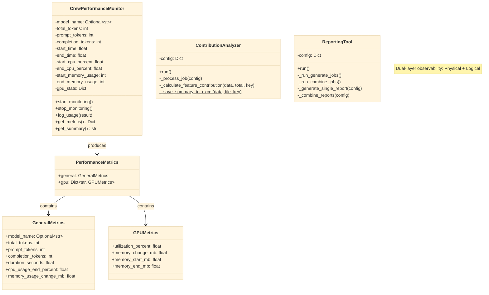
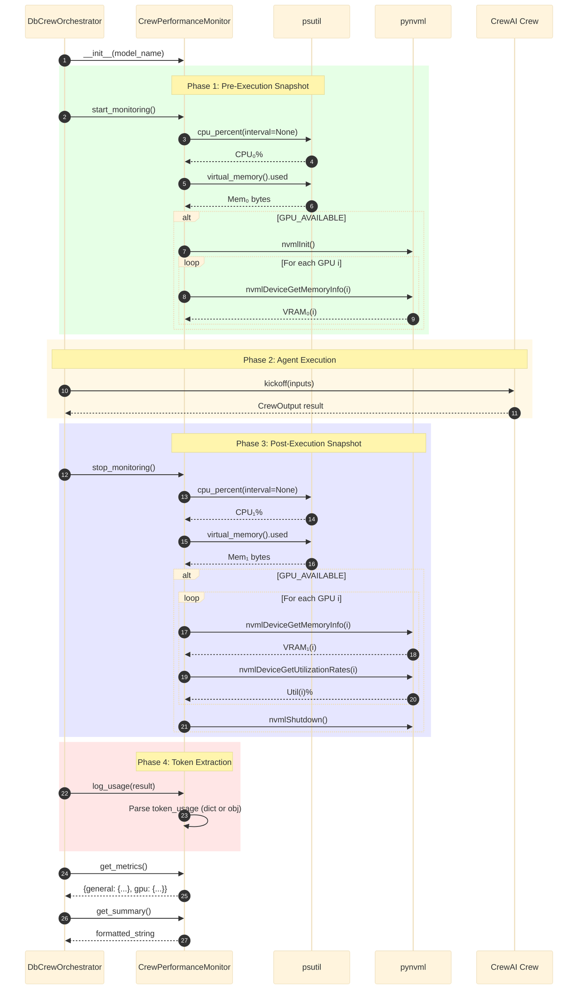
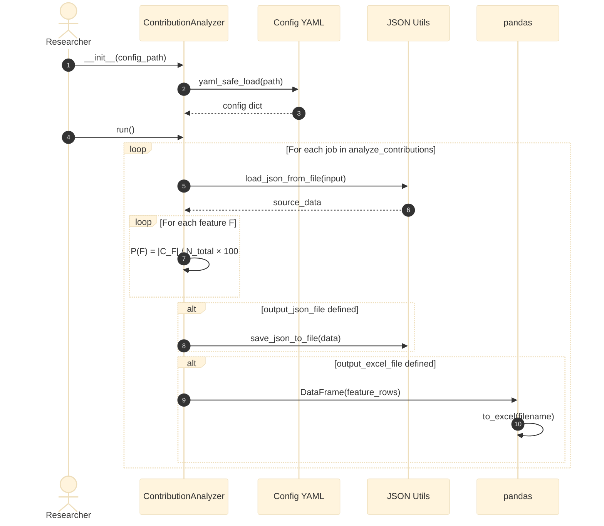
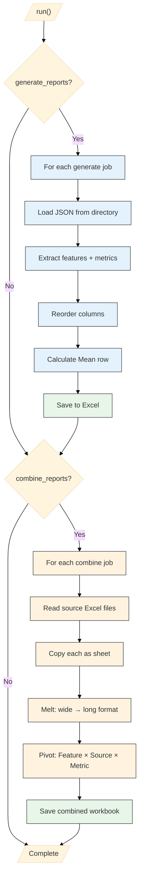
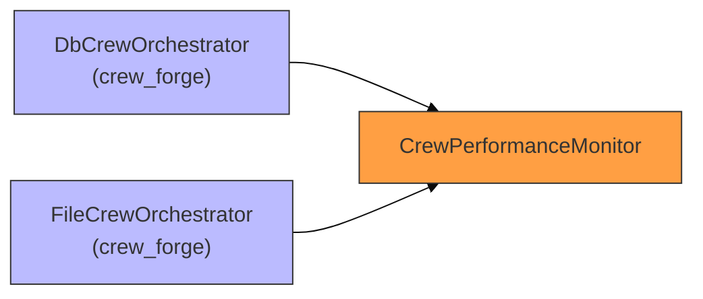

# Crew Monitor: Architecture & Design

## 1. Architectural Overview

The `crew_monitor` module implements a **dual-layer observability system** for multi-agent AI workflows: a **Physical Layer** (CPU, RAM, GPU, Token tracking via sandwich profiler) and a **Logical Layer** (feature consensus analysis and report aggregation). With **7 Python files** across **3 sub-packages**, it serves as the "scientific instrument" that produces all experimental data for the research paper.

### Layered Architecture Diagram

---

## 2. Sub-Package Structure

| Sub-Package | Files | Purpose |
|:---|:---:|:---|
| `domain/` | 1 | Pydantic schemas: `GPUMetrics`, `GeneralMetrics`, `PerformanceMetrics` |
| `service/` | 3 | `CrewPerformanceMonitor` (real-time profiler), `ContributionAnalyzer` (consensus), `ReportingTool` (Excel reporting) |
| Root | 1 | `__init__.py` |

**Total:** 7 Python files, 3 sub-packages

---

## 3. Class Design

### Class Diagram

---

## 4. Monitoring Lifecycle: Sandwich Pattern

The real-time profiler wraps crew execution in a resource-capture sandwich.

### Sequence Diagram: Full Monitoring Lifecycle

---

## 5. Contribution Analysis Pipeline

### Sequence Diagram: Batch Consensus Analysis

---

## 6. Report Generation & Combination Pipeline

### Activity Diagram: ReportingTool Dual Pipeline

---

## 7. Cross-Module Integration

The `CrewPerformanceMonitor` is the **only service consumed by other modules** — specifically both `crew_forge` orchestrators:

| Consumer | Import | Usage |
|:---------|:-------|:------|
| `DbCrewOrchestrator` | [db_crew_orchestrator.py:L5](file:///home/dell/PycharmProjects/Amsha/src/nikhil/amsha/crew_forge/orchestrator/db/db_crew_orchestrator.py#L5) | Wraps crew execution with resource profiling |
| `FileCrewOrchestrator` | [file_crew_orchestrator.py:L5](file:///home/dell/PycharmProjects/Amsha/src/nikhil/amsha/crew_forge/orchestrator/file/file_crew_orchestrator.py#L5) | Wraps crew execution with resource profiling |

---

## 8. Design Patterns Catalog

| # | Pattern | Implementation | File | Benefit |
|---|:---|:---|:---|:---|
| 1 | **Sandwich Profiler** | `start/stop_monitoring()` | [crew_performance_monitor.py](file:///home/dell/PycharmProjects/Amsha/src/nikhil/amsha/crew_monitor/service/crew_performance_monitor.py) | Non-intrusive resource measurement |
| 2 | **Graceful Degradation** | Conditional `pynvml` import | [crew_performance_monitor.py:L5–L9](file:///home/dell/PycharmProjects/Amsha/src/nikhil/amsha/crew_monitor/service/crew_performance_monitor.py#L5-L9) | Works on CPU-only machines |
| 3 | **Polymorphic Extraction** | `log_usage()` dict/obj handling | [crew_performance_monitor.py:L64–L82](file:///home/dell/PycharmProjects/Amsha/src/nikhil/amsha/crew_monitor/service/crew_performance_monitor.py#L64-L82) | Handles varying CrewAI result types |
| 4 | **Batch Processor** | `ContributionAnalyzer.run()` | [contribution_analyzer.py](file:///home/dell/PycharmProjects/Amsha/src/nikhil/amsha/crew_monitor/service/contribution_analyzer.py) | Config-driven multi-job execution |
| 5 | **Configuration Object** | YAML-loaded job configs | [contribution_analyzer.py:L18–L21](file:///home/dell/PycharmProjects/Amsha/src/nikhil/amsha/crew_monitor/service/contribution_analyzer.py#L18-L21) | Externalizes all job parameters |
| 6 | **ETL Pipeline** | `ReportingTool` generate + combine | [reporting_tool.py](file:///home/dell/PycharmProjects/Amsha/src/nikhil/amsha/crew_monitor/service/reporting_tool.py) | JSON → DataFrame → Excel transformation |
| 7 | **Pivot Table** | Melt + pivot for cross-report | [reporting_tool.py:L130–L142](file:///home/dell/PycharmProjects/Amsha/src/nikhil/amsha/crew_monitor/service/reporting_tool.py#L130-L142) | Multi-dimensional comparison |

---

## 9. Module Metrics

| Metric | Value |
|:---|:---|
| Total Python Files | 7 |
| Sub-Packages | 3 |
| Pydantic Models | 3 |
| Design Patterns | 7 |
| Diagrams in this Document | 7 |
| External Dependencies | 4 (psutil, pynvml, pandas, openpyxl) |
| Consumer Modules | 2 (crew_forge DB + File orchestrators) |
| Total Source Lines | ~330 |
