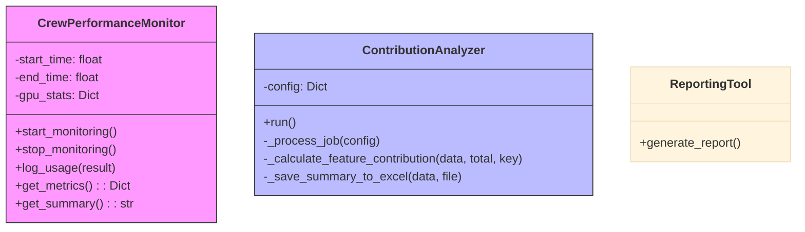
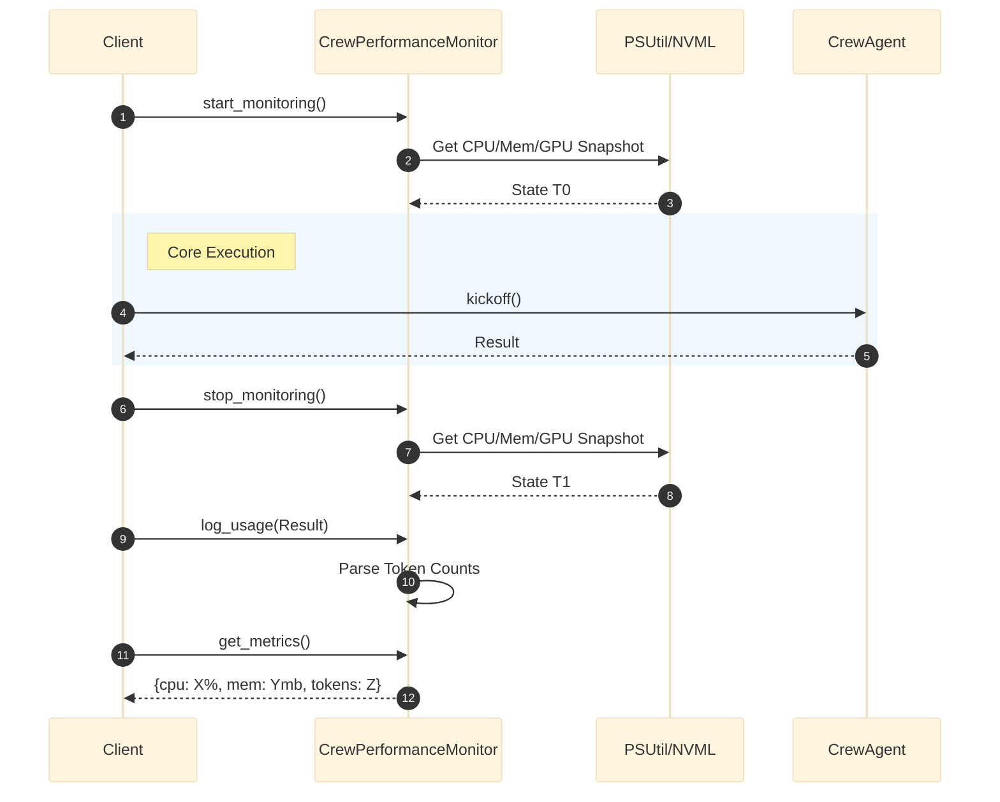
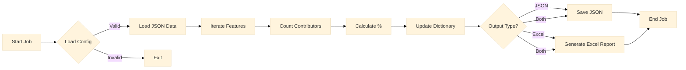

# Crew Monitor: Architecture & Design

## 1. Architectural Overview

The `crew_monitor` module employs a **Profiler Pattern** for system metrics and a **Batch Processing Pattern** for post-execution analysis. It bridges real-time resource tracking (CPU/GPU) with offline consensus analysis of multi-agent outputs.

### Class Diagram

## 2. Monitoring Lifecycle

The sequence illustrates the "sandwich" pattern where monitoring wraps the core execution logic.

### Sequence Diagram: Resource Tracking

## 3. Analysis Pipeline

The batch process for analyzing consensus across multiple model outputs.

### Activity Diagram: Contribution Analysis

