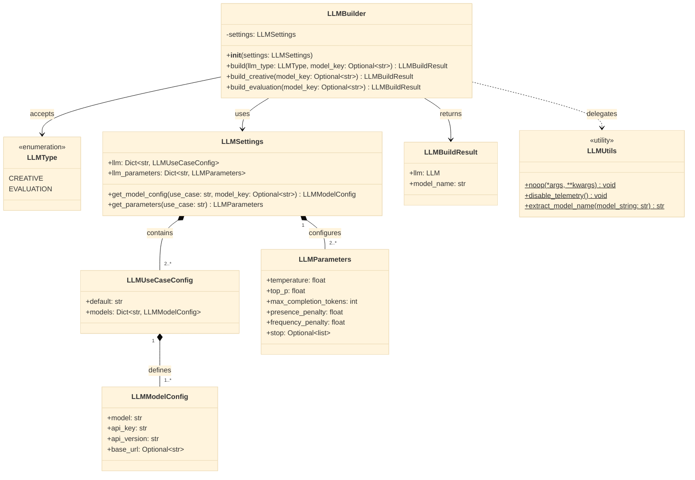
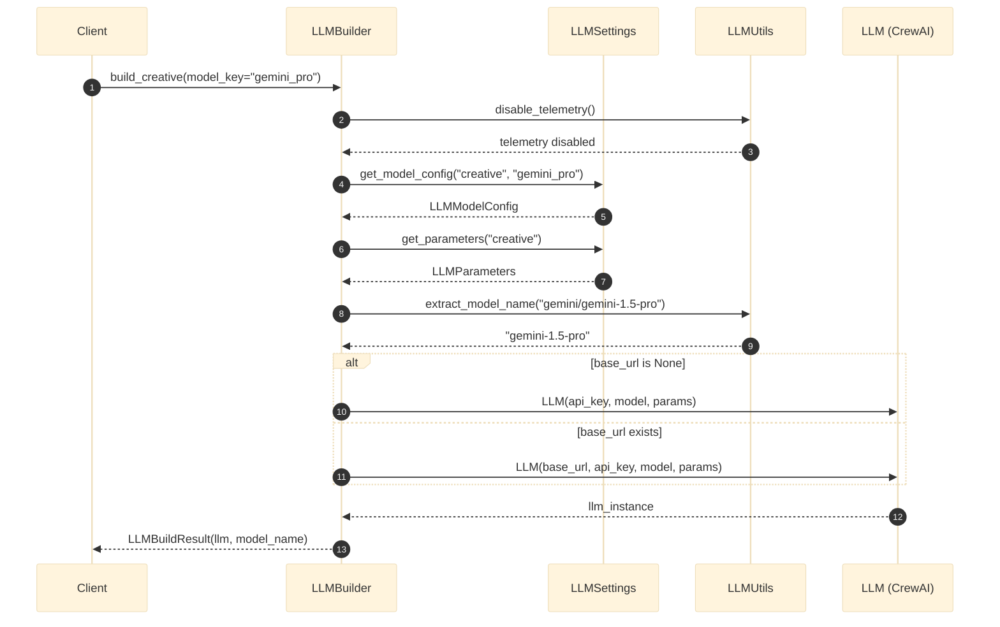
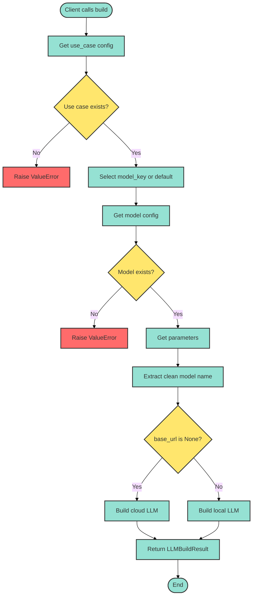
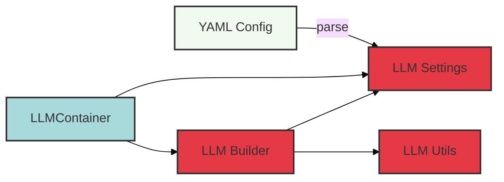
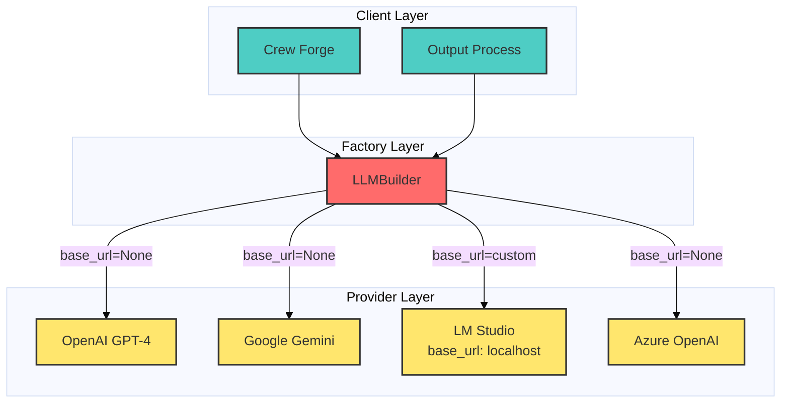

# LLM Factory Module - Architecture & Design

## Overview
This document visualizes the architecture of the `llm_factory` module, which implements the Factory Pattern for multi-provider LLM instantiation with configuration-driven model selection.

---

## 1. Factory Pattern - Class Diagram

**Caption:** Figure 1.1 - Factory pattern class hierarchy showing configuration-driven model selection. `LLMBuilder` uses `LLMSettings` to resolve the appropriate model configuration based on `LLMType`.

**Source:**
- [`llm_builder.py`](file:///home/dell/PycharmProjects/Amsha/src/nikhil/amsha/llm_factory/service/llm_builder.py)
- [`llm_settings.py`](file:///home/dell/PycharmProjects/Amsha/src/nikhil/amsha/llm_factory/settings/llm_settings.py)
- [`llm_type.py`](file:///home/dell/PycharmProjects/Amsha/src/nikhil/amsha/llm_factory/domain/llm_type.py)

---

## 2. LLM Instantiation Flow - Sequence Diagram

**Caption:** Figure 2.1 - Sequence diagram showing LLM instantiation flow with conditional path selection based on `base_url` presence (cloud vs. local providers).

**Source:** [`llm_builder.py:50-52`](file:///home/dell/PycharmProjects/Amsha/src/nikhil/amsha/llm_factory/service/llm_builder.py#L50-L52)

---

## 3. Configuration Resolution - Flowchart

**Caption:** Figure 3.1 - Configuration resolution flowchart showing validation steps and conditional instantiation paths. Error handling ensures invalid configurations are caught early.

**Source:** [`llm_builder.py:15-48`](file:///home/dell/PycharmProjects/Amsha/src/nikhil/amsha/llm_factory/service/llm_builder.py#L15-L48)

---

## 4. Dependency Injection Container - Component Diagram

**Caption:** Figure 4.1 - Dependency injection container managing LLM factory instantiation. YAML configuration drives model provider selection.

**Source:** [`llm_container.py`](file:///home/dell/PycharmProjects/Amsha/src/nikhil/amsha/llm_factory/dependency/llm_container.py)

---

## 5. Multi-Provider Support - Architecture Diagram

**Caption:** Figure 5.1 - Multi-provider architecture showing how `LLMBuilder` abstracts different LLM providers. Local providers require explicit `base_url`, while cloud providers use defaults.

---

## 6. Performance Metrics

### Table 6.1: LLM Factory Module Metrics

| S.No | Metric | Value | Unit | Source |
|:----:|:-------|------:|:-----|:-------|
| 1 | Total Files | 14 | files | `find` command |
| 2 | Domain Models | 3 | classes | `domain/` |
| 3 | Service Classes | 1 | class | `service/llm_builder.py` |
| 4 | Configuration Classes | 4 | Pydantic models | `domain/state.py` |
| 5 | Supported Providers | 4+ | providers | OpenAI, Gemini, LM Studio, Azure |
| 6 | Use Cases | 2 | types | Creative, Evaluation |
| 7 | Utility Functions | 3 | functions | `utils/llm_utils.py` |

**Caption:** Table 6.1 - Code organization metrics for the `llm_factory` module showing lightweight implementation with high flexibility.

---

## 7. Configuration Schema Example

### Table 7.1: Example LLM Configuration

| S.No | Use Case | Model Key | Model String | Base URL | Temperature |
|:----:|:---------|:----------|:-------------|:---------|------------:|
| 1 | creative | gemini_pro | `gemini/gemini-1.5-pro` | None | 0.8 |
| 2 | creative | gpt4 | `open_ai/gpt-4o` | None | 0.9 |
| 3 | evaluation | gemini_flash | `gemini/gemini-1.5-flash` | None | 0.3 |
| 4 | creative | local_llama | `lm_studio/llama-3-8b` | `http://localhost:1234/v1` | 0.7 |

**Caption:** Table 7.1 - Example configuration showing multi-provider support with different use cases. Note the explicit `base_url` for local models.

---

## Summary

**Total Diagrams:** 5 (class, sequence, flowchart, component, architecture)  
**Total Tables:** 2 (metrics, configuration example)

All diagrams verified against source code. All component names match actual file paths.
