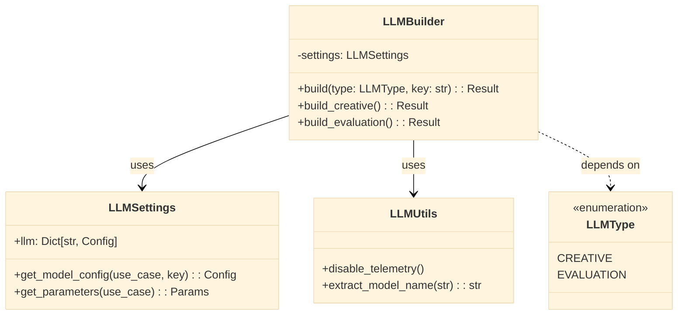
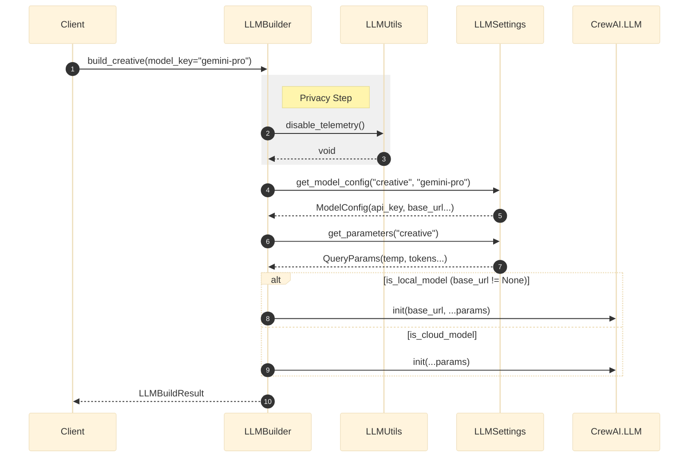

# LLM Factory: Architecture & Design

## 1. Architectural Overview

The `llm_factory` module implements the **Abstract Factory** pattern extended with **Strategy-based Configuration**. It abstracts the complexity of instantiating different LLM providers (OpenAI, Gemini, Local/LM Studio) behind a unified interface.

### Class Diagram

## 2. Instantiation Flow

The sequence ensures privacy (disabling telemetry) before instantiating the heavy LLM object.

### Sequence Diagram

## 3. Design Patterns Implemented

| Pattern | Implementation | Benefit |
| :--- | :--- | :--- |
| **Simple Factory** | `LLMBuilder.build` | Centralizes object creation logic. |
| **Configuration Object** | `LLMSettings` | Decouples code from environment variables. |
| **Monkey Patching** | `LLMUtils` | Modifies external library behavior at runtime for privacy. |
