# LLM Factory: Architecture & Design

## 1. Architectural Overview

The `llm_factory` module implements a **Configuration-Driven Conditional Factory** pattern for LLM provisioning. It abstracts multi-provider complexity (Cloud SaaS, Local Inference, Azure) behind a unified builder interface, enforces runtime privacy through reflection-based telemetry interception, and provides a declarative DI container with pre-wired convenience providers.

### Layered Architecture Diagram

---

## 2. Sub-Package Structure

| Sub-Package | Files | Purpose |
|:---|:---:|:---|
| `domain/` | 2 | `LLMType` enum and 4 Pydantic state models (`LLMParameters`, `LLMModelConfig`, `LLMUseCaseConfig`, `LLMBuildResult`) |
| `settings/` | 1 | `LLMSettings` — Hierarchical config resolution from YAML |
| `service/` | 1 | `LLMBuilder` — Conditional factory with cloud/local branching |
| `utils/` | 1 | `LLMUtils` — Telemetry disabling + model name extraction |
| `dependency/` | 1 | `LLMContainer` — Declarative DI with Singleton/Factory/Pre-wired providers |
| `example/` | 1 | Full usage example demonstrating DI-based LLM provisioning |

**Total:** 14 Python files, 6 sub-packages

---

## 3. Class Design

### Class Diagram

---

## 4. Instantiation Flow

### Sequence Diagram: Full LLM Provisioning Lifecycle

```mermaid
%%{init: {'theme': 'base'}}%%
sequenceDiagram
    autonumber
    actor Client as Consumer Module
    participant Container as LLMContainer
    participant YAML as llm_config.yaml
    participant Settings as LLMSettings
    participant Builder as LLMBuilder
    participant Utils as LLMUtils
    participant Telemetry as CrewAI.Telemetry
    participant CrewLLM as CrewAI.LLM

    Client->>Container: config.llm.yaml_path.from_value(path)
    Client->>Container: llm_builder() / creative_llm()

    rect rgb(245, 245, 220)
        note over Container,Settings: Singleton Resolution (once)
        Container->>YAML: YamlUtils.yaml_safe_load(path)
        YAML-->>Container: raw dict
        Container->>Settings: LLMSettings(**data)
    end

    Container->>Builder: LLMBuilder(settings)

    Client->>Builder: build_creative(model_key)

    rect rgb(255, 230, 230)
        note over Builder,Telemetry: Privacy Guard (before any LLM call)
        Builder->>Utils: disable_telemetry()
        Utils->>Utils: os.environ["OTEL_SDK_DISABLED"] = "true"
        loop For each callable attr in Telemetry
            Utils->>Telemetry: setattr(attr, noop)
        end
    end

    Builder->>Settings: get_model_config("creative", key)
    Settings-->>Builder: LLMModelConfig

    Builder->>Settings: get_parameters("creative")
    Settings-->>Builder: LLMParameters(τ=1.0, p=0.9, T=4096...)

    alt base_url is None (Cloud Provider)
        Builder->>CrewLLM: LLM(api_key, model, temperature, ...)
    else base_url present (Local / Azure)
        Builder->>CrewLLM: LLM(base_url, api_key, model, temperature, ...)
    end

    Builder->>Utils: extract_model_name(model_string)
    Utils-->>Builder: clean_name

    Builder-->>Client: LLMBuildResult(llm, model_name)
```

---

## 5. Provider Classification Matrix

```mermaid
%%{init: {'theme': 'base'}}%%
flowchart LR
    classDef cloud fill:#e3f2fd,stroke:#333;
    classDef local fill:#e8f5e9,stroke:#333;
    classDef azure fill:#fff3e0,stroke:#333;

    subgraph "Provider Types"
        direction TB
        Cloud["☁️ Cloud SaaS"]:::cloud
        Local["🖥️ Local Inference"]:::local
        Azure["🔷 Azure OpenAI"]:::azure
    end

    subgraph "Cloud Providers"
        Gemini["Gemini<br/>gemini-1.5-flash<br/>base_url: None"]:::cloud
    end

    subgraph "Local Providers"
        Phi["LM Studio / Phi-4<br/>localhost:1234/v1"]:::local
        Llama["LM Studio / Llama-3.1<br/>localhost:1234/v1"]:::local
        Gemma["LM Studio / Gemma-3<br/>localhost:1234/v1"]:::local
        GPT_OSS["LM Studio / GPT-OSS-20B<br/>localhost:1234/v1"]:::local
    end

    subgraph "Azure Providers"
        GPT4o["Azure / GPT-4o<br/>*.openai.azure.com"]:::azure
    end

    Cloud --> Gemini
    Local --> Phi
    Local --> Llama
    Local --> Gemma
    Local --> GPT_OSS
    Azure --> GPT4o
```

---

## 6. DI Container Resolution Graph

### Provider Strategy Table

| Provider | Strategy | Lifecycle | Code Reference |
|:---------|:---------|:----------|:-------------|
| `yaml_data` | Singleton | Parse once, share forever | [llm_container.py:L15–L18](file:///home/dell/PycharmProjects/Amsha/src/nikhil/amsha/llm_factory/dependency/llm_container.py#L15-L18) |
| `llm_settings` | Singleton | Constructed once from YAML data | [llm_container.py:L20–L23](file:///home/dell/PycharmProjects/Amsha/src/nikhil/amsha/llm_factory/dependency/llm_container.py#L20-L23) |
| `llm_builder` | Factory | New instance per request | [llm_container.py:L26–L29](file:///home/dell/PycharmProjects/Amsha/src/nikhil/amsha/llm_factory/dependency/llm_container.py#L26-L29) |
| `creative_llm` | Pre-wired | Calls `build_creative()` | [llm_container.py:L31](file:///home/dell/PycharmProjects/Amsha/src/nikhil/amsha/llm_factory/dependency/llm_container.py#L31) |
| `evaluation_llm` | Pre-wired | Calls `build_evaluation()` | [llm_container.py:L33](file:///home/dell/PycharmProjects/Amsha/src/nikhil/amsha/llm_factory/dependency/llm_container.py#L33) |

---

## 7. Cross-Module Integration Map

The `llm_factory` is consumed by multiple modules as the **shared LLM provisioning service**:

| Consumer | Import | Usage |
|:---------|:-------|:------|
| `crew_forge` (DB) | `LLMContainer`, `LLMType` | [amsha_crew_db_application.py:L7–L8](file:///home/dell/PycharmProjects/Amsha/src/nikhil/amsha/crew_forge/orchestrator/db/amsha_crew_db_application.py#L7-L8) |
| `crew_forge` (File) | `LLMContainer`, `LLMType` | [amsha_crew_file_application.py:L7–L8](file:///home/dell/PycharmProjects/Amsha/src/nikhil/amsha/crew_forge/orchestrator/file/amsha_crew_file_application.py#L7-L8) |
| `crew_gen` | `LLMType` | [crew_gen_app.py:L4](file:///home/dell/PycharmProjects/Amsha/src/nikhil/amsha/crew_gen/application/crew_gen_app.py#L4) |

---

## 8. Design Patterns Catalog

| # | Pattern | Implementation | File | Benefit |
|---|:---|:---|:---|:---|
| 1 | **Conditional Factory** | `LLMBuilder.build()` | [llm_builder.py](file:///home/dell/PycharmProjects/Amsha/src/nikhil/amsha/llm_factory/service/llm_builder.py) | Single method produces cloud or local LLM based on `base_url` presence |
| 2 | **Configuration Object** | `LLMSettings` + Pydantic models | [llm_settings.py](file:///home/dell/PycharmProjects/Amsha/src/nikhil/amsha/llm_factory/settings/llm_settings.py) | Type-safe hierarchical config with defaults |
| 3 | **Strategy** | Use-case-based parameter selection | [state.py](file:///home/dell/PycharmProjects/Amsha/src/nikhil/amsha/llm_factory/domain/state.py) | Different parameters per use case (creative vs. evaluation) |
| 4 | **Monkey Patching** | `LLMUtils.disable_telemetry()` | [llm_utils.py](file:///home/dell/PycharmProjects/Amsha/src/nikhil/amsha/llm_factory/utils/llm_utils.py) | Runtime privacy enforcement without library modification |
| 5 | **Dependency Injection** | `LLMContainer` | [llm_container.py](file:///home/dell/PycharmProjects/Amsha/src/nikhil/amsha/llm_factory/dependency/llm_container.py) | Declarative container with Singleton, Factory, and Pre-wired providers |
| 6 | **Immutable Result** | `LLMBuildResult` (NamedTuple) | [state.py](file:///home/dell/PycharmProjects/Amsha/src/nikhil/amsha/llm_factory/domain/state.py) | Thread-safe, hashable build result |

---

## 9. Module Metrics

| Metric | Value |
|:---|:---|
| Total Python Files | 14 |
| Sub-Packages | 6 |
| Domain Models (Pydantic) | 4 |
| Design Patterns | 6 |
| Diagrams in this Document | 6 |
| Supported Providers | 6 (Gemini, LM Studio/Phi, LM Studio/Llama, LM Studio/Gemma, LM Studio/GPT-OSS, Azure GPT-4o) |
| Consumer Modules | 3 (crew_forge DB, crew_forge File, crew_gen) |
