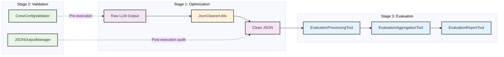
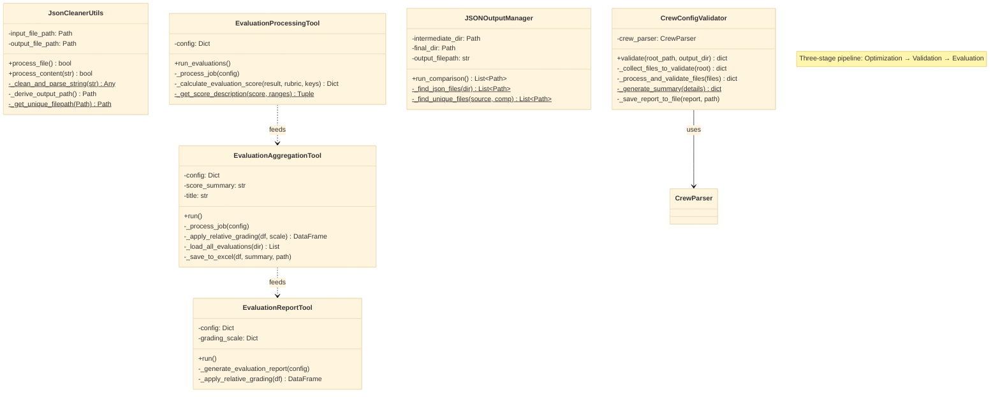
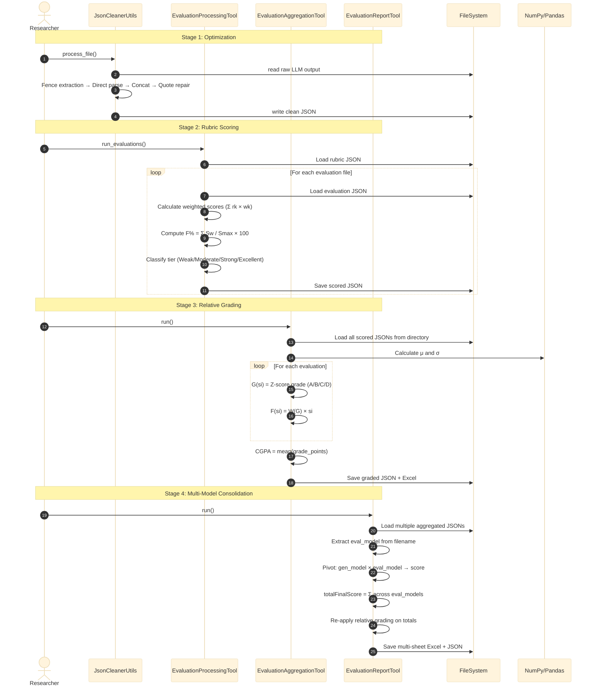
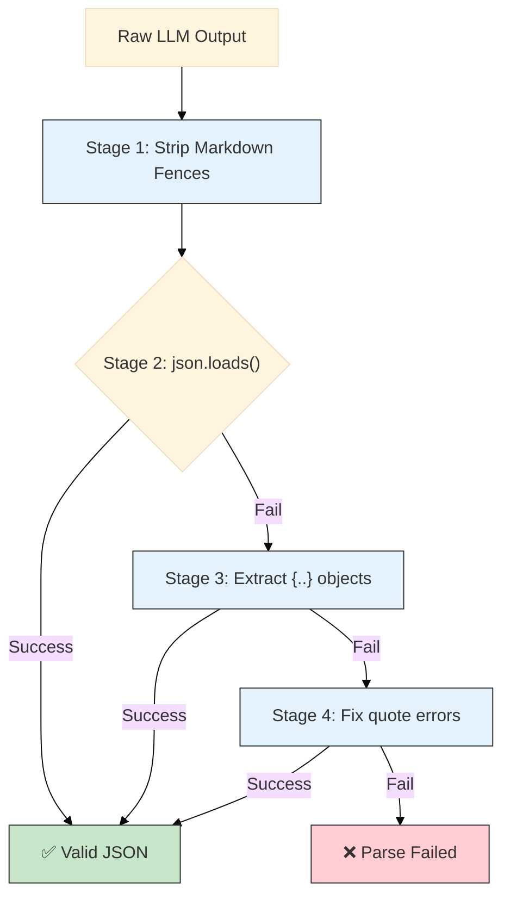
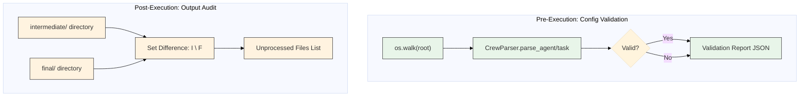

# Output Process: Architecture & Design

## 1. Architectural Overview

The `output_process` module implements a **three-stage post-processing pipeline** for multi-agent AI outputs: **Optimization** (LLM output sanitization), **Validation** (pre-execution config checks + post-execution file auditing), and **Evaluation** (rubric scoring → relative grading → multi-model consolidation). With **10 Python files** across **3 sub-packages**, it transforms raw, noisy agent outputs into structured, graded, and publication-ready data.

### Layered Pipeline Diagram

---

## 2. Sub-Package Structure

| Sub-Package | Files | Purpose |
|:---|:---:|:---|
| `optimization/` | 1 | `JsonCleanerUtils` — Multi-pass LLM output sanitization (fence stripping, concatenation, quote repair) |
| `validation/` | 2 | `CrewConfigValidator` — YAML config validation; `JSONOutputManager` — directory set-difference audit |
| `evaluation/` | 3 | `EvaluationProcessingTool` — rubric-weighted scoring; `EvaluationAggregationTool` — Z-score grading; `EvaluationReportTool` — multi-model pivot consolidation |

**Total:** 10 Python files, 3 sub-packages

---

## 3. Class Design

### Class Diagram

---

## 4. Evaluation Pipeline: Full 3-Stage Flow

### Sequence Diagram

---

## 5. JSON Sanitization Pipeline

---

## 6. Validation Workflow

---

## 7. Cross-Module Dependencies

| Dependency | Direction | Usage |
|:---|:---|:---|
| `crew_forge.seeding.parser.CrewParser` | ← imports | [crew_validator.py:L7](file:///home/dell/PycharmProjects/Amsha/src/nikhil/amsha/output_process/validation/crew_validator.py#L7) uses parser for validation |
| `amsha.utils.json_utils.JsonUtils` | ← imports | Multiple files use shared JSON I/O |
| `amsha.utils.yaml_utils.YamlUtils` | ← imports | Config loading in all tools |

---

## 8. Design Patterns Catalog

| # | Pattern | Implementation | File | Benefit |
|---|:---|:---|:---|:---|
| 1 | **Pipeline** | Optimization → Scoring → Grading → Reporting | Entire module | Sequential transformation of agent output |
| 2 | **Cascading Parser** | 4-stage JSON sanitization | [json_cleaner_utils.py](file:///home/dell/PycharmProjects/Amsha/src/nikhil/amsha/output_process/optimization/json_cleaner_utils.py) | Handles noisy LLM outputs robustly |
| 3 | **Configuration Object** | YAML-driven jobs in all tools | All evaluation tools | Zero-code job definition |
| 4 | **Batch Processor** | Loop over `evaluations`/`aggregation_jobs` | [evaluation_processing_tool.py](file:///home/dell/PycharmProjects/Amsha/src/nikhil/amsha/output_process/evaluation/evaluation_processing_tool.py) | Config-driven multi-job execution |
| 5 | **Statistical Strategy** | Z-score grading with configurable scale | [evaluation_aggregate_tool.py](file:///home/dell/PycharmProjects/Amsha/src/nikhil/amsha/output_process/evaluation/evaluation_aggregate_tool.py) | Population-relative fairness |
| 6 | **Pivot Table** | Multi-model cross-comparison | [evaluation_report_tool.py](file:///home/dell/PycharmProjects/Amsha/src/nikhil/amsha/output_process/evaluation/evaluation_report_tool.py) | Multi-dimensional evaluation |
| 7 | **Set Difference** | Directory comparison for audit | [json_output_validator.py](file:///home/dell/PycharmProjects/Amsha/src/nikhil/amsha/output_process/validation/json_output_validator.py) | Identifies failed processing |
| 8 | **Unique Path Generator** | Counter-based file deduplication | [json_cleaner_utils.py:L48–L67](file:///home/dell/PycharmProjects/Amsha/src/nikhil/amsha/output_process/optimization/json_cleaner_utils.py#L48-L67) | Prevents output overwrites |

---

## 9. Module Metrics

| Metric | Value |
|:---|:---|
| Total Python Files | 10 |
| Sub-Packages | 3 |
| Design Patterns | 8 |
| Diagrams in this Document | 6 |
| Total Source Lines | ~860 |
| External Dependencies | 3 (numpy, pandas, openpyxl) |
| Cross-Module Imports | 3 (CrewParser, JsonUtils, YamlUtils) |
