# Output Process: Architecture & Design

## 1. Architectural Overview

The `output_process` module implements a **Pipeline Architecture** for transforming raw agent outputs into structured, graded, and validated reports. It separates **Validation** (pre-execution) from **Evaluation** (post-execution) and **Aggregation** (meta-analysis).

### Class Diagram

## 2. Evaluation Pipeline

The sequence illustrates how raw JSON outputs are aggregated, graded, and exported.

### Sequence Diagram: Aggregation & Grading

```mermaid
%%{init: {'theme': 'base'}}%%
sequenceDiagram
    autonumber
    participant Orch as Orchestrator
    participant Agg as EvaluationAggregationTool
    participant FS as FileSystem
    participant Stats as NumPy/Pandas

    Orch->>Agg: run()
    Agg->>FS: Load JSON Evaluations
    FS-->>Agg: List[Dict] (Raw Scores)
    
    Agg->>Stats: Calculate Mean (μ) & StdDev (σ)
    Stats-->>Agg: μ, σ
    
    loop For each score
        Agg->>Agg: Apply Z-Score Logic
        Agg->>Agg: Assign Grade (A/B/C/D)
        Agg->>Agg: Calculate Weighted Final Score
    end
    
    Agg->>FS: Save Graded JSON
    Agg->>FS: Export Excel Summary
    
    Agg-->>Orch: Completion Signal
```

## 3. Validation Workflow

The workflow for ensuring configuration integrity before execution.

### Activity Diagram: Config Validation

